Introduction
============
The Problem
-----------

In 2019, American adults spent 3 and a half hours on their phones every day. This was an increase of 20 minutes from a year earlier. Analytics company "Zenith" predicted screen time would increase to over 4 hours in 2021, and then COVID-19 hit [#]_. Twitter has been awash with people
posting alarming pandemic screen time statistics with some hitting 8 hours a day on their phones [#]_.

But how? Why? Targeting networks like Twitter, Google and Facebook engineer their apps to collect massive amounts of data on their users, analyse metrics like impulsivity, content viewed, percentage watched etc.. and use it to make predictions about what users are most likely to view next, and serve it [#]_. 
    
In 2019 alone, YouTube was fined $170 million [#]_ for collecting and using children's data, and Facebook was fined $5 billion in light of the Cambridge Analytica incident [#]_. Studies show that people already are subject to "reinforcing spirals", a phenomenon where people look for and consume content that is similar to content they have seen before. This has been observed to be triggered by violent [#]_, and politically charged content. These content networks' efforts only serve to intensify this effect, leading users into an endless spiral through their platforms and racking up massive screen times.
Studies have linked excessive screen time with symptoms of depression in adolescents [#]_, with a 0.64 unit increase in depressive symptoms on the Brief Symptoms Inventory scale per hour spent on social media. Other studies have found positive associations between screen time and depression symptoms like loneliness and reduced self-esteem.  

There seems to be a growing movement around quitting Google's services [#]_ [#]_ [#]_ 
being promoted by increasingly major players in the media industry. The Forbes article in particular was written in September 2021. People are deeply concerned about how much influence these tech behemoths have on their lives and are making efforts to go lighter. Companies are responding to this by introducing more robust privacy controls on their platforms - notably the iOS 14 and Android 12 updates [#]_. But Android's offering has 
been criticised for not offering enough control to the end user easily enough, they are still forced to delve into the dizzying array of options in the Google privacy portal to manage their privacy settings.

Services created with the best of intentions are increasingly taking up more and more of our times and lives, to the point where instead of helping us, we are helping them. People are spending significant proportions of their lives on these platforms, and a growing number want out.

.. [#] https://www.vox.com/recode/2020/1/6/21048116/tech-companies-time-well-spent-mobile-phone-usage-data
.. [#] https://www.washingtonpost.com/technology/2020/03/24/screen-time-iphone-coronavirus-quarantine-covid/
.. [#] https://privacy.commonsense.org/privacy-report/YouTube
.. [#] https://www.theguardian.com/technology/2019/sep/04/youtube-kids-fine-personal-data-collection-children-
.. [#] https://www.ftc.gov/system/files/documents/public_statements/1536911/chopra_dissenting_statement_on_facebook_7-24-19.pdf
.. [#] Slater  MD, Henry  KL, Swain  RC,  et al.  Violent media content and aggressiveness in adolescents: a download spiral model.  Comm Res. 2003;30(6):713-736. doi:10.1177/0093650203258281
.. [#] https://jamanetwork.com/journals/jamapediatrics/fullarticle/2737909?guestAccessKey=7f0019bd-f2eb-4dc1-a509-cd5bc2444a79&utm_source=For_The_Media&utm_medium=referral&utm_campaign=ftm_links&utm_content=tfl&utm_term=071519
.. [#] https://beebom.com/how-go-google-free/
.. [#] https://www.zdnet.com/article/goodbye-google-why-and-how-to-take-back-your-privacy/
.. [#] https://time.com/9210/how-i-quit-google/
.. [#] https://www.cbsnews.com/news/how-i-tried-and-failed-to-quit-google/

The Solution
------------
**INKI** Mark One is a premium open source smartwatch, born out of a desire to create a usable watch that respects a user's privacy and time, lasts 30 days on a single charge, and makes the user's life better. By building the software from the ground up to be secure and privacy conscious, users who are concerned about the influence of large corporations like Google and Facebook can more easily disconnect from the frenzy of online life and truly relax. INKI has been in development since June 2021 and is being taken to a fully fledged product - but undoubtedly I will have to limit the scope of what I'd like to achieve for this formal NEA. 

Who is it for?
++++++++++++++
INKI will be primarily aimed towards the privacy conscious, the open source software and hardware is intended to build people's trust and put accountability on our part to keep the software clean and privacy friendly. As the general public is shifting in this direction, the watch will need some mainstream-level functionality to be able to compete and garner the support of the masses.

Countless people can benefit from a well-executed smartwatch: the fitness-conscious, the health-conscious, the tech-enthusiast, the list goes on. Of course, these groups will all have their own requirements and preferences, but the beauty of open source software is that technically-inclined people can contribute to the code-base once it reaches an appropriate level (i.e where non-programmers can comfortably use the watch) and add in functionality that everybody would like. The end goal is to create and foster an app ecosystem that allows anyone to create an application and distribute it to people who would enjoy it.

Research Methodology
++++++++++++++++++++
INKI was inspired by similar projects such as the Light Phone [#]_ and Light Phone 2. These are phones built to be used as little as possible to help disconnect from the tech monopolies and social medias that are increasingly sucking up our time and energy. While the Light Phone 2 is beautiful, and INKI seeks a similar aesthetic, the internal hardware of the Light Phone 2 is much like a modern Android smartphone, utilising a fairly beefy ARMv7/ARMv8 CPU capable of running Android, which it does. This isn't a deal-breaker as the Android OS appears to be heavily modified to better support the Electro-Phoretic Display (abbr. EPD) and maximise battery life / minimise power consumption, but Android is still inherently a major operating system with significant overhead and thus power consumption. 
This made me wonder whether lower power hardware, utilising an ultra-low-power display technology like Electro-Phoretic Displays, running a simpler operating system written from the ground up tailored for smartwatch duty could do a highly effective job at a fraction of the complexity and power consumption.

A lot of internet research later, I found Nordic Semiconductor, a fabless semiconductor company that specialises in Bluetooth Low Energy low power ARM chips after looking at powerful microcontrollers on Adafruit's website. The nRF52 series was of particular interest due to the relative simplicity of the SoC but immense power available compared to traditional AVR based microcontrollers. All chips in this series feature a 64MHz ARM Cortex-M4 CPU, which is four times faster than the ATMega32u4 on clock speed alone [#]_ and undoubtedly many times faster on IPC due to the 32 vs 8 bit architecture. The best part is that these chips are as easy to program as an AVR, and massively more capable at the same time; the top spec nRF52840 is a perfect candidate for the smartwatch as it has inbuilt hardware accelerated AES, instruction Cache to speed up execution and minimise current, a floating point unit, and has the most RAM and memory to allow for exciting applications and features to be implemented without being constrained too much by hardware limitations.

Deducing what functionality would be required was a lot easier, I simply looked through the spec sheets and prices for some of the most popular smartwatches today [#]_ [#]_ and saw what they all had in common. The main features I was looking for was determined by several consumer-oriented articles aimed at tech enthusiasts looking to make their next purchase - which is our target market here. [#]_ [#]_ [#]_

From these sources, I deduced the main considerations here were battery life, software support, and 3rd party app support. Here is a quick breakdown of some of the most popular smartwatches on the market today and their specifications. 

+------------------------+-------------------------------+-----------------------------------------+-----------------------------------------------------------------------------------------------------------------------------------------------------------------------------------+-------+
| Watch                  | Display                       | Battery Life                            | Capabilities                                                                                                                                                                      | Price |
+========================+===============================+=========================================+===================================================================================================================================================================================+=======+
| Apple Watch Series 7   | AMOLED                        | 18 hours                                | Fitness tracking - ECG - Heart Rate & Blood Oxygen - Music storage & playback - Fall detection - Always On Display - Compass & altimeter - Extremely comprehensive 3rd party apps | £369  |
+------------------------+-------------------------------+-----------------------------------------+-----------------------------------------------------------------------------------------------------------------------------------------------------------------------------------+-------+
| Samsung Galaxy Watch 4 | AMOLED (2 sizes)              | 40 hours (without GPS/workout tracking) | Fitness tracking - ECG + Heart Rate + SpO2 (Blood Oxygen) - Music storage & playback - Fall detection - Compass - 3rd party apps                                                  | £269  |
+------------------------+-------------------------------+-----------------------------------------+-----------------------------------------------------------------------------------------------------------------------------------------------------------------------------------+-------+
| Fitbit Sense           | AMOLED                        | 6 days                                  | Fitness tracking - ECG + Heart Rate + SpO2 - 3rd party apps - Alexa + Google Assistant                                                                                            | £189  |
+------------------------+-------------------------------+-----------------------------------------+-----------------------------------------------------------------------------------------------------------------------------------------------------------------------------------+-------+
| Garmin Venu            | AMOLED (praised for vibrancy) | 5 days                                  | Very comprehensive fitness tracking - ECG + Heart Rate + SpO2 - Music storage & playback - 3rd party apps                                                                         | £329  |
+------------------------+-------------------------------+-----------------------------------------+-----------------------------------------------------------------------------------------------------------------------------------------------------------------------------------+-------+
| OnePlus Watch          | AMOLED                        | 10 days                                 | Fitness tracking - minimalist design - compass + barometer - sleep tracking - music storage and playback                                                                          | £149  |
+------------------------+-------------------------------+-----------------------------------------+-----------------------------------------------------------------------------------------------------------------------------------------------------------------------------------+-------+

Apple Watch Series 7
********************
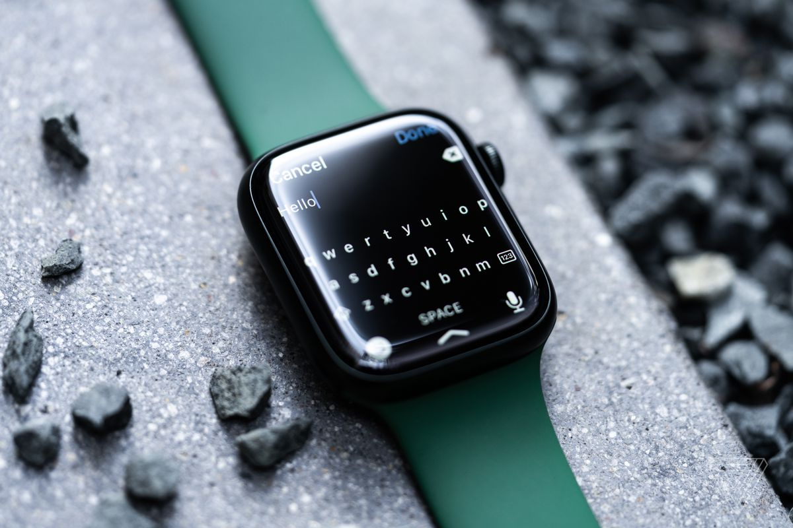

    
The Apple Watch is the current market leader in the smartwatch world, despite being completely incompatible with Android devices. The rectangular screen with the curved edges and robust metal casing is an instantly recognisable design, and one that Apple has maintained for several years now. 
The reason it's been so popular is that it's sort of changed the face of smartwatches, transforming them from a gimmick in the eyes of the public to something genuinely useful and usable. They've integrated high-end fitness tracking, useful 3rd party apps, and effectively extended the iPhone to a user's wrist in a way that hadn't been done before - and it worked!

I respect the Apple Watch for this greatly. Additionally, the Apple Watch, and Apple products in general are well-reputed for being amongst the best on the market with regards to privacy and security. The iCloud lock functionality prevents sensitive data being released off a stolen device, and gives users the ability to remotely lock or disable their lost devices. And of course, all data on the watch itself is encrypted, and activation is authenticated with Apple's "Albert" servers, making false activations and thus any possible data exfiltration impractically difficult. The user-experience is also made quite a lot nicer by the physical controls in conjunction with the touch screen - the Apple Watch is equipped with a rotating "crown" used to scroll through menus, and a singular button is used to switch between apps. This is superior to touch only watches, which are rendered useless underwater or fall victim to crazy, spurious inputs upon entering contact with water. 

The Apple Watch does have a few limitations though. Some models are equipped with optional LTE connectivity, which allows the watch to connect itself directly to the internet using a cellular data connection - a common criticsm is how the watch is still overly reliant upon the mother iOS device for much of its functionality. This has been resolved more with the newer versions, which can download podcasts and songs by themselves. Additionally, the LTE versions cost quite a lot more than the regular counterparts and require a monthly cellular subscription. The notifications can be quite distracting, but since it's an Apple product there's fairly comprehensive notification management and this can be mitigated somewhat. 

Its greatest flaw, which Apple has been chagrined for, is undoubtedly the battery life. Apple Watches run a custom OS known as watchOS, which is known to be descended from iOS which runs on their tablets and smartphones. The iOS underpinnings could potentially explain why these watches struggle to outlast their competition, as it would make sense that iOS would not have been written from the ground up with wearable applications in mind. It is also entirely possible that the slick user interface that is so heavily praised by reviewers requires a power-hungry and powerful SoC to drive, contributing further to the battery drain. In any case, the battery life is likely the last thing holding the Apple Watch back from total domination over the competition. Having to charge another device every evening can get irritating - I personally find myself quite often in situations where I've forgotten to charge my phone overnight and I run out of juice midway through the day.

So to conclude - the Apple Watch Series 7 is an excellent all-round package with Apple's trademark attention to detail and blend of cutting-edge yet well-implemented and well-executed technology, let down by the battery life. 

Samsung Galaxy Watch 4
**********************

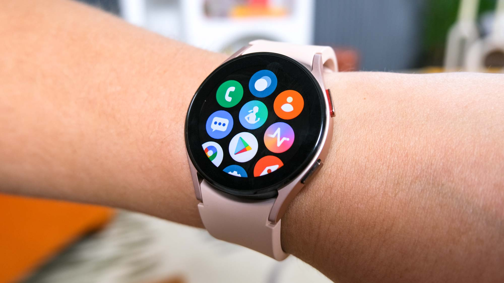

Samsung has been at the smartwatch game since 2013, starting out with their Galaxy Gear which was initially criticised for its poor battery life, half-baked notification system, and uncomfortable strap. They've come a long way since then, with their latest model as of February 2022 being praised for its power & speed, its bio-sensing capabilities, and sleek looks. Samsung smartwatches have been known in the past to incorporate a rotating dial to complement their touchscreens. With a device as small as a smartwatch, a certain degree of tactile interaction is a must as it can streamline the often myriad of swiping motions required to peform repetitive actions like switching between apps or scrolling down a menu. 

Galaxy watches up until recently have run their own custom firmware called Tizen, based on Linux. It's been a competent alternative to WearOS, which had been more or less left by the wayside to collect dust until Samsung came around and offered to help redevelop WearOS using Tizen code. Tizen has been criticised for being "riddled with serious security vulnerabilities" [#]_ in a 2017 article detailing an Israeli security researcher's work into investigating the Tizen firmware that was shipped with their new smart television. Considering this operating system had been in development since 2013, and constrasting these comments to Apple's relative strength in the security/privacy area, this paints these devices in quite a dim light. Recently, Samsung and Google have started working together to merge the floundering WearOS and Tizen codebases into something hopefully fresh and new - and the result can be seen with the Galaxy Watch 4.

The construction is similar to the Apple Watch, with robust and sleek aluminium utilised with the vibrant AMOLED display. The trademark hardware rotating bezel is gone in place of a virtual solution actuated by rotating the finger around the bezel. This would be difficult with gloves on or in rain. The Galaxy Watch 4 comes in two different sizes to cater for all shapes and sizes of wrist - a possible solution for INKI could be to utilise a display in the middle range of what Samsung is utilising in their watches.  

One quite annoying drawback is that Samsung has chosen to reserve several features for Samsung phones only, which seems like a slightly petty (albeit understandable) move to encourage smartphone sales, which could be driven by concerns about profit margins. 

To conclude - fairly solid device using Samsung's own custom silicon with questions surrounding the future of its software support. 

Fitbit Sense
************

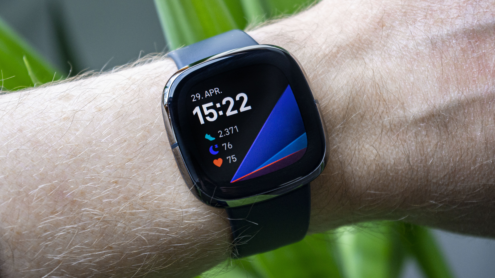

The Fitbit Sense is an interesting piece - it's Fitbit's flagship model at the moment. It's the first Fitbit to monitor your stress using electrodermal activity, which has been used in fraudulent looking [20]_ products in the past to supposedly diagnose and treat illnesses but here is only being used as a stress indicator [21]_. 
It has an attractive square design with rounded corners and a clear, vibrant display much like the other watches we've analysed so far. There's ample customisation with regards to the watch - changing the watchface and changing the physical strap is straightforward. Aluminium is used throughout the construction of the watch module itself, the straps are offered in various materials ranging from leather & nylon, to steel and sillicon. This all looks very promising. 

Multiple reviewers have stated how comfortable the watch is once fastened, this is a great step in the right direction. There's a physical haptic button, meaning the button doesn't actually press down, rather it uses vibration technology to emulate the feeling of the button being pressed much like on the newer Apple devices. This is still much better than not having any buttons at all and would undoubtedly improve water resistance. 

There is support for 3rd party apps, while the app selection is more limited compared to Apple there are still some highly useful applications like Spotify, Pandora, Starbucks, Uber, and quite a few great looking apps from independent developers. 

The only drawback here is the battery life - with light usage this is around six days, but drops drastically during GPS tracking and if the display is left in "always on" mode. To conclude, this is a really interesting device that gets a lot right, but the app selection and battery life could be a little better. It still destroys the Apple Watch and Galaxy Watch in the battery life department though. 

.. [20] https://www.ncbi.nlm.nih.gov/pmc/articles/PMC6140073/
.. [21] https://www.healthline.com/health/fitness/fitbit-sense
.. [22] https://gallery.fitbit.com/apps

Garmin Venu
***********

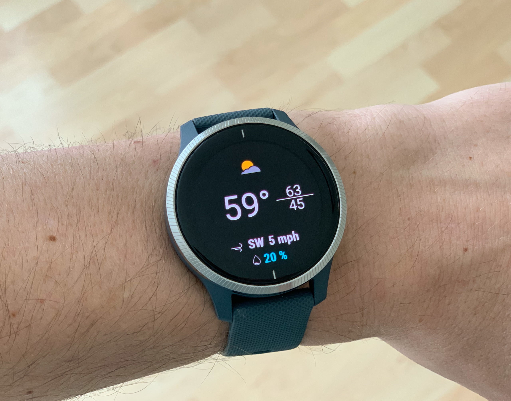

The Garmin Venu has built upon Garmin's Vivoactive 4, replacing the traditional power-saving transflective LCD with a bright & vibrant AMOLED display.
One criticism of the physical design is that it might look a little generic, which in my opinion has some basis. Garmin watches typically have quite a distinctive look, but this model does struggle a little in differentiating itself from the competition [#]_ [#]_. 

Garmin is generally known for their unrivalled fitness tracking - they've recently started orienting more of their products towards the "techie" smartwatch market, and they seem to have done a reasonably good job of it. The Garmin offers music storage and playback, physical buttons for maximised usability in the rain, and a nice gesture based navigation. Garmin doesn't rely on WearOS for its core functionality, they have their own in house operating system that's shared across most of their devices and is part of why the battery life is so much longer. The Garmin has been criticised a little for some UI sluggishness, this might be down to the graphics stack not being designed to cope with the demands of a full-colour high resolution display, or it could simply have slower hardware to maximise battery life. 

Either way these are minor nitpicks, the watch has highly accurate heart-rate monitoring and blood oxygen monitoring which can be supplemented by an external BLE/ANT+ chest strap and can make predictions about stress levels, respiration rate, among others. It can then use this data to guide users through tailored deep breathing and meditation exercises, similarly to how the Apple Watch does things. It's well executed and useful. 

To summarise, this is a fairly decent competitor to the other watches, if it is let down a little by the design, UI ease of use, and 3rd party app library compared to the Apple Watch. 

.. [23] https://www.techradar.com/uk/reviews/garmin-venu
.. [24] https://www.garmin.com/en-GB/c/wearables-smartwatches/

OnePlus Watch
*************
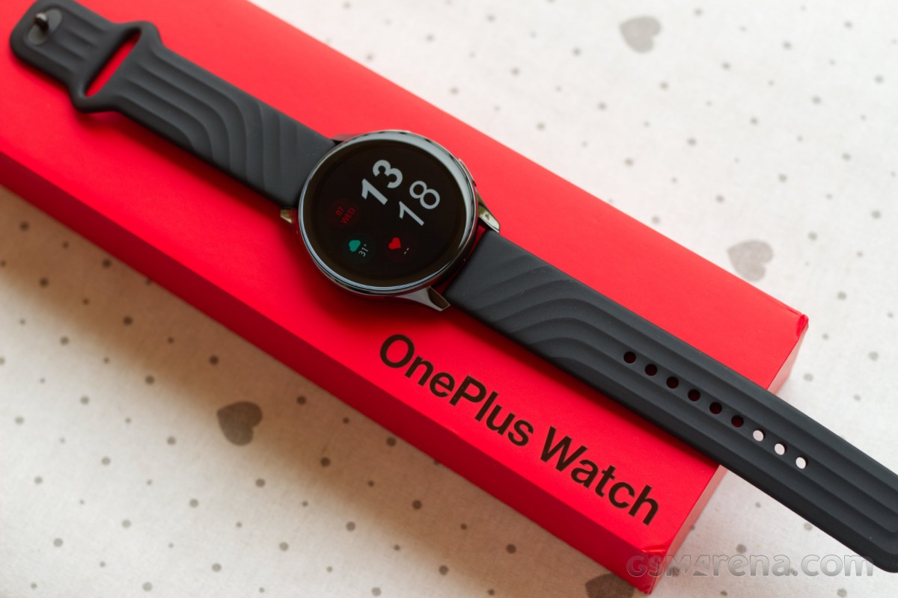

The OnePlus Watch has taken a similar approach to its smartwatch to Garmin and Fitbit in designing its own custom operating system to maximise battery life instead of using WearOS. 
The casing is refined and hits above its price point, but it's quite large at 46mm, perhaps excessively so for consumers with smaller wrists. There's no always-on-display which is understandable to save power, but since AMOLED displays are supposed to be reasonably low-power I don't quite understand why this functionality has been omitted. It also doesn't really differentiate itself from the population. [25]_
There are also concerns about bugs [26]_ in the companion app and some odd design choices on the watch firmware - particularly the "quick reply" functionality for messages which is limited to just 4 choices which do not appear to be changeable. Additionally, emojis in text messages aren't shown which seems like a bit of a waste for the beautiful 454x454 display. Some of these issues have been addressed in a firmware update, but what matters here is why the watch was released without these amenities in the first place. 

On the other hand, the sensors appear to be accurate, meauring heart rate and oxygen level more accurately than competitors at the same price point. The OnePlus Watch's main limitation is the complete lack of third party app support, which relegates it to competing with budget offerings by companies like Amazfit, Xiaomi and Huawei. The existing functionality is okay, but in this case I feel it is not worth trading a long 14 day battery life for 3rd party app support. 

.. [25] https://www.wired.co.uk/article/oneplus-watch-review
.. [26] https://www.notebookcheck.net/OnePlus-Watch-in-review-There-are-still-some-teething-problems.532699.0.html

Takeaways & Fate of WearOS
++++++++++++++++++++++++++

It seems that the smartwatch market isn't quite being taken as seriously as it could be, especially on the Android side of things. In conjunction with the state of WearOS, Qualcomm had let the smartwatch market collect dust from 2016 by simply not releasing any new SoCs for over two years. Not just that, their "flagship" smartwatch SoC was based on Qualcomm's flagship offering on the 28nm node, which would have been produced sometime in 2013 [27]_. Smaller transistors require less power to actuate, benefit from lower leakage current, and are typically more efficient, which contributes to significantly lower power consumption with zero loss in performance. From this follows reduced cooling requirements (only really relevant in full-blown smartphones or personal computers), and extended battery life (universally relevant!). It therefore makes sense that smartwatches should benefit from the smallest node available to Qualcomm, not be left to collect dust for 2 years on an already 3 year old node. 

Apple and Samsung have their own processor design programs that allowed them to dodge this stagnation and provide their teams with newer, faster, more efficient SoCs year on year to claim first and second place in the smartwatch market - this would be fine bar the fact that Samsung uses Tizen for their watches, and Apple uses their own watchOS. They do not rely on WearOS! This could very well have been a factor in WearOS's decline and decay. Even in this situation, there are always optimisations and new features that can be carefully evaluated and added to a watch even on older SoCs without jeopardising the user-experience or perceived responsiveness. 

All this makes me wonder what a fresh look at the problem might give, and how things might be different if more care was given to this exciting sector. We need to rethink what makes a smartwatch a smartwatch, we need a paradigm shift from trying to add feature after feature and instead try to make something really robust that works, gets out of the way of the user, and lets them live their life to the fullest. What if phones, tablets, smartwatches came with automatic distraction-management strategies? What if we eliminated inconvenient forced updates that people don't want, what if our devices worked more as tools for us to do great things?

This is what I want to try and address with INKI. 

Consumers are looking for longer battery lives not just in low-power modes confined to telling the time, but in actual use-cases where much of the cool and useful functionality of the watch is being leveraged and utilised - like LTE, GPS, and workout tracking. Consumers are increasingly concerned about privacy and security, which the Apple watch handles rather well. The health monitoring features of a smartwatch are undoubtedly a major selling point, so standalone GPS functionality would look increasingly attractive. All of these we can begin to establish and formalise with the Key Proposed Considerations. 

Key Proposed Considerations
+++++++++++++++++++++++++++

All the watches I analysed were made by large companies with huge engineering teams driving the software development, meaning that while INKI will not be able to do everything, there are some core functions that I'd like to explore and investigate throughout the course of the project. 

* Efficient BLE communication protocol \- As the watch's hardware is relatively diminutive with respect to current offerings, it will be reliant on a connected phone for certain features like navigation or music playback. This means a fast, low latency communication protocol will be needed for optimal user experience.
* Heart Rate Monitoring \- All of the leading smartwatches analysed earlier offer periodic heart-rate monitoring, so this will be a must-have mainstream level feature. Heart rate monitoring is useful as abnormal heart rates or rhythms could be easily detected, potentially saving lives. Energy statistics can also be approximated from heart rate and fitness information, ideal for fitness/health conscious people. 
* Comprehensive Security \- Security has been a subject of contention in the IoT world for some time now, and is often one of the greatest weak points of otherwise brilliant, cheap hardware. With the nRF52840's integrated AES and stream ciphers (on-the-fly encryption and decryption of any exfiltrated data via serial ports or external memory interfaces), this is most certainly a key requirement or at least consideration during the NEA. [28]_
* Accelerometer \- Most watches employ "raise-to-wake" functionality, where the SoC receives an interrupt with a specified gesture (i.e raised, tapped) and can begin responding to the user's input. INKI will instead utilise "always-on-display" due to the characteristics of the electrophoretic display, but will still need to know when to wake up. This component is also used for counting steps, a basic feature of most modern smartwatches. 
* GPS \- This is rarer on smartwatches, GPS allows users to track their own activity and estimate distance walked or ran. This is a key feature as it opens many doors to exciting software ideas (offline maps, way-point navigation, taxi hailing) and is quite easy to implement on the hardware side. 
* Touch and button responsive UI \- a key frustration with my own Xiaomi Mi Band is that capacitive touch technology functions erratically underwater, often causing the workout to prematurely interrupt. By combining physical button and touch inputs, the user interface will become far less prone to ghost touching and involuntary inputs. This will be particularly critical as the watch's display has a slow refresh rate of ~300ms, so ghost touching could get irritating very quickly. I will also have to consider the physical button location carefully to avoid actuation on wrist contraction. 
* Companion Android app \- this will manage BLE communication with the watch, handle offline processing, and allow the user to view metrics such as heart rate, calculated sleep time, and workouts. 
* Efficient Data Storage \- The watch's SoC only has about 1MB of flash which has a limited endurance (10000 erase cycles per page) and forces the CPU to halt when erased or written to, so I will need to employ an efficient external QSPI data storage medium and protocol for all the user's data. 
* Notification support \- The user should be able to see their notifications on the watch, but there will likely be a watch-side blacklist to help users stay in control of what notifications they'd like to receive, helping them focus on what really matters to them. 

Most functionalities like taxi hailing, navigation, sleep calculation, can be implemented later on in software updates once these core building blocks are in place if we utilise a modular construction. 
For example, navigation can use the BLE protocol to request route data from the phone, then use GPS to prompt the user where and when to turn via the notification stack. Or taxi-hailing can make a API request over HTTP via the BLE link, have the phone relay back data with BLE, and use notifications to notify the user of different events happening with respect to their taxi.

Proposed Software Architecture
++++++++++++++++++++++++++++++
Where possible, we want to minimise code repetition and keep code easy to debug in a complex RTOS environment. By segregating functionality into loosely coupled modules and objects, a far cleaner program flow can be established through direct, tightly defined, and highly deterministic APIs. 
Targetting C++ would be ideal for its fully featured OOP support with access-modification, encapsulation, polymorphism, and multiple inheritance, allowing the construction of highly sophisticated and exciting programs [29]_ . It would provide better access over the hardware, as Python typically requires handwritten inline assembly or C/C++ backend code to access registers. Additionally, Python suffers from significant run-time overhead in terms of CPU and memory - with a platform as relatively constrained as the NRF52, it will be critical to harness as much performance as possible. Other languages like Rust can be used with microcontrollers, but since I already had some prior experience with C++, I decided to use it. This would also allow me to forgo the powerful OOP, templates, and work at a very low level by stepping down a rung to C, something that would be comparatively quite difficult with Rust. 

The nRF52's PlatformIO + Arduino framework already exposed some of the documented functionality of the chip and its peripherals - some deeper inspection within the framework files revealed it was built upon the nRFx standard driver libraries which are "RTOS-agnostic"[30]_. This means they are not optimised specifically for a particular RTOS, or even RTOSes in general, meaning they can be used standalone without an RTOS to build a more traditional Arduino style application. [31]_ Which leads us onto the discussion of RTOSes and bare metal applications. 

Bare Metal vs RTOS
******************

A Bare-Metal device typically hosts a singular application dedicated to a very specific set of functions. For example, the microcontroller driving your oven, the lights on your bicycle, or the doors of your car have a very specific job to do. There are a small number of possible states that the programmer writing the firmware is well aware of while writing the software. In these scenarios, while a microcontroller is invaluable and absolutely a necessity, there is no need for the microcontroller to ever run a different program at will. There is no need for security, app-loading, multi-threading, because they only need to do one thing - unlocking/locking the door, blinking the light etc...
This type of application typically has free-reign over the hardware, which can be risky when manipulating registers directly as one really needs to get to know the hardware to avoid making disastrous mistakes, but at the same time the total control makes for a far more deterministic and hence more easily debuggable application. Any bugs that occur are then totally within your command, and hopefully highly fixable!

An RTOS changes things quite a lot for our humble little microcontrollers. It gives them the boon of multi-threading, allowing them to do multiple things at once. They can react to new events, they can start and stop tasks at will, they can behave quite a lot like a full-blown OS we are used to seeing on our smartphones and laptop/desktop computing devices. RTOS frameworks typically have fairly comprehensive driver bases, much like Linux, so can facilitate development of reasonably portable code that can be built and flashed onto many different kinds of MCU. This can be a game changer with more complicated microcontrollers like the nRF52 series, STM32 and other high-end Cortex M7, where writing code from scratch to control complex periperhals like graphical acceleration or on-chip TCP/IP infrastructure could take months of effort that could be dedicated towards developing kickass applications.

This table summarises some of the differences between Bare Metal and RTOS:

+-------------+--------------------------------------------------------------------------------------------------------------------------------------------------------------------------------+-------------------------------------------------------------------------------------------------------------------------------------------------------------------------------------------------------------------------------+
|             | Bare Metal Application                                                                                                                                                         | RTOS Application                                                                                                                                                                                                              |
+=============+================================================================================================================================================================================+===============================================================================================================================================================================================================================+
| Pre-emption | Possible using interrupts and interrupt priorities but with far higher latencies than an RTOS due to relying on hardware interrupt switching [32]_. Orders of magnitude slower.| Easy and efficient - based on software scheduler rather than hardware-based interrupts.                                                                                                                                       |
+-------------+--------------------------------------------------------------------------------------------------------------------------------------------------------------------------------+-------------------------------------------------------------------------------------------------------------------------------------------------------------------------------------------------------------------------------+
| Effort      | Bare metal can be time-consuming due to direct hardware access and the need to build up applications from the register level but somewhat straightforward to work with         | Easier to work with but phantom bugs can be introduced through the non-deterministic nature of RTOS execution.                                                                                                                |
+-------------+--------------------------------------------------------------------------------------------------------------------------------------------------------------------------------+-------------------------------------------------------------------------------------------------------------------------------------------------------------------------------------------------------------------------------+
| Reusability | Bare-metal modules can work together with a modular construction but a lot of things will be re-implemented - like reinventing the wheel                                       | Possible and even encouraged with RTOSes utilising strong build environments like CMake in conjunction with ninja. RTOSes have fairly comprehensive driver support for a wide variety of peripherals reducing time-to-market. |
+-------------+--------------------------------------------------------------------------------------------------------------------------------------------------------------------------------+-------------------------------------------------------------------------------------------------------------------------------------------------------------------------------------------------------------------------------+
| Resources   | Bare-metal has no overhead bar the code that the developer writes or any external libraries utilised                                                                           | RTOS has some light overhead with the scheduling aspect but far less than a full-blown operating system.                                                                                                                      |
+-------------+--------------------------------------------------------------------------------------------------------------------------------------------------------------------------------+-------------------------------------------------------------------------------------------------------------------------------------------------------------------------------------------------------------------------------+

|
|
|
|

Considering a smartwatch has a lot to juggle - sensor algorithms and parsing, data transfer, user-input, and a pretty GUI, an RTOS makes quite a lot more sense than a standard bare metal application. Enough of the foundations will be laid for us to prevent re-inventing the wheel and wasting precious time during the NEA, but we'd in theory still have the freedom to take the code in whatever direction we like. The folks over at Adafruit chose to integrate the nrfx drivers with FreeRTOS, a very common and well-reputed choice [33]_ - so we know we're in safe hands. We can start to draw up a basic architecture diagram of things we'd need to consider. 

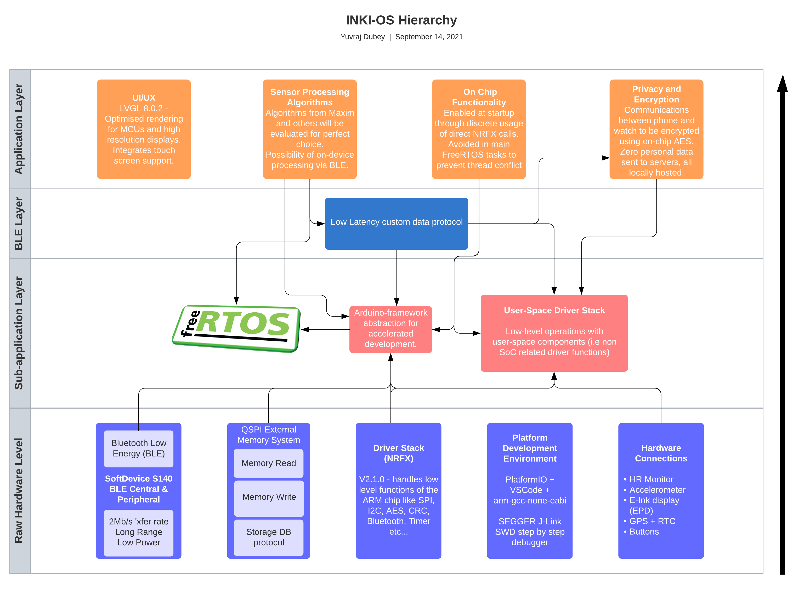

Almost immediately we can see a layered topology revealing itself. We have low-level code and modules, that will interface with some middle layer code - in this case Adafruit's Arduino framework, FreeRTOS, and the User-Space driver stack that we will end up implementing. This driver stack would contain code to drive the various peripherals connected to the nRF52840 - like the display / display backlight, sensors, and charging circuitry. 
Then we have the communications layer, where we have our communication protocol that will build on top of the Adafruit BSP and User-Space driver stack, but then in turn be used by the top level application code.
The application code is where things start getting interesting. We can start implementing code here that builds upon all the previous layers that goes on to perform the functions of a watch. 

|
|
|
|
|

Now within the top application code layer there will be many other layers, especially if we will be working with an RTOS. We can see this in the below image:

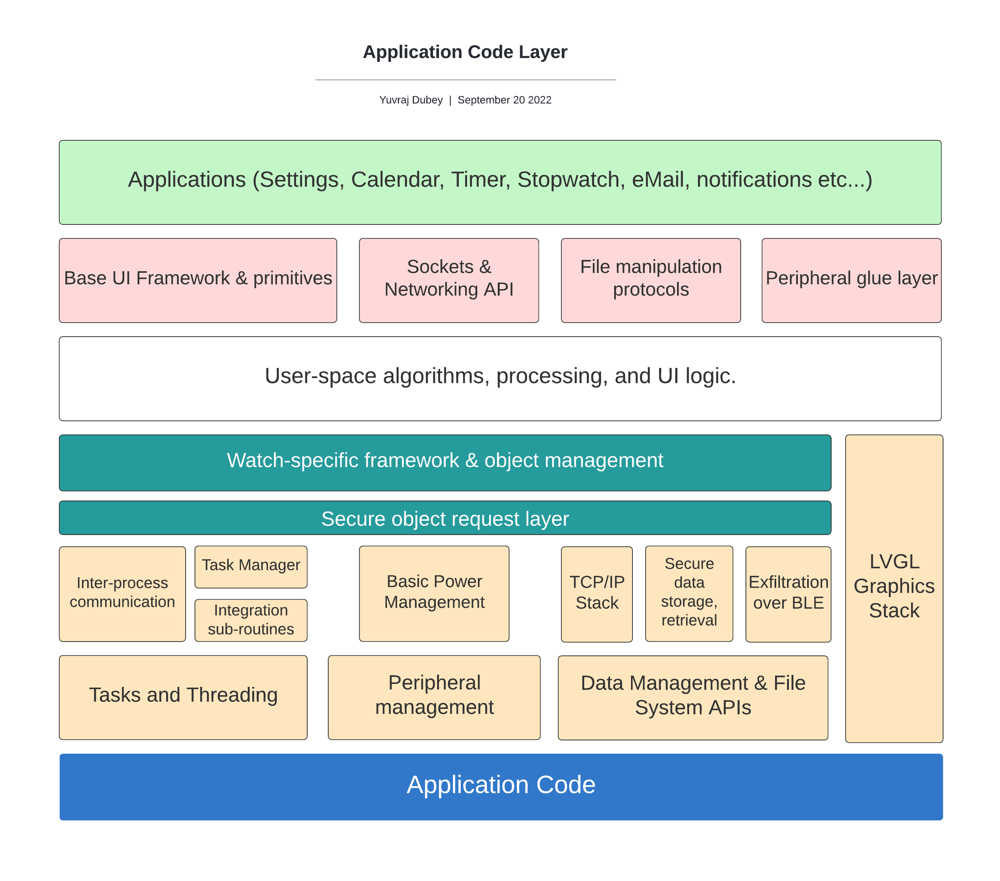

In this image, we can see the different layers going from the bottom up. We'll need filesystems, TCP/IP stacks, Inter process communication, and a robust graphics library. I decided to use LVGL after seeing their extremely impressive user demos on highly resource-constrained devices [34]_ (i.e perfect for my application!) and their excellent documentation [35]_. The issue with a project of this nature is that much of the implementation will inevitably be device or platform specific. I have never done anything like this before, I will be learning everything from scratch, and then trying to write an operating system. This is another further justification for the overwhelming argument that I should use an RTOS. In an RTOS, the tasks & threading, data management & file system APIs, TCP/IP, sometimes power management and very rarely comprehensive memory protection with built in MPUs (memory protection units) & inter-process communication is already implemented, providing some breathing space and allowing the differentiating and really important code to be started as soon as possible. There are more benefits of an RTOS appraoch - since drivers already exist for a plethora of chips, it is possible to write highly portable code that can be easily ported to multiple platforms in the future. This would accomodate hardware upgrades much more easily, not just processor-wise but if I manage to 

With this, we can begin constructing a design plan for the software modules that need to be implemented and constituent libraries, classes, sub-classes, methods that might be required.

Some elements on the architecture diagram may be beyond the scope of the NEA, most notably the "User-space app SDK" as this will not be necessary to obtain a MVP (minimum viable product) and may be incredibly challenging to implement in the first place. Additionally, it is yet to be determined
whether AES encryption is sufficient security, or whether INKI will also need to employ address changing tactics to avoid a Man In The Middle attack, where a malicious device fools both the phone and the watch to connect to it instead of the real devices [36]_. It turns out that BLE 5.0 (the version nRF52 series uses) has no security updates since version 4.2, so the DigiKey article is still very much relevant [37]_.

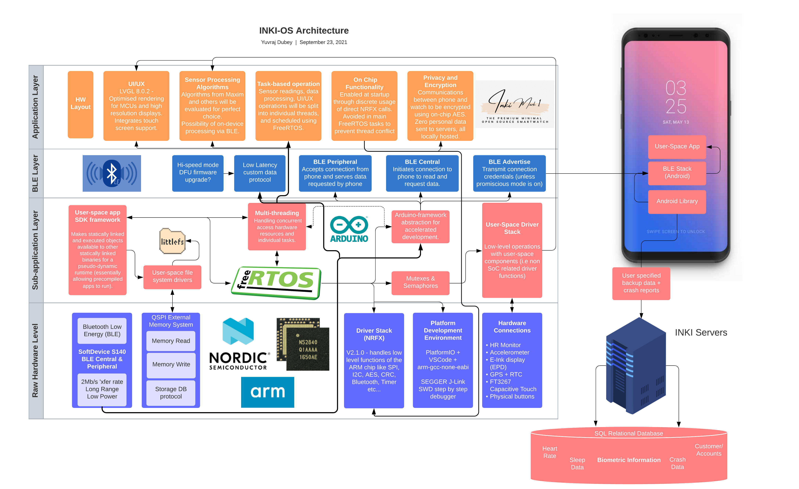

Key Objectives
++++++++++++++

After this research & consideration, I've come to the conclusion that the best way to try and achieve all this functionality would be through a custom RTOS-based firmware. The Nordic nRF52 is not equipped with an MMU, which is necessary to run fully fledged operating systems like Linux, but this is actually a good thing as it'll help cultivate the development of an ultra low power system that can still do much of what the devices on the market today can do. 

My key objective for the NEA is to design and partially implement a complete RTOS-based firmware for the Nordic nRF52/nRF53 series of Bluetooth Low Energy SoCs, which is fully capable of running 3rd party applications all while cutting power consumption to the bone. 

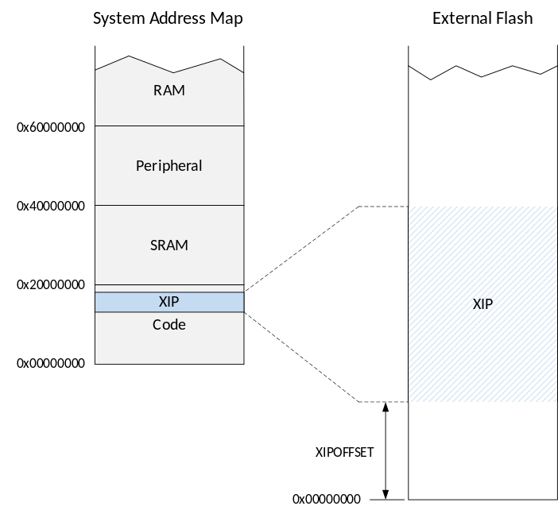

The Nordic nRF52/nRF53 is known for having decent performance [38]_ with some of the lowest power consumption figures on the market - the nRF52832 is particularly popular [39]_, but its big brother (nRF52840) has far more memory and flash, which will be needed to create an effective user experience. Most of the watches I've analysed have gigabytes of storage, what will allow us to compete is the nRF52/nRF53's ability to map an external storage chip connected via QSPI (quad SPI, essentially SPI but with four lanes) into its unified MCU address space. 

This provides us with over 128MB of addressable memory for apps, user data, and potentially bits of the firmware. I have no doubt that a well-optimised RTOS-based firmware minimising the use of heavy external libraries will comfortably fit and provide a great user experience.  

|
|
|

.. [#] https://www.thelightphone.com/about-us
.. [#] https://www.microchip.com/en-us/product/ATmega32U4
.. [#] https://www.techradar.com/uk/news/wearables/best-smart-watches-what-s-the-best-wearable-tech-for-you-1154074
.. [#] https://www.amazfit.com/en/bip
.. [#] https://www.tomsguide.com/uk/us/smartwatch-buying-guide,review-3360.html
.. [#] https://www.engadget.com/best-smartwatches-153013118.html
.. [#] https://www.t3.com/news/best-smartwatch
.. [#] https://www.vice.com/en/article/xy9p7n/samsung-tizen-operating-system-bugs-vulnerabilities
.. [27] https://arstechnica.com/gadgets/2018/02/android-wear-is-getting-killed-and-its-all-qualcomms-fault/
.. [28] https://www.securityweek.com/iots-importance-growing-rapidly-its-security-still-weak
.. [29] https://www.ko2.co.uk/advantages-disadvantages-of-c-plus-plus/
.. [30] https://developer.nordicsemi.com/nRF_Connect_SDK/doc/latest/nrfxlib/softdevice_controller/doc/softdevice_controller.html
.. [31] https://github.com/adafruit/Adafruit_nRF52_Arduino/tree/master/cores/nRF5
.. [32] https://www.digikey.com/es/articles/real-time-some-notes-on-microcontroller-interrupt-latency
.. [33] https://freertos.org/RTOS.html
.. [34] https://lvgl.io/demos
.. [35] https://docs.lvgl.io/master/intro/index.html
.. [36] https://forum.digikey.com/t/a-basic-introduction-to-ble-4-x-security/12501
.. [37] https://www.bluetooth.com/wp-content/uploads/2019/03/Bluetooth_5-FINAL.pdf
.. [38] https://predictabledesigns.com/review-of-bluetooth-low-energy-ble-solutions/
.. [39] https://www.nordicsemi.com/Products/nRF52840

Requirements Specification
**************************

With all the information and research we've done so far, we can finally draw up a final requirement specification table which we can refer back to during the design and implementation phase of the project of things that we want to achieve or at least think very carefully about for the scope of the NEA.  

.. figure:: investigationrequirements.png
    :width: 75% 
    :align: center
    :alt: "core, nice to have, and extension table of requirements"

There are several things here that I hope will differentiate INKI from the crowded population of competitors in the smartwatch market. Firstly, by designing the project around an ultra-low-power MCU not designed to run Linux, power consumption will be extremely low. At full load, with a 500mAh Lithium-Polymer battery, an nRF52840 would last for over six days [40]_, and it has a built in BLE radio! In reality, the microcontroller would be asleep for most of the time, so a 30-day battery life is entirely possible. 
Secondly, the Electro-Phoretic display is highly unique and unusual for a smartwatch - there have been attempts at this but they have been treated more as smarter mechanical watches rather than smartwatches. They've been relegated to the simplest duties of telling the time and notifications, but an EPD's partial refresh can complete in under 300ms, and nowadays full refreshes in under a second. It'd be an experience entirely akin to using a Kindle Paperwhite or equivalent EPD e-Reader as they use the same technology and the same partial refreshing trick to maximise usability.

|
|

Thirdly, the quirky display (which will most likely be square for higher resolution and real-estate) could give rise to some really interesting and elegant design language, like the Sony FES U which never really took off. 

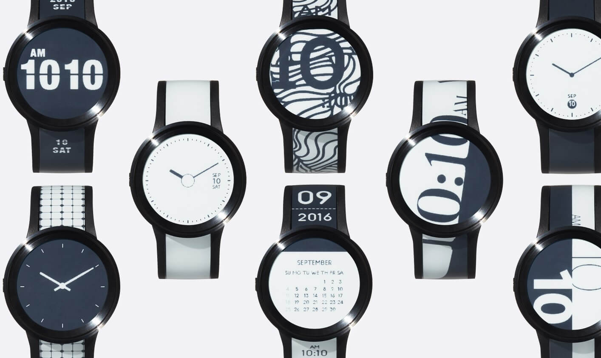

This was the main criticism of the OnePlus Watch and a minor nitpick on the Garmin Venu - both those watches didn't quite do enough to differentiate themselves. Something like this or something completely different, thinking carefully about the end casing design and incorporating the slowness of the EPD as a feature rather than a drawback trying to be worked around will be critical if this product ever stands a chance on the fierce and competitive smartwatch market.   

.. [40] https://infocenter.nordicsemi.com/pdf/nRF5340_OPS_v0.5.pdf

Development Path
++++++++++++++++

This is the projected course of development throughout the NEA.

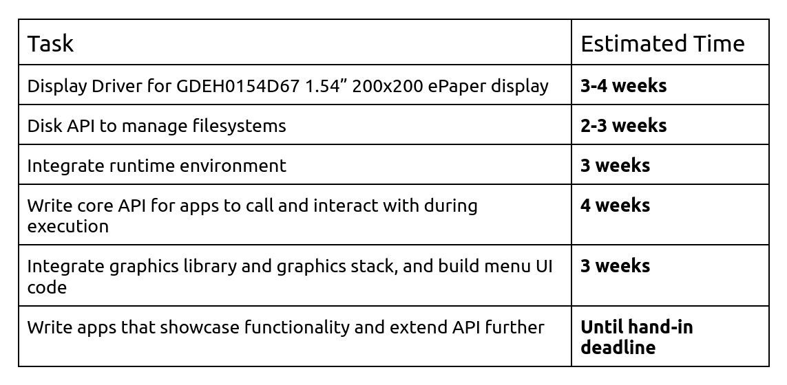

The Design 
==========

Disk API
--------

Mounting
++++++++

First, I needed to start with the disk API, which would be responsible for higher level management of filesystems at init time. Different filesystems turned out to have different initialization code, so I need to construct a neat API that would abstract all of this away, which would allow the system to dynamically recognise and mount new filesystems (that it knows how to mount of course!).
Here is a UML diagram explaining how the main objects interact with each other. 

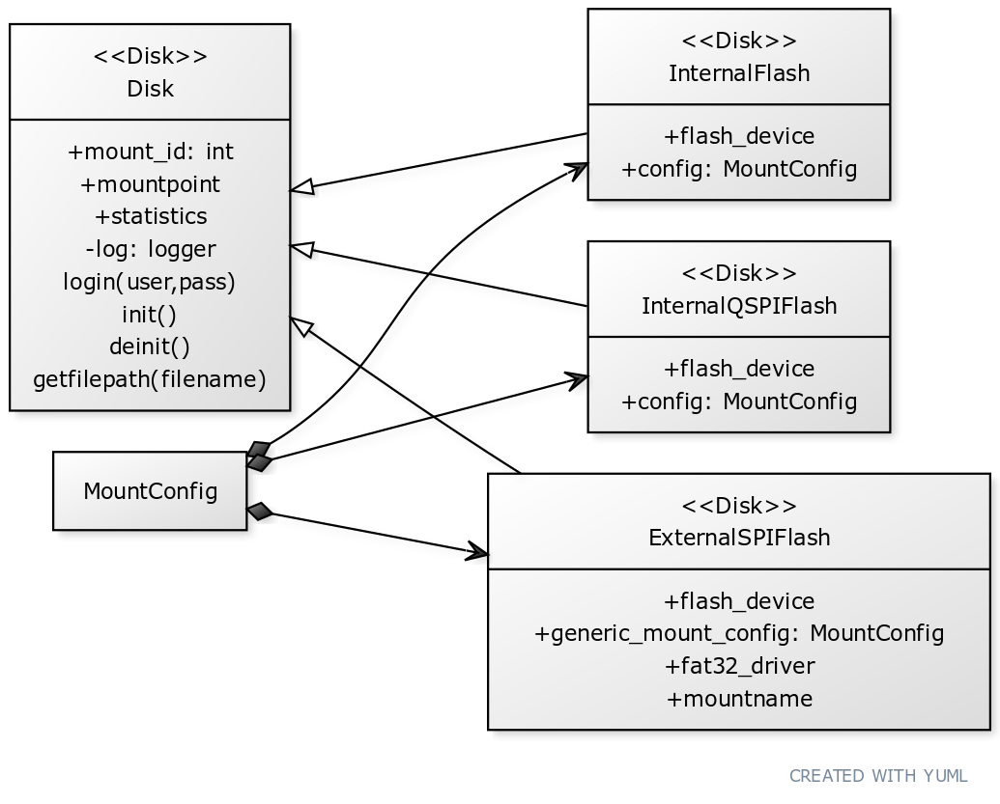

MountConfig is a struct in C that contains some parameters like the type of filesystem, mount point, corresponding devicetree binding, and filesystem specific parameters. In our case, we hardcoded MountConfig's parameters for InternalFlash and InternalQSPIFlash, as we know they must use a specific defined filesystem. 
For this application, I chose to use LittleFS as it offers built-in wear levelling which would be critical to the long-term endurance and life-cycle of the product. The flash memory embedded inside the nRF52/nRF53 series and even the external QSPI flash have a limited number of write operations, meaning that after some time the contents of the flash can no longer be trusted and the device is effectively rendered useless. 
On top of this, it offers bounded RAM usage on file traversal, which will be critical for our memory constrained [41]_application, and is incredibly resilient to faults and power-losses. It fits all our constraints perfectly. 
There are some other alternatives, like SPIFFS and FATFS (FAT32). SPIFFS is an older filesystem which has been superseded by LittleFS - LittleFS can write a file 8 times faster than SPIFFS, read a file 5 times faster, format 500 times faster, and mount 60 times faster [42]_. For an application that needs to eek as much speed and performance out of the resource-constrained hardware, LittleFS is a no-brainer. FAT32 is similarly destroyed by LittleFS, it is unsuitable for systems that might have random power failures (hopefully that won't happen too much with a smartwatch, but there's always a risk during software upgrades!) as it gets corrupted very easily [43]_.

The LittleFS initialisation routine is not overly complex - we can see this in the below image:

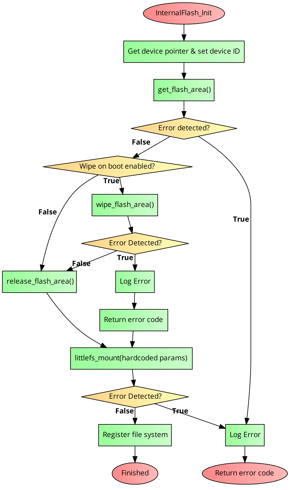

It is critical to check for errors at every stage to avoid system instability and avoid wasting CPU cycles in executing pointless subroutines due to a prior error condition. 

Since both the internal and QSPI flashes use LittleFS, this initialisation code can be reused - saving code duplication and reducing binary size. The unmounting routine is very simple, it calls the filesystem specific unmount and checks for an error. The point of having a formal disk API layer of abstraction above the RTOS's inbuilt filesystem support is to keep all additional objects and support methods necessary for maintaining different kinds of filesystems in one object. The internal and QSPI flashes will have differing setup parameters, it'd be a great idea to abstract it away to allow apps further on to use these routines and objects.

Finding Files
+++++++++++++
I have also designed an abstraction layer for file traversal and finding, as different filesystems may have different properties (i.e some may not support directories or require a unique algorithm to iterate through) that need to be taken into consideratino while trying to look for a file and/or retrieve it. This algorithm executes recursively as at this point I had not designed a stack. I quickly discovered I needed one, but since we will not be storing many files on the filesystem, a recursive approach is probably fine. 

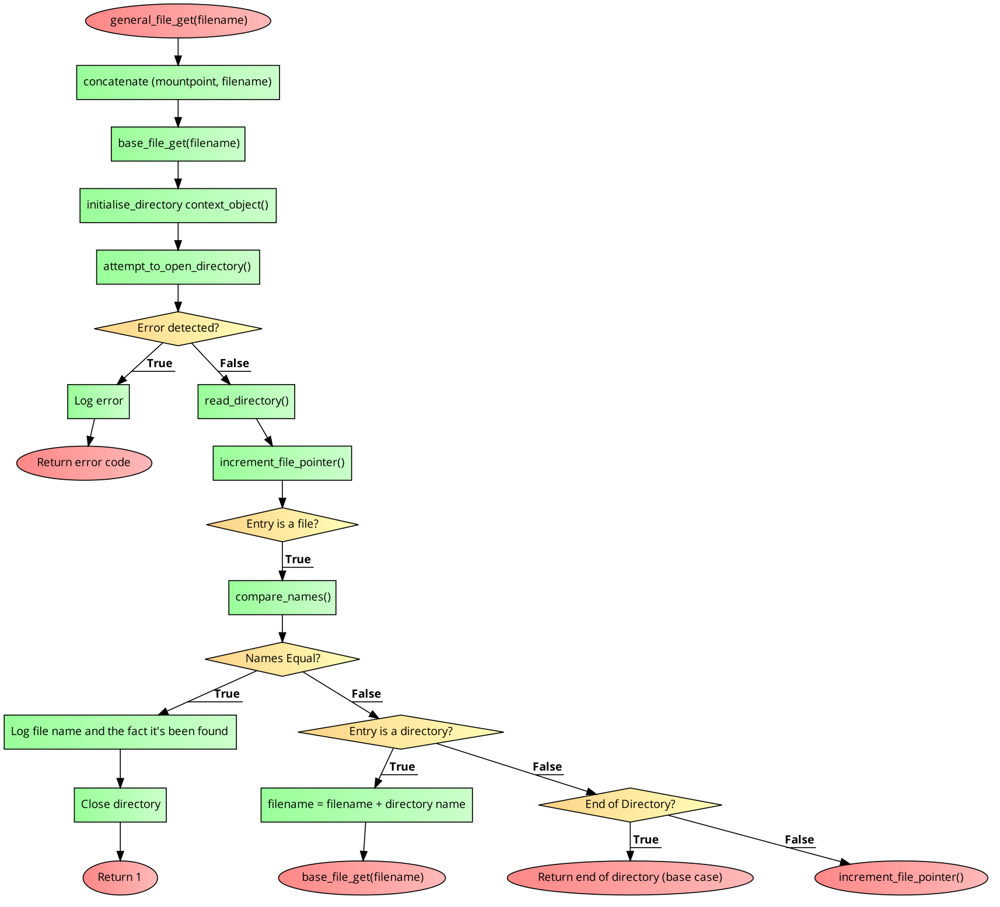

At the next recursive function call, the algorithm will check to see if the file has been found by using an internal boolean variable - if it is true then the program will come out of the stack directory by directory, and the value of the boolean variable can be evaluated to ensure the file does indeed exist. 

Hardware Interface
++++++++++++++++++
The Disk API needs some way of knowing what devices should be permanently connected to the system, and which devices might be connected later on. The nRF52/nRF53 series' USB controller does not support host mode, meaning it cannot mount a USB stick by itself for instance. This is not much of a limitation for the project however, as USB sticks are understandably not used with smartwatches. Even for mass data backup and/or exfiltration, the nRF52/nRF53 SoCs' BLE link will be utilised instead. 
What might be worth supporting is an external SD card for music streaming & storage, and/or other large data. 

nRF52/nRF53 series has several RTOSes to choose from, FreeRTOS and Zephyr to name a few. For reasons I will explain in detail a little later, I dumped FreeRTOS and took up Zephyr which has an innovative Kconfig + devicetree build system, which works much like the mainline Linux kernel albeit with some syntactical differences. This is brilliant, as we're moving towards robust, tried & tested industry standard approaches to device enumeration rather than shoving in a library every time. Some interfacing is required to connect with the filesystem nodes on the devicetree, and typically devicetree partitions have to be defined from scratch. 

See the hierarchy diagram below to see how all this fits together:

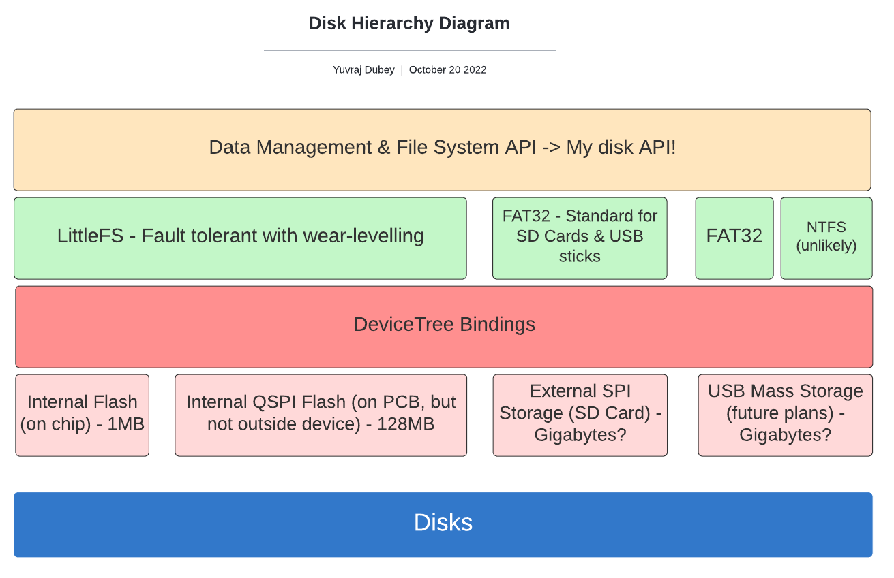

.. By far the most difficult part of this was working with Zephyr's build system, trying to decipher the cryptic texts of CMake build files and figuring out the correct device-tree binding methods. Once all that was in place, the actual implementation was fair (reserve for post module implementation evaluation)

EPD Display Driver
------------------
The EPD Display Driver is necessary to interface with the GDEH0154D67 eInk display that I intend to use - it's responsibilities are transferring binary image data stored in memory buffers to the EPD's internal framebuffer, before instructing the EPD to update itself and thus display the new image. 
Where possible, I will treat the display itself as an object in code, to which I can apply specific definitions of generic methods and thus introduce modularity, reusability, and extensibility. 

Initialisation
++++++++++++++
The display drivers will be very hardware specific, so I will need to consult example code from the manufacturer of the display (GoodDisplay), and the datasheet to ensure that the initialisation routine is correct. The display interfaces with the application core over a communication protocol called SPI (Serial Peripheral Interface). The principle behind SPI is similar to that of UART (Universal Asynchronous Receiver Transmitter), but alleviates issues regarding speed negotation and uncertainty of when data will be transferred or received by introducing a shared clock signal that instructs each peripheral/component when to sample the serial bus for data. 

Implementing SPI in silicon is significantly easier than UART, as the receiving logic doesn't need to asynchronously decode data. With more advanced ARM MCUs equipped with Programmable Peripheral Interconnects, it is possible to emulate SPI using the GPIO peripheral to raise interrupts and autonomously service them using counters and memory buffers. Because the decoding logic is simpler, you'll typically get faster data transfer rates which is ideal for a display. With an eInk display which can only display two colours, SPI can make for some excellently efficient transfer times with far less GPIO pins used compared to a parallel display interface. [44]_

4 Grayscale Mode
++++++++++++++++
After some email exchanges with the lovely folks over at GoodDisplay in Liaoning, China, I managed to get my hands on a GDEH0154D67 display with integrated touch panel. The special thing about this display was that it was possible of displaying an extra 2 colours using an in-house developed waveform (what they represent are closely guarded trade secrets, but the binary generated waveforms are safe) and a little hack on the display controller. 

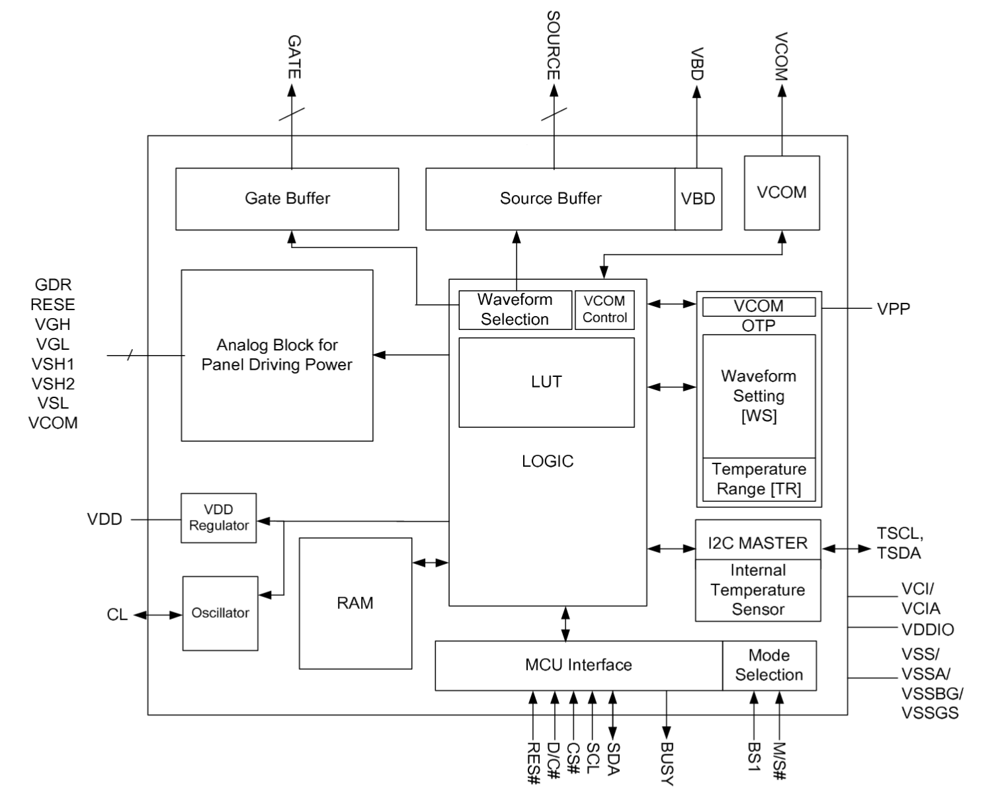

In this block diagram, we can see there is a RAM bank connected to the main LOGIC unit. This is in fact made up of TWO RAM banks which are identical in size [45]_. This is intended for tri-colour EPD displays which, upon adding a second bit to the pixel data, can have electro-phoretic particles of a third colour be manipulated dependeing on their state. How it generally works is you generate your first colour's data in the form of black/white and store it in the first RAM bank of the EPD. Then your second, more exotic colour's data is stored in the 2nd RAM bank of the EPD. The waveform takes information from both RAM-banks and ditheres the output signal for each pixel as required - by inducing less particle movement a lighter gray can be achieved. In this fashion, 2^2 = 4 shades can be displayed - Black, Dark Gray, Light Gray, White. 

So ultimately we needed a way to decode an image framebuffer used by the user-space applications into two separate frame buffers ready for upload to the EPD. We can do this by creating one framebuffer in RAM with 2 bits allocated for each of the 200x200 pixels, then coming up with a convention for which patterns of bits represent which colours. 
Then, as we traverse through the framebuffer to send byte by byte to the EPD, we can construct bytes by adding every second bit, and then ultimately we can send the data to the EPD. Then switch RAM banks, and take every odd bit, assemble into bytes and transmit.

Driving the EPD
+++++++++++++++
By consulting the datasheet we can see there are several states that the display can have - it supports an ultra-low-power sleep mode where the controller stops listening on the SPI bus and the RAM itself is powered down, so we need to implement the logic to handle this. The display also needs a waveform loaded into it at init-time that dictates the voltage patterns the controller sends to each individual pixel to change its colour, and some parameters that tell the controller how to update the display (i.e in what order to interpret the binary data residing in the SRAM) also need to be provided. Then, we need some methods that control the refreshing of the EPD - since it has two different refreshing modes which are triggered by transferring SPI commands after writing the image binary data. The resulting proposed UML diagram is below:

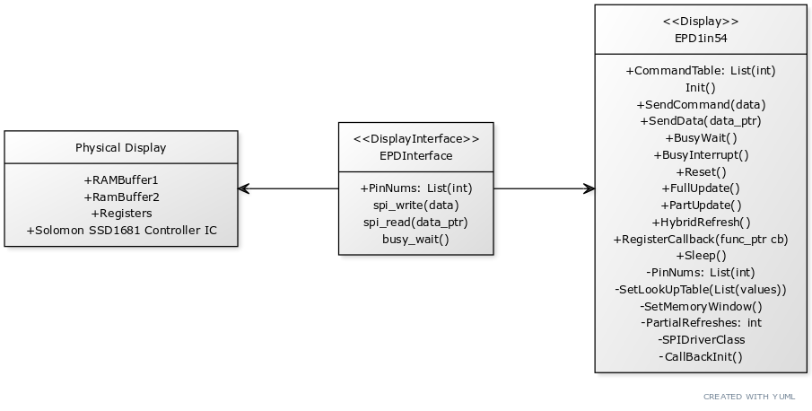

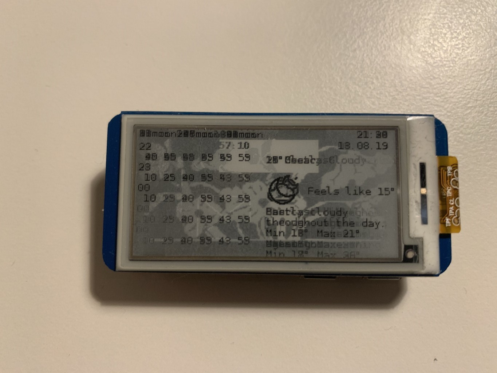

SetMemoryWindow() is a function that initialises memory interpretation parameters necessary for the EPD to understand how its SRAM is being filled, and how it should update itself once the SPI SRAM transfer is complete. SetLookUpTable() will set a private/constant set of lookup table values depending on what type of refresh is required. HybridRefresh takes an integer parameter denoting the threshold number of partial refreshes before a slower full refresh is taken. This is necessary as the EPD technology's limitations result in the display looking scruffy with ghost images after about 8-10 partial refreshes. 

The reason for this is the waveforms that affect one particular pixel will have a knock on effect on pixels around it. Normally during a full refresh every single pixel is updated at once, which nullifies this effect as the controller is acutely aware of the state of every pixel. However, during a partial refresh, the controller has no way of knowing which pixels have been influenced by the waveforms. So it is necessary to clear the display after a few partial refreshes to keep the image looking sharp and clear. 

Finally, using an intermediary abstraction layer for the SPI transfers, writes, and delays required to drive the EPD (EPDInterface) ensures that the driver code is portable across platforms, the only thing that needs to be changed is the platform-specific hardware transfer code. 

Below is a flowchart showing how the various methods will interlink to drive the EPD and manage its states from init-time to the next reboot according to the datasheet for the SSD1681 controller IC [45]_. 

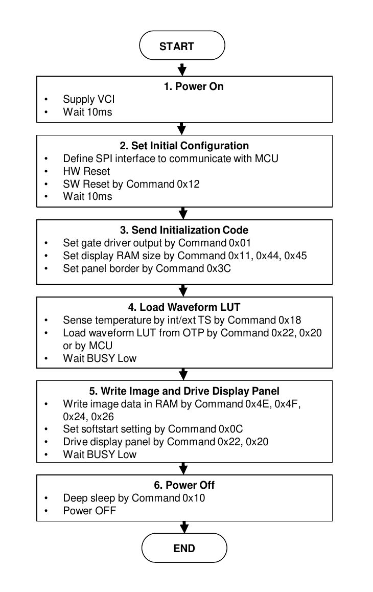

We can see that each of the six basic parts can be segregated into their own subroutines for greater control and resilience. There are two options for waiting for the EPD - either we can have a thread poll the BUSY pin until it goes low, which wastes CPU cycles and power, or we can configure an interrupt that will fire when the pin goes to low, which we can then handle according to the known state of the EPD. 

XIPA_FS - eXecute In Place compiled Ahead of time File System
-------------------------------------------------------------
Soon after I had attempted to integrate the runtime into the firmware, I ran into a huge unforseen limitaiton. I couldn't use the external storage as I originally thought to extend the MCU's capabilities, as the nRF52/nRF53 series is not equipped with an MMU. This means it cannot map files stored in a fragmented way on LittleFS as memory and directly execute it without severe slow-down and needless complexity. 
For WASM runtime, the app must be found in a contiguous memory buffer which can be passed as an argument to the initialisation routine. This meant I had to design my own filesystem which would store binary apps and other bits of large information contiguously on the external flash in a memory-efficient and power-efficient manner. 
Another show-stopper limitation was that I could not write to any memory addresses mapped into the XIP space, meaning I could not treat the QSPI flash as merely an extension of SRAM. If I wanted to write to the flash, I would need to use a DMA (Direct Memory Access) transfer (i.e the normal approach) and suspend all XIP operations.
Even this would be serviceable, but it turned out that the nRF52840 had some serious silicon bugs [46]_ in the QSPI peripheral. In essence, it would be impossible to get accurate reads directly from the QSPI XIP region without using memcpy() because of a race condition. This made it even more critical that I write a bespoke filesystem that could work around these show-stopping bugs - ultimately the QSPI race-condition bug forced me to dump the nRF52840 in favour of the nRF5340 which has almost three times the processing power of the nRF52840 with very similar power consumption. 

I chose a modular construction once again for the file system, abstracting away device specific operations to a separate driver module that worked around the read-only limitation of the XIP memory space, and relying on Zephyr's excellent driver support to drive the actual external flash which has a standardised protocol as it communicates over QSPI, much like how a SATA SSD will communicate in pretty much the same way as a SATA HDD. 

My design decisions were driven by the need to have completely bounded RAM/ROM requirements no matter how many files were stored, so we could preserve every byte of the precious 512KB of SRAM that the new nRF5340 gave us. I came up with a journal-style approach, essentially a 1000-page book at the start of the filesystem that pointed to the physical location of the file on the filesystem. It is somewhat similar to how inodes work on the Linux EXT2 filesystem, but heavily stripped down to save space:

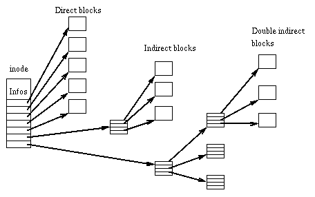
     
Each of the "infos" within the inode in XIPA_FS are treated as entries called "records", are 64 bytes wide, and contains a set of parameters optimised for dealing with large binary applications. These are listed below:

* **Name** - 16 bytes, maximum of 15 characters including null termination. In C/C++, strings are null terminated. I can use this property to attempt to verify if a record is valid, as hitting a binary application will have a low probability of reaching a NULL byte.
* **SHA256 Hash** - 32 bytes, not null terminated. This is a precalculated value that the system can use to verify the integrity of the file stored in the physical location using the hardware cryptographic acceleration (if present).
* **Extension (Run)** - 4 bytes, null terminated. This is used for the system to decide how it should deal with a particular file. This allows multiple types of runtime to be integrated later on, or could act as signalling for different types of program execution. 
* **Version String** - 4 bytes, null terminated. This is used for the system to verify the version of the file currently stored and can be used to cross-verify SHA256 hashes against a central server later on to prevent tampering and/or detect errors. 
* **Size** - 4 bytes, not null terminated, interpreted as a raw binary value and converted to denary to save space. Can have a file as big as 4GigaBytes, this is effectively the exact limitation FAT32 has regarding individual file sizes, but realistically the nRF5340's Cortex M33 is puny relative to ARM's flagship offerings and will never be able to make use of a 4GigaByte binary executable. Worst case, I can develop a partial file format that can assemble multiple 4GigaByte files together as required. Even forgetting all of that, the nRF5340's XIP memory space is only 128MB wide, so this is a complete and total non-issue. 
* **Location** - 4 bytes, not null terminated, interpreted as a raw binary value. This value is where the file is located in relation to the start of the filesystem. This combined with the size allows XIPA_FS to know exactly where the file starts and ends - XIPA_FS must use this value and the expected offset in memory that the external flash is mapped to in XIP mode to output pointers for the runtimes to read and execute the binaries. 

I chose 1024 files for several reasons. Firstly, this would result in a clean 64KiB of storage used, which would in most cases be a multiple of a set of sectors. Flash memory like QSPI NOR flash are arranged in sectors - while you can read & write data the size of a machine word (32-bits here), erasing can only be performed on an entire sector due to the way their erase mechanisms are wired. This reduces cost, but also imposes a requirement on the software to maintain at least one sector in memory while performing erase and copy operations. When the journal size is a multiple of a sector and the start of the journal is aligned to a sector, the efficiency of journal updating and deletion is increased as we don't have to erase across multiple sectors and handle information straddling a sector boundary. 

Secondly, it doesn't occupy too much space on the filesystem relative to the files. Especially on filesystems with a smaller logical size (like a few MB), 64KB can be treated as almost insignificant while being able to store a significant number of files. Thirdly, we can set the location of the first file as being 64KB after the start of the journal - as we are storing files contiguously we cannot really afford to keep shuffling every block forwards when we want to add another journal entry as this will wear out the flash. 

A core part of the filesystem's design is the concept of journal being contained inside other journals, much like how nested inodes work on Linux. By allowing the user to register an address pointing to another journal and setting the appropriate file extension, XIPA_FS can effectively address/cover an arbitrarily large file system with infinitely many files, provided each of them is less than 4GB to avoid the 32-bit limitation (which will not be amended for 64-bit systems to provide compatibility with 32-bit systems). 

A logical diagram of the data can be seen below:

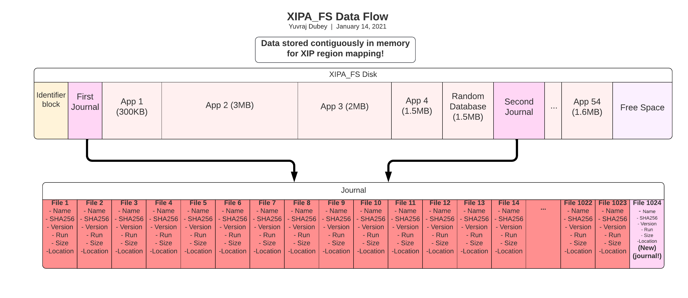

Seems straightforward enough... (spoiler: it is not). The advantage of this sort of design is that writing files, the most common use-case, can be completed fairly quickly without having to worry about erasing too much at first. To understand why, we must look at how NOR Flash actually works. 

|norpic1| |norpic2|

    
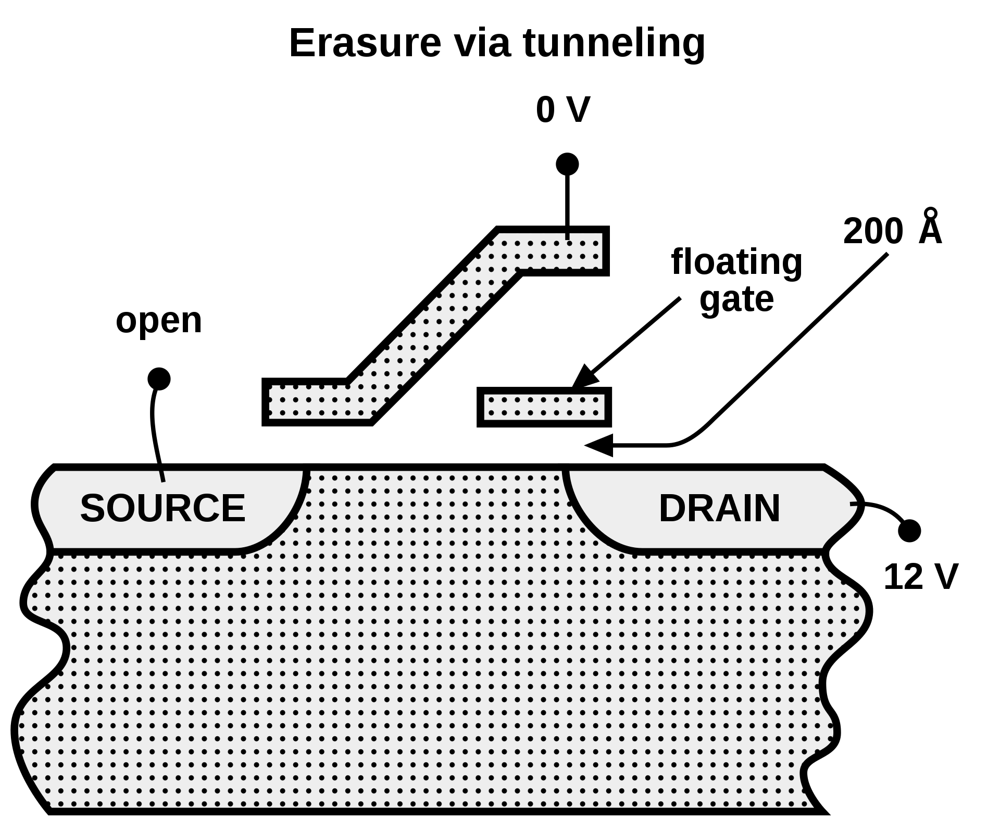

NOR Flash is implemented as a series of floating-gate MOSFETs (Metal Oxide Field Effect Transistors), which are very similar to regular transistors but have an additional "gate" mounted below the standard silicon "control gate" that is surrounded by an oxide layer. The gate itself can be charged, which then generates an electric field that hampers the flow of current unless a higher potential is applied. NOR Flash is read by applying a voltage between the old threshold voltage of the cell and the new threshold voltage with the additional charge taken into account, and measuring how much current flows - if there is very little current then the floating gate must be charged - this is interpreted as a "0" stored inside the cell. If there is a lot of current, then the floating gate will be uncharged and we interpret this as a "1" being stored inside the cell.

The floating gate can be charged by:

* Switching on the floating-gate MOSFET with elevated voltage (>5V)
* Letting current flow from source to drain
* Get current high enough for electrons to jump through the oxide layer to the gate - this is "hot-electron injection"
* Since the oxide prevents electrons from escaping from the floating-gate, it's effectively permanently charged until the erase procedure, so can be read as many times as required. [47]_

Discharging the floating gate is an interesting process that works using quantum tunneling. Under normal circumstances, the probability of electrons moving off the floating gate and onto the channel region of the transistor are very low. What NOR Flash does is apply a large negative voltage across the "control gate", which causes repulsion and greatly increases the probability of electrons breaking through into the channel, releasing the charge and thus erasing the cell. The extremely high voltages required are all generated on-chip using charge-pumps - these voltages induce an incredibly strong electric field (10 million volts per cm) which can break up the oxide's atomic bonds over time, resulting in flash-cell degradation and eventual failure once the oxide is unable to permit electrons from escaping the floating gate at any opportunity. 

Evidently, writing data to the filesystem is significantly faster than erasing it, as we have to wait for electrons to literally quantum tunnel their way to the control gate in the latter case. The design of this filesystem will mean no erases will be required to accomodate more and bigger files - all that is required is some iterative reading to find a free journal, and write a new entry. Plus, whenever an erase is required, since files will be stored in location order within the journals, it'll be easier to align the filesystem after a deletion. Thus the initial experience of downloading and writing files to the filesystem should be smooth and fast.

|
|

Here is a UML diagram of the expected objects for this filesystem and how they will interact with each other to implement this functionality. In C++, lists are known as "vectors", and C has to make do without lists entirely so it should be reimplemented as a conatiner which can store fixed size values dynamically. The benefits of doing so would be total control over the data flow and storage, and the ability to use the resulting vector library to implement a stack feature, which would be necessary while traversing through multiple journals with references to further journals.
For reasons I will explain later, I had to program nearly all of the NEA code in C, so I had to implement the vector and stack classes myself. 

Here is a flowchart diagram of the mounting algorithm:

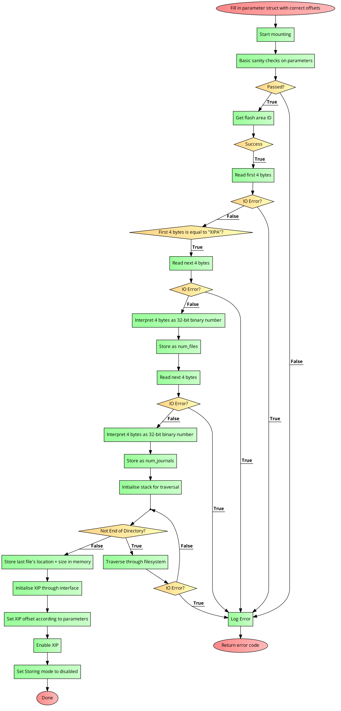

In short, it looks for a magic number at the start that identifies it as a XIPA type filesystem made up of the ascii codes of the word "XIPA". If this is found, then it reads 4 bytes and stores it as the number of files, then reads the next 4 bytes and deduces the number of journals. Then, resources required are initialised, and a traversal takes place. This is to find the last memory address of the entire used filesystem to help the aligning algorithm. 

Evidently the traversal algorithm is the heart of the read-mechanism of the filesystem - by using a journalled design it can effectively traverse gigabytes of data with just a few megabytes of metadata to traverse in the worst case. Additionally, as read operations are very fast on NOR flash with extremely low latency, this will work really well. 

Here is a flowchart diagram of the traversal algorithm:

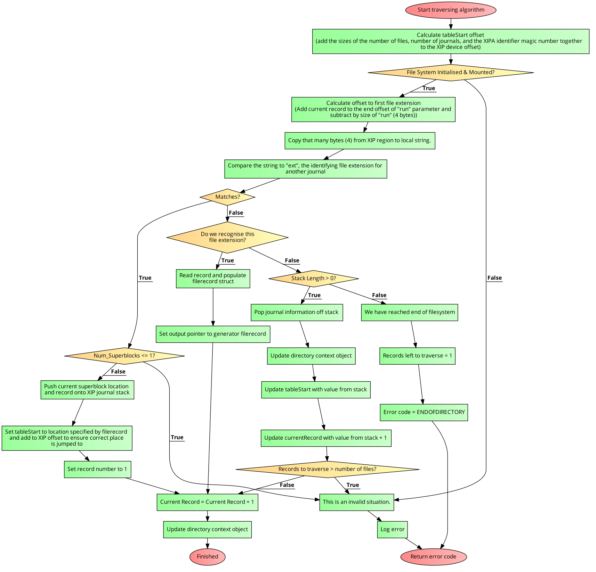

The traversal algorithm is designed to be called repeatedly in a loop to allow for various different behaviors to be implemented like file searching. It gives the filesystem code nice access to the device allowing it to detect journal entries and find a free entry easily and effectively. 
There are two variants of the traversal algorithm - since the filesystem will not be in XIP mode when storing files, there is a version which uses the DMA-based driver directly to read a single journal entry at a time (64 bytes), and then performs the exact same logic on the copied data. 

The traversal algorithm keeps track of its position in the filesystem using a combination of two objects - a directory object that keeps track of the current record and files left to traverse, and a journal object is designed to be stored inside stacks to keep track of the journals that new journal entries have jumped from. The reason these objects are separate is that we want to keep track of the number of files left to traverse separate from the journal-locating logic. 

|
|
|

Now let's see how we can write a file to the file system:

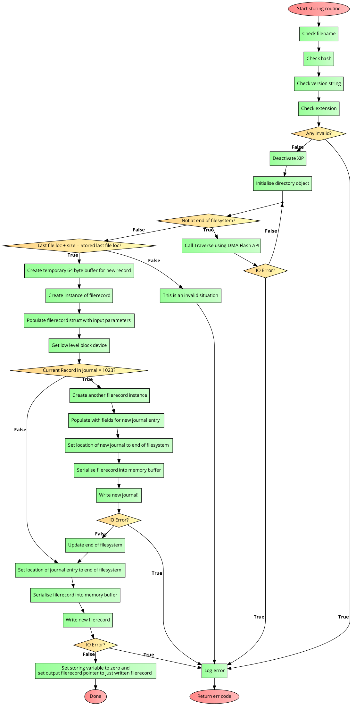

The point of this algorithm is to write a new record with the details of the new file provided by the user, which then places the filesystem into a sort of "STORE ONLY" mode. This will lock out the storing algorithm from writing any more file records until the current record is satisfied. Data can be written in little chunks as it is received, unloading the system from the burden of keeping the entire file in memory at once using a simple callback which is provided with a memory buffer pointer with a buffer size, which will then let the data be copied and written. This uses the internal "storing" variable to keep track of how much data has been written, and it automatically brings the filesystem out of "STORE ONLY" mode once the desired amount of data has been written to the filesystem. 
Then of course we can increment the number of journals and files as required and write those back to the filesystem header. 

|
|

Now let's see how we can delete a file from the file system:

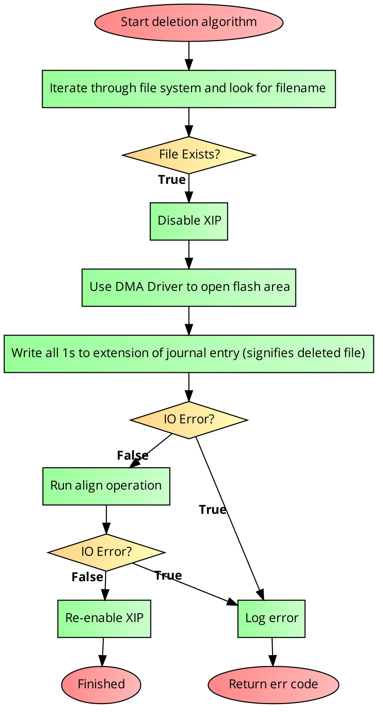

This algorithm manages XIP and prevents any simulatenous write/read operations which are not supported by external QSPI flash. It marks a journal entry as freed, and calls the aligning operation. I will explain shortly why it does not erase the file straightaway, to understand this we need to understand the aligning algorithm. 

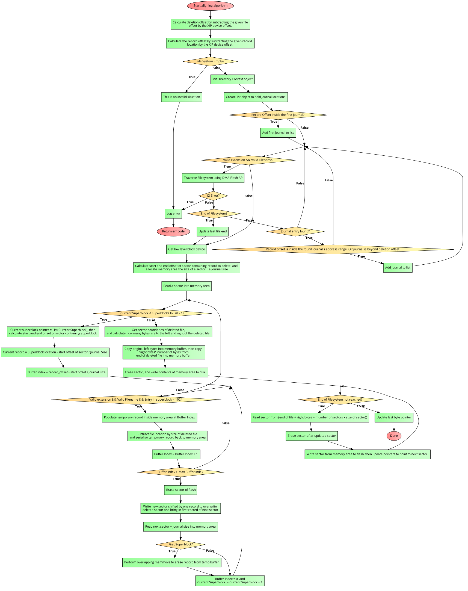

    XIPA_FS's aligning algorithm for arbitrarily large file systems with very low RAM requirements. Warning, there are several cycles in this flowchart! 

|

The aligning algorithm is capable of dealing with arbitrarily large file systems, as long as there is enough free RAM for a singluar temporary sector in memory, and perhaps a kilobyte to hold the journal locations for an extremely large file system. In reality, especially on the nRF5340, it is highly unlikely that I even make use of a second journal, but this drastically future proofs the filesystem making it suitable for use with future CPUs with far more capable SPI peripherals perhaps even capable of half a GB of addressing. Here's how it works:

Firstly, this algorithm tries to find the journal containing the record of the file to delete by storing all journals which could contain it or have a starting offset higher than the deleted file's record. It then gets sector boundaries, reads a sector and an additional filerecord into memory, calculates the appropriate buffer index to shift to to reach the record of the file to delete, and uses a memmove() operation to completely overwrite the file record. The reason an extra filerecord is copied is that the memmove() operation shifts the first record of the next sector as well as overwriting the deleted file record - we're killing two birds with one stone here in an incredibly efficient operation. 
Then, it continues onwards from that point, journal entry by journal entry, changing the file record locations to account for the shifting that will happen when the files are aligned togther. Once it reaches the end of a sector, it loads the next sector into memory until the end of the journal is reached.

After this, the algorithm subtracts all the file locations on the journals above the deleted record by the deleted file's size. 

Then, the algorithm will calculate the correct copy offsets to avoid losing any wanted data that straddle across sector lines, and will go through from the end of the deleted file to the end of the filesystem copying data, erasing the corresponding sector at the start of the freed space, and writing the sector to flash. Eventually, the algorithm will reach the end of the filesystem, and the aligning algorithm will be complete. It updates the last file pointer, deinitialises any dynamically allocated variables, and exits. 

These are the main algorithms of the filesystem defined and described - From here there is implementation-specific and thus platform specific information to consider in the implementation section. 

LP_UARTE - Low Power Universal Asynchronous Receiver Transmitter with DMA
-------------------------------------------------------------------------
While exploring possibilities for integrating GPS at the lowest possible power consumption, I discovered another chip in Nordic Semiconductor's lineup called the nRF9160. This was after several weeks of pursuing solutions by uBlox, who had some incredibly small and innovative little GPS modules which didn't seem to be available anywhere. Upon further investigation, I found that they were likely only available under massive minimum order quantities which wouldn't be feasible or sustainable. 
There were other options for GPS modules in uBlox's lineup which were publicly available, but their power consumption was too high and they were too large. Soon, I discovered uBlox's range of SARA chips which integrated a low power IOT-optimised cellular connection with a GPS receiver and I was intrigued. I had been looking to reduce the watch's dependence on the external smartphone for quite some time, and a dedicated cellular connection could very well be the answer.

Most devices on the market today don't have their own cellular connection - or don't utilise it to the full extent possible as we saw in the analysis of the Apple Watch Series 7. The only issue with the uBlox SARA was its board size - it took up a significant amount of room that could be used to house the display 

.. [41] https://github.com/littlefs-project/littlefs
.. [42] https://github.com/RIOT-OS/RIOT/pull/8316
.. [43] https://os.mbed.com/blog/entry/littlefs-high-integrity-embedded-fs/
.. [44] https://learn.sparkfun.com/tutorials/serial-peripheral-interface-spi/all
.. [45] https://www.crystalfontz.com/controllers/SolomonSystech/SSD1681/500/
.. [46] https://infocenter.nordicsemi.com/topic/errata_nRF52840_Rev3/ERR/nRF52840/Rev3/latest/err_840.html 
.. [47] https://volga.eng.yale.edu/teaching-resources/flash-drives/methods-and-materials
