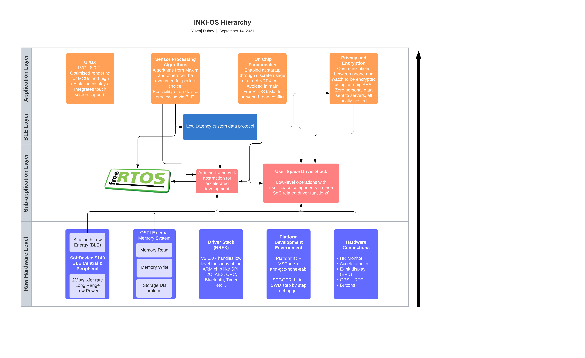

Introduction
============
The Problem
-----------

In 2019, American adults spent 3 and a half hours on their phones every day. This was an increase of 20 minutes from a year earlier. Analytics company "Zenith" predicted screen time would increase to over 4 hours in 2021, and then COVID-19 hit [#]_. Twitter has been awash with people
posting alarming pandemic screen time statistics with some hitting 8 hours a day on their phones [#]_.

.. figure:: privacyphone.jpg
    :figwidth: 20% 
    :align: right
    :alt: "privacy image"

But how? Why? Targeting networks like Twitter, Google and Facebook engineer their apps to collect massive amounts of data on their users, analyse metrics like impulsivity, content viewed, percentage watched etc.. and use it to make predictions about what users are most likely to view next, and serve it [#]_. 
    
In 2019 alone, YouTube was fined $170 million [#]_ for collecting and using children's data, and Facebook was fined $5 billion in light of the Cambridge Analytica incident [#]_. Studies show that people already are subject to "reinforcing spirals", a phenomenon where people look for and consume content that is similar to content they have seen before. This has been observed to be triggered by violent [#]_, and politically charged content. These content networks' efforts only serve to intensify this effect, leading users into an endless spiral through their platforms and racking up massive screen times.
Studies have linked excessive screen time with symptoms of depression in adolescents [#]_, with a 0.64 unit increase in depressive symptoms on the Brief Symptoms Inventory scale per hour spent on social media. Other studies have found positive associations between screen time and depression symptoms like loneliness and reduced self-esteem.  

There seems to be a growing movement around quitting Google's services [#]_ [#]_ [#]_ 
being promoted by increasingly major players in the media industry. The Forbes article in particular was written in September 2021. People are deeply concerned about how much influence these tech behemoths have on their lives and are making efforts to go lighter. Companies are responding to this by introducing more robust privacy controls on their platforms - notably the iOS 14 and Android 12 updates [#]_. But Android's offering has 
been criticised for not offering enough control to the end user easily enough, they are still forced to delve into the dizzying array of options in the Google privacy portal to manage their privacy settings.

Services created with the best of intentions are increasingly taking up more and more of our times and lives, to the point where instead of helping us, we are helping them. People are spending significant proportions of their lives on these platforms, and a growing number want out.

.. [#] https://www.vox.com/recode/2020/1/6/21048116/tech-companies-time-well-spent-mobile-phone-usage-data
.. [#] https://www.washingtonpost.com/technology/2020/03/24/screen-time-iphone-coronavirus-quarantine-covid/
.. [#] https://privacy.commonsense.org/privacy-report/YouTube
.. [#] https://www.theguardian.com/technology/2019/sep/04/youtube-kids-fine-personal-data-collection-children-
.. [#] https://www.ftc.gov/system/files/documents/public_statements/1536911/chopra_dissenting_statement_on_facebook_7-24-19.pdf
.. [#] Slater  MD, Henry  KL, Swain  RC,  et al.  Violent media content and aggressiveness in adolescents: a download spiral model.  Comm Res. 2003;30(6):713-736. doi:10.1177/0093650203258281
.. [#] https://jamanetwork.com/journals/jamapediatrics/fullarticle/2737909?guestAccessKey=7f0019bd-f2eb-4dc1-a509-cd5bc2444a79&utm_source=For_The_Media&utm_medium=referral&utm_campaign=ftm_links&utm_content=tfl&utm_term=071519
.. [#] https://beebom.com/how-go-google-free/
.. [#] https://www.zdnet.com/article/goodbye-google-why-and-how-to-take-back-your-privacy/
.. [#] https://time.com/9210/how-i-quit-google/
.. [#] https://www.cbsnews.com/news/how-i-tried-and-failed-to-quit-google/

The Solution
------------
**INKI** Mark One is a premium open source smartwatch, born out of a desire to create a usable watch that respects a user's privacy and time, lasts 30 days on a single charge, and makes the user's life better. By building the software from the ground up to be secure and privacy conscious, users who are concerned about the influence of large corporations like Google and Facebook can more easily disconnect from the frenzy of online life and truly relax. INKI has been in development since June 2021 and is being taken to a fully fledged product - but undoubtedly I will have to limit the scope of what I'd like to achieve for this formal NEA. 

Who is it for?
++++++++++++++
INKI will be primarily aimed towards the privacy conscious, the open source software and hardware is intended to build people's trust and put accountability on our part to keep the software clean and privacy friendly. As the general public is shifting in this direction, the watch will need some mainstream-level functionality to be able to compete and garner the support of the masses.

Countless people can benefit from a well-executed smartwatch: the fitness-conscious, the health-conscious, the tech-enthusiast, the list goes on. Of course, these groups will all have their own requirements and preferences, but the beauty of open source software is that technically-inclined people can contribute to the code-base once it reaches an appropriate level (i.e where non-programmers can comfortably use the watch) and add in functionality that everybody would like. The end goal is to create and foster an app ecosystem that allows anyone to create an application and distribute it to people who would enjoy it.

Research Methodology
++++++++++++++++++++
INKI was inspired by similar projects such as the Light Phone [#]_ and Light Phone 2. These are phones built to be used as little as possible to help disconnect from the tech monopolies and social medias that are increasingly sucking up our time and energy. While the Light Phone 2 is beautiful, and INKI seeks a similar aesthetic, the internal hardware of the Light Phone 2 is much like a modern Android smartphone, utilising a fairly beefy ARMv7/ARMv8 CPU capable of running Android, which it does. This isn't a deal-breaker as the Android OS appears to be heavily modified to better support the Electro-Phoretic Display (abbr. EPD) and maximise battery life / minimise power consumption, but Android is still inherently a major operating system with significant overhead and thus power consumption. 
This made me wonder whether lower power hardware with a simpler operating system written from the ground up, tailored for smartwatch duty could do a highly effective job at a fraction of the power consumption.

A lot of internet research later, I found Nordic Semiconductor, a fabless semiconductor company that specialises in Bluetooth Low Energy low power ARM chips after looking at powerful microcontrollers on Adafruit's website. The nRF52 series was of particular interest due to the relative simplicity of the SoC but immense power available compared to traditional AVR based microcontrollers. All chips in this series feature a 64MHz ARM Cortex-M4 CPU, which is four times faster than the ATMega32u4 on clock speed alone [#]_ and undoubtedly many times faster on IPC due to the 32 vs 8 bit architecture. The best part is that these chips are as easy to program as an AVR, and massively more capable at the same time; the top spec nRF52840 is a perfect candidate for the smartwatch as it has inbuilt hardware accelerated AES, instruction Cache to speed up execution and minimise current, a floating point unit, and has the most RAM and memory to allow for exciting applications and features to be implemented without being constrained too much by hardware limitations.

Deducing what functionality would be required was a lot easier, I simply looked through the spec sheets and prices for some of the most popular smartwatches today [#]_ [#]_ and saw what they all had in common. The main features I was looking for was determined by several consumer-oriented articles aimed at tech enthusiasts looking to make their next purchase - which is our target market here. [#]_ [#]_ [#]_

From these sources, I deduced the main considerations here were battery life, software support, and 3rd party app support. Here is a quick breakdown of some of the most popular smartwatches on the market today and their specifications. 

+------------------------+-------------------------------+-----------------------------------------+-----------------------------------------------------------------------------------------------------------------------------------------------------------------------------------+-------+
| Watch                  | Display                       | Battery Life                            | Capabilities                                                                                                                                                                      | Price |
+========================+===============================+=========================================+===================================================================================================================================================================================+=======+
| Apple Watch Series 7   | AMOLED                        | 18 hours                                | Fitness tracking - ECG - Heart Rate & Blood Oxygen - Music storage & playback - Fall detection - Always On Display - Compass & altimeter - Extremely comprehensive 3rd party apps | £369  |
+------------------------+-------------------------------+-----------------------------------------+-----------------------------------------------------------------------------------------------------------------------------------------------------------------------------------+-------+
| Samsung Galaxy Watch 4 | AMOLED (2 sizes)              | 40 hours (without GPS/workout tracking) | Fitness tracking - ECG + Heart Rate + SpO2 (Blood Oxygen) - Music storage & playback - Fall detection - Compass - 3rd party apps                                                  | £269  |
+------------------------+-------------------------------+-----------------------------------------+-----------------------------------------------------------------------------------------------------------------------------------------------------------------------------------+-------+
| Fitbit Sense           | AMOLED                        | 6 days                                  | Fitness tracking - ECG + Heart Rate + SpO2 - 3rd party apps - Alexa + Google Assistant                                                                                            | £189  |
+------------------------+-------------------------------+-----------------------------------------+-----------------------------------------------------------------------------------------------------------------------------------------------------------------------------------+-------+
| Garmin Venu            | AMOLED (praised for vibrancy) | 5 days                                  | Very comprehensive fitness tracking - ECG + Heart Rate + SpO2 - Music storage & playback - 3rd party apps                                                                         | £329  |
+------------------------+-------------------------------+-----------------------------------------+-----------------------------------------------------------------------------------------------------------------------------------------------------------------------------------+-------+
| OnePlus Watch          | AMOLED                        | 10 days                                 | Fitness tracking - minimalist design - compass + barometer - sleep tracking - music storage and playback                                                                          | £149  |
+------------------------+-------------------------------+-----------------------------------------+-----------------------------------------------------------------------------------------------------------------------------------------------------------------------------------+-------+

Apple Watch Series 7
********************
.. figure:: applewatchseries3.jpg
    :figwidth: 40%
    :align: center
    :alt: "Series 3 on someone's wrist"

    
The Apple Watch is the current market leader in the smartwatch world, despite being completely incompatible with Android devices. The rectangular screen with the curved edges and robust metal casing is an instantly recognisable design, and one that Apple has maintained for several years now. 
The reason it's been so popular is that it's sort of changed the face of smartwatches, transforming them from a gimmick in the eyes of the public to something genuinely useful and usable. They've integrated high-end fitness tracking, useful 3rd party apps, and effectively extended the iPhone to a user's wrist in a way that hadn't been done before - and it worked!

I respect the Apple Watch for this greatly. Additionally, the Apple Watch, and Apple products in general are well-reputed for being amongst the best on the market with regards to privacy and security. The iCloud lock functionality prevents sensitive data being released off a stolen device, and gives users the ability to remotely lock or disable their lost devices. And of course, all data on the watch itself is encrypted, and activation is authenticated with Apple's "Albert" servers, making false activations and thus any possible data exfiltration impractically difficult. The user-experience is also made quite a lot nicer by the physical controls in conjunction with the touch screen - the Apple Watch is equipped with a rotating "crown" used to scroll through menus, and a singular button is used to switch between apps. This is superior to touch only watches, which are rendered useless underwater or fall victim to crazy, spurious inputs upon entering contact with water. 

The Apple Watch does have a few limitations though. Some models are equipped with optional LTE connectivity, which allows the watch to connect itself directly to the internet using a cellular data connection - a common criticsm is how the watch is still overly reliant upon the mother iOS device for much of its functionality. This has been resolved more with the newer versions, which can download podcasts and songs by themselves. Additionally, the LTE versions cost quite a lot more than the regular counterparts and require a monthly cellular subscription. The notifications can be quite distracting, but since it's an Apple product there's fairly comprehensive notification management and this can be mitigated somewhat. 

Its greatest flaw, which Apple has been chagrined for, is undoubtedly the battery life. Apple Watches run a custom OS known as watchOS, which is known to be descended from iOS which runs on their tablets and smartphones. The iOS underpinnings could potentially explain why these watches struggle to outlast their competition, as it would make sense that iOS would not have been written from the ground up with wearable applications in mind. It is also entirely possible that the slick user interface that is so heavily praised by reviewers requires a power-hungry and powerful SoC to drive, contributing further to the battery drain. In any case, the battery life is likely the last thing holding the Apple Watch back from total domination over the competition. Having to charge another device every evening can get irritating - I personally find myself quite often in situations where I've forgotten to charge my phone overnight and I run out of juice midway through the day.

So to conclude - the Apple Watch Series 7 is an excellent all-round package with Apple's trademark attention to detail and blend of cutting-edge yet well-implemented and well-executed technology, let down by the battery life. 

Samsung Galaxy Watch 4
**********************
.. figure:: galaxywatch4.jpg
    :figwidth: 40%
    :align: center
    :alt: "Series 3 on someone's wrist"

Samsung has been at the smartwatch game since 2013, starting out with their Galaxy Gear which was initially criticised for its poor battery life, half-baked notification system, and uncomfortable strap. They've come a long way since then, with their latest model as of February 2022 being praised for its power & speed, its bio-sensing capabilities, and sleek looks. Samsung smartwatches have been known in the past to incorporate a rotating dial to complement their touchscreens. With a device as small as a smartwatch, a certain degree of tactile interaction is a must as it can streamline the often myriad of swiping motions required to peform repetitive actions like switching between apps or scrolling down a menu. 

Galaxy watches up until recently have run their own custom firmware called Tizen, based on Linux. It's been a competent alternative to WearOS, which had been more or less left by the wayside to collect dust until Samsung came around and offered to help redevelop WearOS using Tizen code. Tizen has been criticised for being "riddled with serious security vulnerabilities" [#]_ in a 2017 article detailing an Israeli security researcher's work into investigating the Tizen firmware that was shipped with their new smart television. Considering this operating system had been in development since 2013, and constrasting these comments to Apple's relative strength in the security/privacy area, this paints these devices in quite a dim light. Recently, Samsung and Google have started working together to merge the floundering WearOS and Tizen codebases into something hopefully fresh and new - and the result can be seen with the Galaxy Watch 4.

The construction is similar to the Apple Watch, with robust and sleek aluminium utilised with the vibrant AMOLED display. The trademark hardware rotating bezel is gone in place of a virtual solution actuated by rotating the finger around the bezel. This would be difficult with gloves on or in rain. The Galaxy Watch 4 comes in two different sizes to cater for all shapes and sizes of wrist - a possible solution for INKI could be to utilise a display in the middle range of what Samsung is utilising in their watches.  

One quite annoying drawback is that Samsung has chosen to reserve several features for Samsung phones only, which seems like a slightly petty (albeit understandable) move to encourage smartphone sales, which could be driven by concerns about profit margins. 

To conclude - fairly solid device with questions surrounding the future of its software support. 

Fitbit Sense
************
TODO

Garmin Venu
***********
TODO

OnePlus Watch
*************
TODO

Takeaways
+++++++++

It seems that the smartwatch market isn't quite being taken as seriously as it could be, especially on the Android side of things. In conjunction with the state of WearOS, Qualcomm had let the smartwatch market collect dust from 2016 by simply not releasing any new SoCs for over two years. Not just that, their "flagship" smartwatch SoC was based on Qualcomm's flagship offering on the 28nm node, which would have been produced sometime in 2013 [#]_. Smaller transistors require less power to actuate, benefit from lower leakage current, and are typically more efficient, which contributes to significantly lower power consumption with zero loss in performance. From this follows reduced cooling requirements (only really relevant in full-blown smartphones or personal computers), and extended battery life (universally relevant!). It therefore makes sense that smartwatches should benefit from the smallest node available to Qualcomm, not be left to collect dust for 2 years on an already 3 year old node. 

Apple and Samsung have their own processor design programs that allowed them to dodge this stagnation and provide their teams with newer, faster, more efficient SoCs year on year to claim first and second place in the smartwatch market - this would be fine bar the fact that Samsung uses Tizen for their watches, and Apple uses their own watchOS. They do not rely on WearOS! This could very well have been a factor in WearOS's decline and decay. Even in this situation, there are always optimisations and new features that can be carefully evaluated and added to a watch even on older SoCs without jeopardising the user-experience or perceived responsiveness. 

All this makes me wonder what a fresh look at the problem might give, and how things might be different if more care was given to this exciting sector. We need to rethink what makes a smartwatch a smartwatch, we need a paradigm shift from trying to add feature after feature and instead try to make something really robust that works, gets out of the way of the user, and lets them live their life to the fullest. What if phones, tablets, smartwatches came with automatic distraction-management strategies? What if we eliminated inconvenient forced updates that people don't want, what if our devices worked more as tools for us to do great things?

This is what I want to try and address with INKI. 

Consumers are looking for longer battery lives not just in low-power modes confined to telling the time, but in actual use-cases where much of the cool and useful functionality of the watch is being leveraged and utilised - like LTE, GPS, and workout tracking. Consumers are increasingly concerned about privacy and security, which the Apple watch handles rather well. The health monitoring features of a smartwatch are undoubtedly a major selling point, so standalone GPS functionality would look increasingly attractive. All of these we can begin to establish and formalise with the Key Proposed Considerations. 

Key Proposed Considerations
+++++++++++++++++++++++++++

All the watches I analysed were made by large companies with huge engineering teams driving the software development, meaning that while INKI will not be able to do everything, there are some core functions that INKI will realistically achieve, some of these even before the completion of the NEA! 

* Efficient BLE communication protocol \- As the watch's hardware is relatively diminutive with respect to current offerings, it will be reliant on a connected phone for certain features like navigation or music playback. This means a fast, low latency communication protocol will be needed for optimal user experience.
* Heart Rate Monitoring \- All of the leading smartwatches analysed earlier offer periodic heart-rate monitoring, so this will be a must-have mainstream level feature. Heart rate monitoring is useful as abnormal heart rates or rhythms could be easily detected, potentially saving lives. Energy statistics can also be approximated from heart rate and fitness information, ideal for fitness/health conscious people. 
* Comprehensive Security \- Security has been a subject of contention in the IoT world for some time now, and is often one of the greatest weak points of otherwise brilliant, cheap hardware. With the nRF52840's integrated AES and stream ciphers (on-the-fly encryption and decryption of any exfiltrated data via serial ports or external memory interfaces), this is most certainly a key requirement or at least consideration during the NEA. [#]_
* Accelerometer \- Most watches employ "raise-to-wake" functionality, where the SoC receives an interrupt with a specified gesture (i.e raised, tapped) and can begin responding to the user's input. INKI will instead utilise "always-on-display" due to the characteristics of the electrophoretic display, but will still need to know when to wake up. This component is also used for counting steps, a basic feature of most modern smartwatches. 
* GPS \- This is rarer on smartwatches, GPS allows users to track their own activity and estimate distance walked or ran. This is a key feature as it opens many doors to exciting software ideas (offline maps, way-point navigation, taxi hailing) and is quite easy to implement on the hardware side. 
* Touch and button responsive UI \- a key frustration with my own Xiaomi Mi Band is that capacitive touch technology functions erratically underwater, often causing the workout to prematurely interrupt. By combining physical button and touch inputs, the user interface will become far less prone to ghost touching and involuntary inputs. This will be particularly critical as the watch's display has a slow refresh rate of ~300ms, so ghost touching could get irritating very quickly. I will also have to consider the physical button location carefully to avoid actuation on wrist contraction. 
* Companion Android app \- this will manage BLE communication with the watch, handle offline processing, and allow the user to view metrics such as heart rate, calculated sleep time, and workouts. 
* Efficient Data Storage \- The watch's SoC only has about 1MB of flash which has a limited endurance (10000 erase cycles per page) and forces the CPU to halt when erased or written to, so I will need to employ an efficient external QSPI data storage medium and protocol for all the user's data. 
* Notification support \- The user should be able to see their notifications on the watch, but there will likely be a watch-side blacklist to help users stay in control of what notifications they'd like to receive, helping them focus on what really matters to them. 

Most functionalities like taxi hailing, navigation, sleep calculation, can be implemented later on in software updates once these core building blocks are in place if we utilise a modular construction. 
For example, navigation can use the BLE protocol to request route data from the phone, then use GPS to prompt the user where and when to turn via the notification stack. Or taxi-hailing can make a API request over HTTP via the BLE link, have the phone relay back data with BLE, and use notifications to notify the user of different events happening with respect to their taxi.

Proposed Software Architecture
++++++++++++++++++++++++++++++
Where possible, we want to minimise code repetition and keep code easy to debug in a complex RTOS environment. By segregating functionality into loosely coupled modules and objects, a far cleaner program flow can be established through direct, tightly defined, and highly deterministic APIs. 
Targetting C++ would be ideal for its fully featured OOP support with access-modification, encapsulation, polymorphism, and multiple inheritance, allowing the construction of highly sophisticated and exciting programs [#]_ . It would provide better access over the hardware, as Python typically requires handwritten inline assembly or C/C++ backend code to access registers. Additionally, Python suffers from significant run-time overhead in terms of CPU and memory - with a platform as relatively constrained as the NRF52, it will be critical to harness as much performance as possible. Other languages like Rust can be used with microcontrollers, but since I already had some prior experience with C++, I decided to use it. This would also allow me to forgo the powerful OOP, templates, and work at a very low level by stepping down a rung to C, something that would be comparatively quite difficult with Rust. 

The nRF52's PlatformIO + Arduino framework already exposed some of the documented functionality of the chip and its peripherals - some deeper inspection within the framework files revealed it was built upon the nRFx standard driver libraries which are "RTOS-agnostic"[#]_. This means they are not optimised specifically for a particular RTOS, or even RTOSes in general, meaning they can be used standalone without an RTOS to build a more traditional Arduino style application. [#]_ Which leads us onto the discussion of RTOSes and bare metal applications. 

Bare Metal vs RTOS
******************

A Bare-Metal device typically hosts a singular application dedicated to a very specific set of functions. For example, the microcontroller driving your oven, the lights on your bicycle, or the doors of your car have a very specific job to do. There are a small number of possible states that the programmer writing the firmware is well aware of while writing the software. In these scenarios, while a microcontroller is invaluable and absolutely a necessity, there is no need for the microcontroller to ever run a different program at will. There is no need for security, app-loading, multi-threading, because they only need to do one thing - unlocking/locking the door, blinking the light etc...
This type of application typically has free-reign over the hardware, which can be risky when manipulating registers directly as one really needs to get to know the hardware to avoid making disastrous mistakes, but at the same time the total control makes for a far more deterministic and hence more easily debuggable application. Any bugs that occur are then totally within your command, and hopefully highly fixable!

An RTOS changes things quite a lot for our humble little microcontrollers. It gives them the boon of multi-threading, allowing them to do multiple things at once. They can react to new events, they can start and stop tasks at will, they can behave quite a lot like a full-blown OS we are used to seeing on our smartphones and laptop/desktop computing devices. RTOS frameworks typically have fairly comprehensive driver bases, much like Linux, so can facilitate development of reasonably portable code that can be built and flashed onto many different kinds of MCU. This can be a game changer with more complicated microcontrollers like the nRF52 series, STM32 and other high-end Cortex M7, where writing code from scratch to control complex periperhals like graphical acceleration or on-chip TCP/IP infrastructure could take months of effort that could be dedicated towards developing kickass applications.

This table summarises some of the differences between Bare Metal and RTOS:

+-------------+--------------------------------------------------------------------------------------------------------------------------------------------------------------------------------+-------------------------------------------------------------------------------------------------------------------------------------------------------------------------------------------------------------------------------+
|             | Bare Metal Application                                                                                                                                                         | RTOS Application                                                                                                                                                                                                              |
+=============+================================================================================================================================================================================+===============================================================================================================================================================================================================================+
| Pre-emption | Possible using interrupts and interrupt priorities but with far higher latencies than an RTOS due to relying on hardware interrupt switching [#]_. Orders of magnitude slower. | Easy and efficient - based on software scheduler rather than hardware-based interrupts.                                                                                                                                       |
+-------------+--------------------------------------------------------------------------------------------------------------------------------------------------------------------------------+-------------------------------------------------------------------------------------------------------------------------------------------------------------------------------------------------------------------------------+
| Effort      | Bare metal can be time-consuming due to direct hardware access and the need to build up applications from the register level but somewhat straightforward to work with         | Easier to work with but phantom bugs can be introduced through the non-deterministic nature of RTOS execution.                                                                                                                |
+-------------+--------------------------------------------------------------------------------------------------------------------------------------------------------------------------------+-------------------------------------------------------------------------------------------------------------------------------------------------------------------------------------------------------------------------------+
| Reusability | Bare-metal modules can work together with a modular construction but a lot of things will be re-implemented - like reinventing the wheel                                       | Possible and even encouraged with RTOSes utilising strong build environments like CMake in conjunction with ninja. RTOSes have fairly comprehensive driver support for a wide variety of peripherals reducing time-to-market. |
+-------------+--------------------------------------------------------------------------------------------------------------------------------------------------------------------------------+-------------------------------------------------------------------------------------------------------------------------------------------------------------------------------------------------------------------------------+
| Resources   | Bare-metal has no overhead bar the code that the developer writes or any external libraries utilised                                                                           | RTOS has some light overhead with the scheduling aspect but far less than a full-blown operating system.                                                                                                                      |
+-------------+--------------------------------------------------------------------------------------------------------------------------------------------------------------------------------+-------------------------------------------------------------------------------------------------------------------------------------------------------------------------------------------------------------------------------+

Considering a smartwatch has a lot to juggle - sensor algorithms and parsing, data transfer, user-input, and a pretty GUI, an RTOS makes quite a lot more sense than a standard bare metal application. Enough of the foundations will be laid for us to prevent re-inventing the wheel and wasting precious time during the NEA, but we'd in theory still have the freedom to take the code in whatever direction we like. The folks over at Adafruit chose to integrate the nrfx drivers with FreeRTOS, a very common and well-reputed choice [#]_ - so we know we're in safe hands. We can start to draw up a basic architecture diagram of things we'd need to consider. 

Almost immediately we can see a layered topology revealing itself. We have low-level code and modules, that will interface with some middle layer code - in this case Adafruit's Arduino framework, FreeRTOS, and the User-Space driver stack that we will end up implementing. This driver stack would contain code to drive the various peripherals connected to the nRF52840 - like the display / display backlight, sensors, and charging circuitry. 
Then we have the communications layer, where we have our communication protocol that will build on top of the Adafruit BSP and User-Space driver stack, but then in turn be used by the top level application code.
The application code is where things start getting interesting. We can start implementing code here that builds upon all the previous layers that goes on to perform the functions of a watch. 

Now within the top application code layer there will be many other layers, especially if we will be working with an RTOS. We can see this in the below image:

.. figure:: application-code-layer(2).png
    :figwidth: 70%
    :align: center
    :alt: "inki application code layer diagram"

In this image, we can see the different layers going from the bottom up. We'll need filesystems, TCP/IP stacks, Inter process communication, and a robust graphics library. I decided to use LVGL after seeing their extremely impressive user demos on highly resource-constrained devices [#]_ (i.e perfect for my application!) and their excellent documentation [#]_. The issue with a project of this nature is that much of the implementation will inevitably be device or platform specific. I have never done anything like this before, I will be learning everything from scratch, and then trying to write an operating system. This is another further justification for the overwhelming argument that I should use an RTOS. In an RTOS, the tasks & threading, data management & file system APIs, TCP/IP, sometimes power management and very rarely comprehensive memory protection with built in MPUs (memory protection units) & inter-process communication is already implemented, providing some breathing space and allowing the differentiating and really important code to be started as soon as possible. 

With this, we can begin constructing a design plan for the software modules that need to be implemented and constituent libraries, classes, sub-classes, methods that might be required.

System Architecture
+++++++++++++++++++

.. figure:: inkiarchitecture.jpeg
    :figwidth: 100% 
    :align: center
    :alt: "inki architecture"

Some elements on the architecture diagram may be beyond the scope of the NEA, most notably the "User-space app SDK" as this will not be necessary to obtain a MVP (minimum viable product) and may be incredibly challenging to implement in the first place. Additionally, it is yet to be determined
whether AES encryption is sufficient security, or whether INKI will also need to employ address changing tactics to avoid a Man In The Middle attack, where a malicious device fools both the phone and the watch to connect to it instead of the real devices [#]_. It turns out that BLE 5.0 (the version nRF52 series uses) has no security updates since version 4.2, so the DigiKey article is still very much relevant [#]_.

.. [#] https://www.thelightphone.com/about-us
.. [#] https://www.microchip.com/en-us/product/ATmega32U4
.. [#] https://www.techradar.com/uk/news/wearables/best-smart-watches-what-s-the-best-wearable-tech-for-you-1154074
.. [#] https://www.amazfit.com/en/bip
.. [#] https://www.tomsguide.com/uk/us/smartwatch-buying-guide,review-3360.html
.. [#] https://www.engadget.com/best-smartwatches-153013118.html
.. [#] https://www.t3.com/news/best-smartwatch
.. [#] https://www.vice.com/en/article/xy9p7n/samsung-tizen-operating-system-bugs-vulnerabilities
.. [#] https://arstechnica.com/gadgets/2018/02/android-wear-is-getting-killed-and-its-all-qualcomms-fault/
.. [#] https://www.securityweek.com/iots-importance-growing-rapidly-its-security-still-weak
.. [#] https://www.ko2.co.uk/advantages-disadvantages-of-c-plus-plus/
.. [#] https://developer.nordicsemi.com/nRF_Connect_SDK/doc/latest/nrfxlib/softdevice_controller/doc/softdevice_controller.html
.. [#] https://github.com/adafruit/Adafruit_nRF52_Arduino/tree/master/cores/nRF5
.. [#] https://www.digikey.com/es/articles/real-time-some-notes-on-microcontroller-interrupt-latency
.. [#] https://freertos.org/RTOS.html
.. [#] https://lvgl.io/demos
.. [#] https://docs.lvgl.io/master/intro/index.html
.. [#] https://forum.digikey.com/t/a-basic-introduction-to-ble-4-x-security/12501
.. [#] https://www.bluetooth.com/wp-content/uploads/2019/03/Bluetooth_5-FINAL.pdf

Development Path
++++++++++++++++

This is a VERY preliminary timescale, I will refine this as I learn about how much time I really have.

+---------------------------------------------------------------------------------------------------+------+
| Development Milestone                                                                             | Week |
+===================================================================================================+======+
| Get GDE0154D67 and FT3267 user-space drivers completed                                            | 4    |
+---------------------------------------------------------------------------------------------------+------+
| Build touch UI and implement stopwatch + timer + HR page + swiping gestures + notification struct | 8    |
+---------------------------------------------------------------------------------------------------+------+
| Get BLE working in central and peripheral mode and be able to switch between them                 | 10   |
+---------------------------------------------------------------------------------------------------+------+
| Research highest throughput data method and implement it. Get HR and accel data streaming working | 12   |
+---------------------------------------------------------------------------------------------------+------+
| Port INKI to GadgetBridge android app and prepare for open sourcing                               | 15   |
+---------------------------------------------------------------------------------------------------+------+
| Open-source INKI-OS under GPL-3.0 and prepare HW design                                           | 18   |
+---------------------------------------------------------------------------------------------------+------+

Requirements Specification
++++++++++++++++++++++++++

See System Architecture diagram - requirement numbers incoming. 

Success criteria will be the features functioning on the watch, I will be using GitHub as VCS and PlatformIO
to build the software and test it on the watch. I will write down some edge cases to test through the GUI, and
test code snippets in isolation where appropriate. 

 

