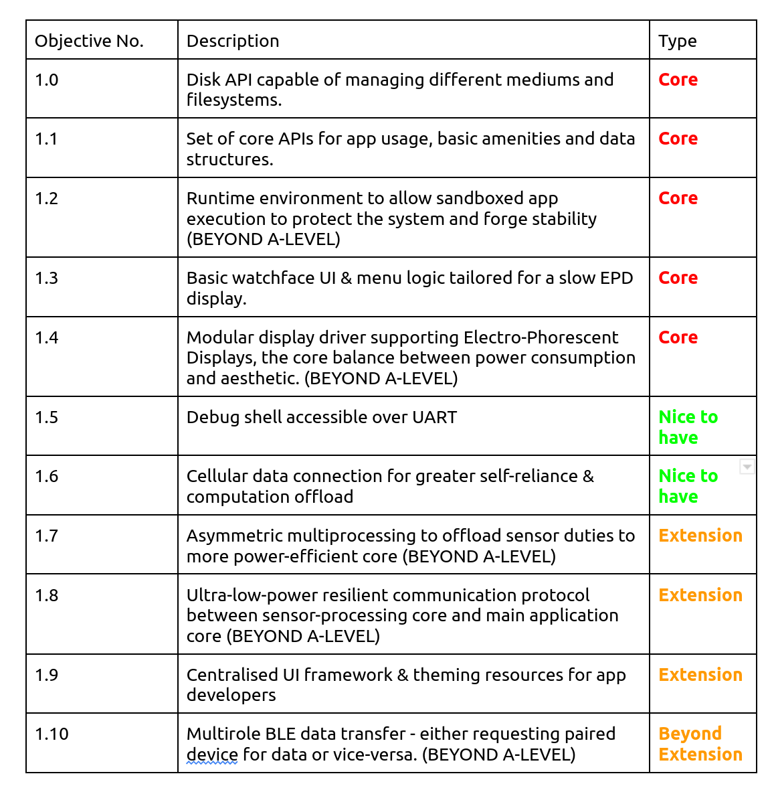

Introduction
============
The Problem
-----------

In 2019, American adults spent 3 and a half hours on their phones every day. This was an increase of 20 minutes from a year earlier. Analytics company "Zenith" predicted screen time would increase to over 4 hours in 2021, and then COVID-19 hit [#]_. Twitter has been awash with people
posting alarming pandemic screen time statistics with some hitting 8 hours a day on their phones [#]_.

.. figure:: privacyphone.jpg
    :figwidth: 20% 
    :align: right
    :alt: "privacy image"

But how? Why? Targeting networks like Twitter, Google and Facebook engineer their apps to collect massive amounts of data on their users, analyse metrics like impulsivity, content viewed, percentage watched etc.. and use it to make predictions about what users are most likely to view next, and serve it [#]_. 
    
In 2019 alone, YouTube was fined $170 million [#]_ for collecting and using children's data, and Facebook was fined $5 billion in light of the Cambridge Analytica incident [#]_. Studies show that people already are subject to "reinforcing spirals", a phenomenon where people look for and consume content that is similar to content they have seen before. This has been observed to be triggered by violent [#]_, and politically charged content. These content networks' efforts only serve to intensify this effect, leading users into an endless spiral through their platforms and racking up massive screen times.
Studies have linked excessive screen time with symptoms of depression in adolescents [#]_, with a 0.64 unit increase in depressive symptoms on the Brief Symptoms Inventory scale per hour spent on social media. Other studies have found positive associations between screen time and depression symptoms like loneliness and reduced self-esteem.  

There seems to be a growing movement around quitting Google's services [#]_ [#]_ [#]_ 
being promoted by increasingly major players in the media industry. The Forbes article in particular was written in September 2021. People are deeply concerned about how much influence these tech behemoths have on their lives and are making efforts to go lighter. Companies are responding to this by introducing more robust privacy controls on their platforms - notably the iOS 14 and Android 12 updates [#]_. But Android's offering has 
been criticised for not offering enough control to the end user easily enough, they are still forced to delve into the dizzying array of options in the Google privacy portal to manage their privacy settings.

Services created with the best of intentions are increasingly taking up more and more of our times and lives, to the point where instead of helping us, we are helping them. People are spending significant proportions of their lives on these platforms, and a growing number want out.

.. [#] https://www.vox.com/recode/2020/1/6/21048116/tech-companies-time-well-spent-mobile-phone-usage-data
.. [#] https://www.washingtonpost.com/technology/2020/03/24/screen-time-iphone-coronavirus-quarantine-covid/
.. [#] https://privacy.commonsense.org/privacy-report/YouTube
.. [#] https://www.theguardian.com/technology/2019/sep/04/youtube-kids-fine-personal-data-collection-children-
.. [#] https://www.ftc.gov/system/files/documents/public_statements/1536911/chopra_dissenting_statement_on_facebook_7-24-19.pdf
.. [#] Slater  MD, Henry  KL, Swain  RC,  et al.  Violent media content and aggressiveness in adolescents: a download spiral model.  Comm Res. 2003;30(6):713-736. doi:10.1177/0093650203258281
.. [#] https://jamanetwork.com/journals/jamapediatrics/fullarticle/2737909?guestAccessKey=7f0019bd-f2eb-4dc1-a509-cd5bc2444a79&utm_source=For_The_Media&utm_medium=referral&utm_campaign=ftm_links&utm_content=tfl&utm_term=071519
.. [#] https://beebom.com/how-go-google-free/
.. [#] https://www.zdnet.com/article/goodbye-google-why-and-how-to-take-back-your-privacy/
.. [#] https://time.com/9210/how-i-quit-google/
.. [#] https://www.cbsnews.com/news/how-i-tried-and-failed-to-quit-google/

The Solution
------------
**INKI** Mark One is a premium open source smartwatch, born out of a desire to create a usable watch that respects a user's privacy and time, lasts 30 days on a single charge, and makes the user's life better. By building the software from the ground up to be secure and privacy conscious, users who are concerned about the influence of large corporations like Google and Facebook can more easily disconnect from the frenzy of online life and truly relax. INKI has been in development since June 2021 and is being taken to a fully fledged product - but undoubtedly I will have to limit the scope of what I'd like to achieve for this formal NEA. 

Who is it for?
++++++++++++++
INKI will be primarily aimed towards the privacy conscious, the open source software and hardware is intended to build people's trust and put accountability on our part to keep the software clean and privacy friendly. As the general public is shifting in this direction, the watch will need some mainstream-level functionality to be able to compete and garner the support of the masses.

Countless people can benefit from a well-executed smartwatch: the fitness-conscious, the health-conscious, the tech-enthusiast, the list goes on. Of course, these groups will all have their own requirements and preferences, but the beauty of open source software is that technically-inclined people can contribute to the code-base once it reaches an appropriate level (i.e where non-programmers can comfortably use the watch) and add in functionality that everybody would like. The end goal is to create and foster an app ecosystem that allows anyone to create an application and distribute it to people who would enjoy it.

Research Methodology
++++++++++++++++++++
INKI was inspired by similar projects such as the Light Phone [#]_ and Light Phone 2. These are phones built to be used as little as possible to help disconnect from the tech monopolies and social medias that are increasingly sucking up our time and energy. While the Light Phone 2 is beautiful, and INKI seeks a similar aesthetic, the internal hardware of the Light Phone 2 is much like a modern Android smartphone, utilising a fairly beefy ARMv7/ARMv8 CPU capable of running Android, which it does. This isn't a deal-breaker as the Android OS appears to be heavily modified to better support the Electro-Phoretic Display (abbr. EPD) and maximise battery life / minimise power consumption, but Android is still inherently a major operating system with significant overhead and thus power consumption. 
This made me wonder whether lower power hardware, utilising an ultra-low-power display technology like Electro-Phoretic Displays, running a simpler operating system written from the ground up tailored for smartwatch duty could do a highly effective job at a fraction of the complexity and power consumption.

A lot of internet research later, I found Nordic Semiconductor, a fabless semiconductor company that specialises in Bluetooth Low Energy low power ARM chips after looking at powerful microcontrollers on Adafruit's website. The nRF52 series was of particular interest due to the relative simplicity of the SoC (System on a Chip) but immense power available compared to traditional AVR based microcontrollers. All chips in this series feature a 64MHz ARM Cortex-M4 CPU, which is four times faster than the ATMega32u4 on clock speed alone [#]_ and undoubtedly many times faster on IPC due to the 32 vs 8 bit architecture. The best part is that these chips are as easy to program as an AVR, and massively more capable at the same time; the top spec nRF52840 is a perfect candidate for the smartwatch as it has inbuilt hardware accelerated AES, instruction Cache to speed up execution and minimise current, a floating point unit, and has the most RAM and memory to allow for exciting applications and features to be implemented without being constrained too much by hardware limitations.

Deducing what functionality would be required was a lot easier, I simply looked through the spec sheets and prices for some of the most popular smartwatches today [#]_ [#]_ and saw what they all had in common. The main features I was looking for was determined by several consumer-oriented articles aimed at tech enthusiasts looking to make their next purchase - which is our target market here. [#]_ [#]_ [#]_

From these sources, I deduced the main considerations here were battery life, software support, and 3rd party app support. Here is a quick breakdown of some of the most popular smartwatches on the market today and their specifications. 

+------------------------+-------------------------------+-----------------------------------------+-----------------------------------------------------------------------------------------------------------------------------------------------------------------------------------+-------+
| Watch                  | Display                       | Battery Life                            | Capabilities                                                                                                                                                                      | Price |
+========================+===============================+=========================================+===================================================================================================================================================================================+=======+
| Apple Watch Series 7   | AMOLED                        | 18 hours                                | Fitness tracking - ECG - Heart Rate & Blood Oxygen - Music storage & playback - Fall detection - Always On Display - Compass & altimeter - Extremely comprehensive 3rd party apps | £369  |
+------------------------+-------------------------------+-----------------------------------------+-----------------------------------------------------------------------------------------------------------------------------------------------------------------------------------+-------+
| Samsung Galaxy Watch 4 | AMOLED (2 sizes)              | 40 hours (without GPS/workout tracking) | Fitness tracking - ECG + Heart Rate + SpO2 (Blood Oxygen) - Music storage & playback - Fall detection - Compass - 3rd party apps                                                  | £269  |
+------------------------+-------------------------------+-----------------------------------------+-----------------------------------------------------------------------------------------------------------------------------------------------------------------------------------+-------+
| Fitbit Sense           | AMOLED                        | 6 days                                  | Fitness tracking - ECG + Heart Rate + SpO2 - 3rd party apps - Alexa + Google Assistant                                                                                            | £189  |
+------------------------+-------------------------------+-----------------------------------------+-----------------------------------------------------------------------------------------------------------------------------------------------------------------------------------+-------+
| Garmin Venu            | AMOLED (praised for vibrancy) | 5 days                                  | Very comprehensive fitness tracking - ECG + Heart Rate + SpO2 - Music storage & playback - 3rd party apps                                                                         | £329  |
+------------------------+-------------------------------+-----------------------------------------+-----------------------------------------------------------------------------------------------------------------------------------------------------------------------------------+-------+
| OnePlus Watch          | AMOLED                        | 10 days                                 | Fitness tracking - minimalist design - compass + barometer - sleep tracking - music storage and playback                                                                          | £149  |
+------------------------+-------------------------------+-----------------------------------------+-----------------------------------------------------------------------------------------------------------------------------------------------------------------------------------+-------+

Apple Watch Series 7
********************
.. figure:: applewatchseries3.jpg
    :width: 400px
    :align: right
    :alt: "Series 3 on someone's wrist"

    
The Apple Watch is the current market leader in the smartwatch world, despite being completely incompatible with Android devices. The rectangular screen with the curved edges and robust metal casing is an instantly recognisable design, and one that Apple has maintained for several years now. 
The reason it's been so popular is that it's sort of changed the face of smartwatches, transforming them from a gimmick in the eyes of the public to something genuinely useful and usable. They've integrated high-end fitness tracking, useful 3rd party apps, and effectively extended the iPhone to a user's wrist in a way that hadn't been done before - and it worked!

I respect the Apple Watch for this greatly. Additionally, Apple products in general are well-reputed for being amongst the best on the market with regards to privacy and security. The iCloud lock functionality prevents sensitive data being released off a stolen device, and gives users the ability to remotely lock or disable their lost devices. And of course, all data on the watch itself is encrypted, and activation is authenticated with Apple's "Albert" servers, making false activations and thus any possible data exfiltration impractically difficult. The user-experience is also made quite a lot nicer by the physical controls in conjunction with the touch screen - the Apple Watch is equipped with a rotating "crown" used to scroll through menus, and a singular button is used to switch between apps. This is superior to touch only watches, which are rendered useless underwater or fall victim to crazy, spurious inputs upon entering contact with water. 

The Apple Watch does have a few limitations though. Some models are equipped with optional LTE connectivity, which allows the watch to connect itself directly to the internet using a cellular data connection - a common criticsm is how the watch is still overly reliant upon the mother iOS device for much of its functionality. This has been improved with the newer versions, which can download podcasts and songs by themselves. Additionally, the LTE versions cost quite a lot more than the regular counterparts and require a monthly cellular subscription. The notifications can be quite distracting, but since it's an Apple product there are some fairly comprehensive notification management settings, meaning this can be mitigated somewhat. 

Its greatest flaw, which Apple has been chagrined for, is undoubtedly the battery life. Apple Watches run a custom OS known as watchOS, which is known to be descended from iOS which runs on their tablets and smartphones. The iOS underpinnings could potentially explain why these watches struggle to outlast their competition, as it would make sense that iOS would not have been written from the ground up with wearable applications in mind. It is also entirely possible that the slick user interface that is so heavily praised by reviewers requires a power-hungry and powerful SoC to drive, contributing further to the battery drain. In any case, the battery life is likely the last thing holding the Apple Watch back from total domination over the competition. Having to charge another device every evening can get irritating - I personally find myself quite often in situations where I've forgotten to charge my phone overnight and I run out of juice midway through the day.

So to conclude - the Apple Watch Series 7 is an excellent all-round package with Apple's trademark attention to detail and blend of cutting-edge yet well-implemented and well-executed technology, let down by the battery life. 

Samsung Galaxy Watch 4
**********************

Samsung has been at the smartwatch game since 2013, starting out with their Galaxy Gear which was initially criticised for its poor battery life, half-baked notification system, and uncomfortable strap. They've come a long way since then, with their latest model as of February 2022 being praised for its power & speed, its bio-sensing capabilities, and sleek looks. Samsung smartwatches have been known in the past to incorporate a rotating dial to complement their touchscreens. With a device as small as a smartwatch, a certain degree of tactile interaction is a must as it can streamline the often myriad of swiping motions required to peform repetitive actions like switching between apps or scrolling down a menu. 

Galaxy watches up until recently have run their own custom firmware called Tizen, based on Linux. It's been a competent alternative to WearOS, which had been more or less left by the wayside to collect dust until Samsung came around and offered to help redevelop WearOS using Tizen code. Tizen has been criticised for being "riddled with serious security vulnerabilities" [#]_ in a 2017 article detailing an Israeli security researcher's work into investigating the Tizen firmware that was shipped with their new smart television. Considering this operating system had been in development since 2013, and constrasting these comments to Apple's relative strength in the security/privacy area, this paints these devices in quite a dim light. Recently, Samsung and Google have started working together to merge the floundering WearOS and Tizen codebases into something hopefully fresh and new - and the result can be seen with the Galaxy Watch 4.

The construction is similar to the Apple Watch, with robust and sleek aluminium utilised with the vibrant AMOLED display. The trademark hardware rotating bezel is gone in place of a virtual solution actuated by rotating the finger around the bezel. This would be difficult with gloves on or in rain. The Galaxy Watch 4 comes in two different sizes to cater for most shapes and sizes of wrist - a possible solution for INKI could be to utilise a display in the middle range of what Samsung is utilising in their watches. 

One quite annoying drawback is that Samsung has chosen to reserve several features for Samsung phones only, which seems like a slightly petty (albeit understandable) move to encourage smartphone sales, which could be driven by concerns about profit margins.

To conclude - fairly well-executed device using Samsung's own custom silicon with questions surrounding the future of its software support. 

Fitbit Sense
************

.. figure:: fitbitsense.jpg
    :width: 400px
    :align: right
    :alt: "Fitbit Sense on someone's wrist"

The Fitbit Sense is an interesting flagship piece at the moment. It's the first to monitor your stress using electrodermal activity. There have been cases of electrodermal activity being used in fraudulent looking [20]_ products in the past to supposedly diagnose and treat illnesses, but here it's just being used as a stress indicator [21]_ .
It has an attractive square design with rounded corners and a clear, vibrant display much like the other watches we've analysed so far. There's ample customisation with regards to the watch - changing the watchface and changing the physical strap is straightforward. Aluminium is used throughout the construction of the watch module itself, the straps are offered in various materials ranging from leather & nylon, to steel and sillicon. This all looks very promising. 

Multiple reviewers have stated how comfortable the watch is once fastened, this is a great step in the right direction. There's a physical haptic button, meaning the button doesn't actually press down, rather it uses vibration technology to emulate the feeling of the button being pressed much like on the newer Apple devices. This is still much better than not having any buttons at all and would undoubtedly improve water resistance. 

There is support for 3rd party apps, while the app selection is more limited compared to Apple there are still some highly useful applications like Spotify, Pandora, Starbucks, Uber, and quite a few great looking apps from independent developers. [22]_

The only drawback here is the battery life - with light usage this is around six days, but drops drastically during GPS tracking and if the display is left in "always on" mode. To conclude, this is a really interesting device that gets a lot right, but the app selection and battery life could be a little better. It still trumps the Apple Watch and Galaxy Watch in the battery life department though. 

.. [20] https://www.ncbi.nlm.nih.gov/pmc/articles/PMC6140073/
.. [21] https://www.healthline.com/health/fitness/fitbit-sense
.. [22] https://gallery.fitbit.com/apps

Garmin Venu
***********

.. figure:: garminvenu.jpg
    :width: 300px
    :align: left
    :alt: "Garmin Venu on someone's wrist"

The Garmin Venu has built upon Garmin's Vivoactive 4, replacing the traditional power-saving transflective LCD with a bright & vibrant AMOLED display.
One criticism of the physical design is that it might look a little generic, which in my opinion has some basis. Garmin watches typically have quite a distinctive look, but this model does struggle a little in differentiating itself from the competition [23]_ [24]_. 

Garmin is generally known for their unrivalled fitness tracking - they've recently started orienting more of their products towards the "techie" smartwatch market, and they seem to have done a reasonably good job of it. The Garmin offers music storage and playback, physical buttons for maximised usability in the rain, and a nice gesture based navigation. Garmin doesn't rely on WearOS for its core functionality, they have their own in house operating system that's shared across most of their devices and is part of why the battery life is so much longer. The Garmin has been criticised a little for some UI sluggishness, this might be down to the graphics stack not being designed to cope with the demands of a full-colour high resolution display, or it could simply have slower hardware to maximise battery life. 

Either way these are minor nitpicks, the watch has highly accurate heart-rate monitoring and blood oxygen monitoring which can be supplemented by an external BLE/ANT+ chest strap and can make predictions about stress levels, respiration rate, among others. It can then use this data to guide users through tailored deep breathing and meditation exercises, similarly to how the Apple Watch does things. It's well executed and useful. 

To summarise, this is a fairly decent competitor to the other watches, if it is let down a little by the design, UI ease of use, and 3rd party app library compared to the Apple Watch. 

.. [23] https://www.techradar.com/uk/reviews/garmin-venu
.. [24] https://www.garmin.com/en-GB/c/wearables-smartwatches/

OnePlus Watch
*************
.. figure:: onepluswatch.jpg
    :width: 300px
    :align: right
    :alt: "OnePlus Watch on someone's wrist"

The OnePlus Watch has taken a similar approach to its smartwatch to Garmin and Fitbit in designing its own custom operating system to maximise battery life.
The casing is refined and hits above its price point, but it's quite large at 46mm, perhaps excessively so for consumers with smaller wrists. There's no always-on-display which is understandable to save power, but since AMOLED displays are supposed to be reasonably low-power I don't quite understand why this functionality has been omitted. It also doesn't really differentiate itself from the population. [25]_
There are also concerns about bugs [26]_ in the companion app and some odd design choices on the watch firmware - particularly the "quick reply" functionality for messages which is limited to just 4 choices which do not appear to be changeable. Additionally, emojis in text messages aren't shown which seems like a bit of a waste for the beautiful 454x454 display. Some of these issues have been addressed in a firmware update, but what matters here is why the watch was released without these amenities in the first place. 

On the other hand, the sensors appear to be accurate, meauring heart rate and oxygen level more accurately than competitors at the same price point. The OnePlus Watch's main limitation is the complete lack of third party app support, which relegates it to competing with budget offerings by companies like Amazfit, Xiaomi and Huawei. The existing functionality is okay, but in this case I feel it is not worth trading a long 14 day battery life for 3rd party app support. 

.. [25] https://www.wired.co.uk/article/oneplus-watch-review
.. [26] https://www.notebookcheck.net/OnePlus-Watch-in-review-There-are-still-some-teething-problems.532699.0.html

Takeaways & Fate of WearOS
++++++++++++++++++++++++++

It seems that the smartwatch market isn't quite being taken as seriously as it could be, especially on the Android side of things. In conjunction with the state of WearOS, Qualcomm had let the smartwatch market collect dust from 2016 by simply not releasing any new SoCs for over two years. Not just that, their "flagship" smartwatch SoC was based on Qualcomm's flagship offering on the 28nm node, which would have been produced sometime in 2013 [27]_. Smaller transistors require less power to actuate, benefit from lower leakage current, and are typically more efficient, which contributes to significantly lower power consumption with zero loss in performance. From this follows reduced cooling requirements (only really relevant in full-blown smartphones or personal computers), and extended battery life (universally relevant!). It therefore makes sense that smartwatches should benefit from the smallest node available to Qualcomm, not be left to wither away for 2 years on an already 3 year old node. 

Apple and Samsung have their own processor design programs that allowed them to dodge this stagnation and provide their teams with newer, faster, more efficient SoCs year on year to claim first and second place in the smartwatch market - this would be fine bar the fact that Samsung uses Tizen for their watches, and Apple uses their own watchOS. They do not rely on WearOS! This could very well have been a factor in WearOS's decline and decay. Even in this situation, there are always optimisations and new features that can be carefully evaluated and added to a watch even on older SoCs without jeopardising the user-experience or perceived responsiveness. 

All this makes me wonder what a fresh look at the problem might give, and how things might be different if more care was given to this exciting sector. We need to rethink what makes a smartwatch a smartwatch, we need a paradigm shift from trying to add feature after feature and instead try to make something really robust that works, gets out of the way of the user, and lets them live their life to the fullest. What if phones, tablets, smartwatches came with automatic distraction-management strategies? What if we eliminated inconvenient forced updates that people don't want, what if our devices worked more as tools for us to do great things?

This is what I want to try and address with INKI. 

Consumers are looking for longer battery lives not just in low-power modes confined to telling the time, but in actual use-cases where much of the cool and useful functionality of the watch is being leveraged and utilised - like LTE, GPS, and workout tracking. Consumers are increasingly concerned about privacy and security, which the Apple watch handles rather well. The health monitoring features of a smartwatch are undoubtedly a major selling point, so standalone GPS functionality would look increasingly attractive. All of these we can begin to establish and formalise with the Key Proposed Considerations. 

Key Proposed Considerations
+++++++++++++++++++++++++++

All the watches I analysed were made by large companies with huge engineering teams driving the software development, meaning that while INKI will not be able to do everything, there are some core functions that I'd like to explore and investigate throughout the course of the project. 

* Efficient BLE communication protocol \- As the watch's hardware is relatively diminutive with respect to current offerings, it will be reliant on a connected phone for certain features like navigation or music playback. This means a fast, low latency communication protocol will be needed for optimal user experience.
* Heart Rate Monitoring \- All of the leading smartwatches analysed earlier offer periodic heart-rate monitoring, so this will be a must-have mainstream level feature. Heart rate monitoring is useful as abnormal heart rates or rhythms could be easily detected, potentially saving lives. Energy statistics can also be approximated from heart rate and fitness information, ideal for fitness/health conscious people. 
* Comprehensive Security \- Security has been a subject of contention in the IoT world for some time now, and is often one of the greatest weak points of otherwise brilliant, cheap hardware. With the nRF52840's integrated AES and stream ciphers (on-the-fly encryption and decryption of any exfiltrated data via serial ports or external memory interfaces), this is most certainly a key requirement or at least consideration during the NEA. [28]_
* Accelerometer \- Most watches employ "raise-to-wake" functionality, where the SoC receives an interrupt with a specified gesture (i.e raised, tapped) and can begin responding to the user's input. INKI will instead utilise "always-on-display" due to the characteristics of the electrophoretic display, but will still need to know when to wake up. This component is also used for counting steps, a basic feature of most modern smartwatches. 
* GPS \- This is rarer on smartwatches, GPS allows users to track their own activity and estimate distance walked or ran. This is a key feature as it opens many doors to exciting software ideas (offline maps, way-point navigation, taxi hailing) and is quite easy to implement on the hardware side. 
* Touch and button responsive UI \- a key frustration with my own Xiaomi Mi Band is that capacitive touch technology functions erratically underwater, often causing the workout to prematurely interrupt. By combining physical button and touch inputs, the user interface will become far less prone to ghost touching and involuntary inputs. This will be particularly critical as the watch's display has a slow refresh rate of ~300ms, so ghost touching could get irritating very quickly. I will also have to consider the physical button location carefully to avoid actuation on wrist contraction. 
* Companion Android app \- this will manage BLE communication with the watch, handle offline processing, and allow the user to view metrics such as heart rate, calculated sleep time, and workouts. 
* Efficient Data Storage \- The watch's SoC only has about 1MB of flash which has a limited endurance (10000 erase cycles per page) and forces the CPU to halt when erased or written to, so I will need to employ an efficient external ``QSPI`` data storage medium and protocol for all the user's data. 
* Notification support \- The user should be able to see their notifications on the watch, but there will likely be a watch-side blacklist to help users stay in control of what notifications they'd like to receive, helping them focus on what really matters to them. 

Most functionalities like taxi hailing, navigation, sleep calculation, can be implemented later on in software updates once these core building blocks are in place if we utilise a modular construction. 
For example, navigation can use the BLE protocol to request route data from the phone, then use GPS to prompt the user where and when to turn via the notification stack. Or taxi-hailing can make a API request over HTTP via the BLE link, have the phone relay back data with BLE, and use notifications to notify the user of different events happening with respect to their taxi.

Proposed Software Architecture
++++++++++++++++++++++++++++++
Where possible, we want to minimise code repetition and keep code easy to debug in a complex RTOS environment. By segregating functionality into loosely coupled modules and objects, a far cleaner program flow can be established through direct, tightly defined, and highly deterministic APIs. 
Targetting C++ would be ideal for its fully featured OOP support with access-modification, encapsulation, polymorphism, and multiple inheritance, allowing the construction of highly sophisticated and exciting programs [29]_ . It would provide better access over the hardware, as Python typically requires handwritten inline assembly or C/C++ backend code to access registers. Additionally, Python suffers from significant run-time overhead in terms of CPU and memory - with a platform as relatively constrained as the NRF52, it will be critical to harness as much performance as possible. Other languages like Rust can be used with microcontrollers, but since I already had some prior experience with C++, I decided to use it. This would also allow me to forgo the powerful OOP, templates, and work at a very low level by stepping down a rung to C, something that would be comparatively quite difficult with Rust. 

The nRF52's PlatformIO + Arduino framework already exposed some of the documented functionality of the chip and its peripherals - some deeper inspection within the framework files revealed it was built upon the nRFx standard driver libraries which are "RTOS-agnostic"[30]_. This means they are not optimised specifically for a particular RTOS, or even RTOSes in general, meaning they can be used standalone without an RTOS to build a more traditional Arduino style application. [31]_ Which leads us onto the discussion of RTOSes and bare metal applications. 

Bare Metal vs RTOS
******************

A Bare-Metal device typically hosts a singular application dedicated to a very specific set of functions. For example, the microcontroller driving your oven, the lights on your bicycle, or the doors of your car have a very specific job to do. There are a small number of possible states that the programmer writing the firmware is well aware of while writing the software. In these scenarios, while a microcontroller is invaluable and absolutely a necessity, there is no need for the microcontroller to ever run a different program at will. There is no need for security, app-loading, multi-threading, because they only need to do one thing - unlocking/locking the door, blinking the light etc...
This type of application typically has free-reign over the hardware, which can be risky when manipulating registers directly as one really needs to get to know the hardware to avoid making disastrous mistakes, but at the same time the total control makes for a far more deterministic and hence more easily debuggable application. Any bugs that occur are then totally within your command, and hopefully highly fixable!

An RTOS changes things quite a lot for our humble little microcontrollers. It gives them the boon of multi-threading, allowing them to do multiple things at once. They can react to new events, they can start and stop tasks at will, they can behave quite a lot like a full-blown OS we are used to seeing on our smartphones and laptop/desktop computing devices. RTOS frameworks typically have fairly comprehensive driver bases, much like Linux, so can facilitate development of reasonably portable code that can be built and flashed onto many different kinds of MCU. This can be a game changer with more complicated microcontrollers like the nRF52 series, STM32 and other high-end Cortex M7, where writing code from scratch to control complex periperhals like graphical acceleration or on-chip TCP/IP infrastructure could take months of effort that could be dedicated towards developing kickass applications. 

This table summarises some of the differences between Bare Metal and RTOS:

+-------------+--------------------------------------------------------------------------------------------------------------------------------------------------------------------------------+-------------------------------------------------------------------------------------------------------------------------------------------------------------------------------------------------------------------------------+
|             | Bare Metal Application                                                                                                                                                         | RTOS Application                                                                                                                                                                                                              |
+=============+================================================================================================================================================================================+===============================================================================================================================================================================================================================+
| Pre-emption | Possible using interrupts and interrupt priorities but with far higher latencies than an RTOS due to relying on hardware interrupt switching [32]_. Orders of magnitude slower.| Easy and efficient - based on software scheduler rather than hardware-based interrupts.                                                                                                                                       |
+-------------+--------------------------------------------------------------------------------------------------------------------------------------------------------------------------------+-------------------------------------------------------------------------------------------------------------------------------------------------------------------------------------------------------------------------------+
| Effort      | Bare metal can be time-consuming due to direct hardware access and the need to build up applications from the register level but somewhat straightforward to work with         | Easier to work with but phantom bugs can be introduced through the non-deterministic nature of RTOS execution.                                                                                                                |
+-------------+--------------------------------------------------------------------------------------------------------------------------------------------------------------------------------+-------------------------------------------------------------------------------------------------------------------------------------------------------------------------------------------------------------------------------+
| Reusability | Bare-metal modules can work together with a modular construction but a lot of things will be re-implemented - like reinventing the wheel                                       | Possible and even encouraged with RTOSes utilising strong build environments like CMake in conjunction with ninja. RTOSes have fairly comprehensive driver support for a wide variety of peripherals reducing time-to-market. |
+-------------+--------------------------------------------------------------------------------------------------------------------------------------------------------------------------------+-------------------------------------------------------------------------------------------------------------------------------------------------------------------------------------------------------------------------------+
| Resources   | Bare-metal has no overhead bar the code that the developer writes or any external libraries utilised                                                                           | RTOS has some light overhead with the scheduling aspect but far less than a full-blown operating system.                                                                                                                      |
+-------------+--------------------------------------------------------------------------------------------------------------------------------------------------------------------------------+-------------------------------------------------------------------------------------------------------------------------------------------------------------------------------------------------------------------------------+

|
|
|
|

Considering a smartwatch has a lot to juggle - sensor algorithms and parsing, data transfer, user-input, and a pretty GUI, an RTOS makes quite a lot more sense than a standard bare metal application. Enough of the foundations will be laid for us to prevent re-inventing the wheel and wasting precious time during the NEA, but we'd in theory still have the freedom to take the code in whatever direction we like. The folks over at Adafruit chose to integrate the nrfx drivers with FreeRTOS, a very common and well-reputed choice [33]_ - so we know we're in safe hands. We can start to draw up a basic architecture diagram of things we'd need to consider. 

Almost immediately we can see a layered topology revealing itself. We have low-level code and modules, that will interface with some middle layer code - in this case Adafruit's Arduino framework, FreeRTOS, and the User-Space driver stack that we will end up implementing. This driver stack would contain code to drive the various peripherals connected to the nRF52840 - like the display / display backlight, sensors, and charging circuitry. 
Then we have the communications layer, where we have our communication protocol that will build on top of the Adafruit BSP and User-Space driver stack, but then in turn be used by the top level application code.
The application code is where things start getting interesting. We can start implementing code here that builds upon all the previous layers that goes on to perform the functions of a watch. 

|
|
|
|
|

Now within the top application code layer there will be many other layers, especially if we will be working with an RTOS. We can see this in the below image:

In this image, we can see the different layers going from the bottom up. We'll need filesystems, TCP/IP stacks, Inter process communication, and a robust graphics library. I decided to use LVGL after seeing their extremely impressive user demos on highly resource-constrained devices [34]_ (i.e perfect for my application!) and their excellent documentation [35]_. The issue with a project of this nature is that much of the implementation will inevitably be device or platform specific. I have never done anything like this before, I will be learning everything from scratch, and then trying to write an operating system. This is another further justification for the overwhelming argument that I should use an RTOS. In an RTOS, the tasks & threading, data management & file system APIs, TCP/IP, sometimes power management and very rarely comprehensive memory protection with built in MPUs (memory protection units) & inter-process communication is already implemented, providing some breathing space and allowing the differentiating and really important code to be started as soon as possible. There are more benefits of an RTOS appraoch - since drivers already exist for a plethora of chips, it is possible to write highly portable code that can be easily ported to multiple platforms in the future. This would accomodate hardware upgrades much more easily, not just processor-wise but if I manage to 

With this, we can begin constructing a design plan for the software modules that need to be implemented and constituent libraries, classes, sub-classes, methods that might be required.

Some elements on the architecture diagram may be beyond the scope of the NEA, most notably the "User-space app SDK" as this will not be necessary to obtain a MVP (minimum viable product) and may be incredibly challenging to implement in the first place. Additionally, it is yet to be determined
whether AES encryption is sufficient security, or whether INKI will also need to employ address changing tactics to avoid a Man In The Middle attack, where a malicious device fools both the phone and the watch to connect to it instead of the real devices [36]_. It turns out that BLE 5.0 (the version nRF52 series uses) has no security updates since version 4.2, so the DigiKey article is still very much relevant [37]_.

.. figure:: inkiarchitecture.jpeg
    :width: 80% 
    :align: center
    :alt: "inki architecture"

Key Objectives
++++++++++++++

After this research & consideration, I've come to the conclusion that the best way to try and achieve all this functionality would be through a custom RTOS-based firmware. The Nordic nRF52 is not equipped with an MMU, which is necessary to run fully fledged operating systems like Linux, but this is actually a good thing as it'll help cultivate the development of an ultra low power system that can still do much of what the devices on the market today can do. 

My key objective for the NEA is to design and partially implement a complete RTOS-based firmware for the Nordic nRF52/nRF53 series of Bluetooth Low Energy SoCs, which is fully capable of running 3rd party applications all while cutting power consumption to the bone. 

.. figure:: xip.png
    :width: 180pt 
    :align: right
    :alt: "inki xip diagram"

The Nordic nRF52/nRF53 is known for having decent performance [38]_ with some of the lowest power consumption figures on the market - the nRF52832 is particularly popular [39]_, but its big brother (nRF52840) has far more memory and flash, which will be needed to create an effective user experience. Most of the watches I've analysed have gigabytes of storage, what will allow us to compete is the nRF52/nRF53's ability to map an external storage chip connected via ``QSPI`` (quad SPI, essentially SPI but with four lanes) into its unified MCU address space. 

This provides us with over 128MB of addressable memory for apps, user data, and potentially bits of the firmware. I have no doubt that a well-optimised RTOS-based firmware minimising the use of heavy external libraries will comfortably fit and provide a great user experience.  

|
|
|

.. [#] https://www.thelightphone.com/about-us
.. [#] https://www.microchip.com/en-us/product/ATmega32U4
.. [#] https://www.techradar.com/uk/news/wearables/best-smart-watches-what-s-the-best-wearable-tech-for-you-1154074
.. [#] https://www.amazfit.com/en/bip
.. [#] https://www.tomsguide.com/uk/us/smartwatch-buying-guide,review-3360.html
.. [#] https://www.engadget.com/best-smartwatches-153013118.html
.. [#] https://www.t3.com/news/best-smartwatch
.. [#] https://www.vice.com/en/article/xy9p7n/samsung-tizen-operating-system-bugs-vulnerabilities
.. [27] https://arstechnica.com/gadgets/2018/02/android-wear-is-getting-killed-and-its-all-qualcomms-fault/
.. [28] https://www.securityweek.com/iots-importance-growing-rapidly-its-security-still-weak
.. [29] https://www.ko2.co.uk/advantages-disadvantages-of-c-plus-plus/
.. [30] https://developer.nordicsemi.com/nRF_Connect_SDK/doc/latest/nrfxlib/softdevice_controller/doc/softdevice_controller.html
.. [31] https://github.com/adafruit/Adafruit_nRF52_Arduino/tree/master/cores/nRF5
.. [32] https://www.digikey.com/es/articles/real-time-some-notes-on-microcontroller-interrupt-latency
.. [33] https://freertos.org/RTOS.html
.. [34] https://lvgl.io/demos
.. [35] https://docs.lvgl.io/master/intro/index.html
.. [36] https://forum.digikey.com/t/a-basic-introduction-to-ble-4-x-security/12501
.. [37] https://www.bluetooth.com/wp-content/uploads/2019/03/Bluetooth_5-FINAL.pdf
.. [38] https://predictabledesigns.com/review-of-bluetooth-low-energy-ble-solutions/
.. [39] https://www.nordicsemi.com/Products/nRF52840

Requirements Specification
**************************

With all the information and research we've done so far, we can finally draw up a final requirement specification table which we can refer back to during the design and implementation phase of the project of things that we want to achieve or at least think very carefully about for the scope of the NEA.  

There are several things here that I hope will differentiate INKI from the crowded population of competitors in the smartwatch market. Firstly, by designing the project around an ultra-low-power MCU not designed to run Linux, power consumption will be extremely low. At full load, with a 500mAh Lithium-Polymer battery, an nRF52840 would last for over six days [40]_, and it has a built in BLE radio! In reality, the microcontroller would be asleep for most of the time, so a 30-day battery life is entirely possible. 
Secondly, the Electro-Phoretic display is highly unique and unusual for a smartwatch - there have been attempts at this but they have been treated more as smarter mechanical watches rather than smartwatches. They've been relegated to the simplest duties of telling the time and notifications, but an EPD's partial refresh can complete in under 300ms, and nowadays full refreshes in under a second. It'd be an experience entirely akin to using a Kindle Paperwhite or equivalent EPD e-Reader as they use the same technology and the same partial refreshing trick to maximise usability.

|
|

Thirdly, the quirky display (which will most likely be square for higher resolution and real-estate) could give rise to some really interesting and elegant design language, like the Sony FES U which never really took off. 

.. figure:: feswatch.jpg
    :width: 75% 
    :align: center
    :alt: "Sony FES watch"

This was the main criticism of the OnePlus Watch and a minor nitpick on the Garmin Venu - both those watches didn't quite do enough to differentiate themselves. Something like this or something completely different, thinking carefully about the end casing design and incorporating the slowness of the EPD as a feature rather than a drawback trying to be worked around will be critical if this product ever stands a chance on the fierce and competitive smartwatch market.   

.. [40] https://infocenter.nordicsemi.com/pdf/nRF5340_OPS_v0.5.pdf

Development Path
++++++++++++++++

This is the projected course of development throughout the NEA.

.. figure:: criticalpath.png
    :width: 75% 
    :align: center
    :alt: "Projected Timescale"

The Design 
==========

Disk API
--------

Mounting
++++++++

First, I needed to start with the disk API, which would be responsible for higher level management of filesystems at init time. Different filesystems turned out to have different initialization code, so I need to construct a neat API that would abstract all of this away, which would allow the system to dynamically recognise and mount new filesystems (that it knows how to mount of course!).
Here is a UML diagram explaining how the main objects interact with each other. 

.. figure:: diskuml.png
    :width: 75% 
    :align: center
    :alt: "Disk API UML diagram"

MountConfig is a struct in C that contains some parameters like the type of filesystem, mount point, corresponding devicetree binding, and filesystem specific parameters. In our case, we hardcoded MountConfig's parameters for InternalFlash and InternalQSPIFlash, as we know they must use a specific defined filesystem. 
For this application, I chose to use LittleFS as it offers built-in wear levelling which would be critical to the long-term endurance and life-cycle of the product. The flash memory embedded inside the nRF52/nRF53 series and even the external ``QSPI`` flash have a limited number of write operations, meaning that after some time the contents of the flash can no longer be trusted and the device is effectively rendered useless. 
On top of this, it offers bounded RAM usage on file traversal, which will be critical for our memory constrained [41]_ application, and is incredibly resilient to faults and power-losses. It fits all our constraints perfectly. 
There are some other alternatives, like SPIFFS and FATFS (FAT32). SPIFFS is an older filesystem which has been superseded by LittleFS - LittleFS can write a file 8 times faster than SPIFFS, read a file 5 times faster, format 500 times faster, and mount 60 times faster [42]_. For an application that needs to eek as much speed and performance out of the resource-constrained hardware, LittleFS is a no-brainer. FAT32 is similarly destroyed by LittleFS, it is unsuitable for systems that might have random power failures (hopefully that won't happen too much with a smartwatch, but there's always a risk during software upgrades!) as it gets corrupted very easily [43]_.

The LittleFS initialisation routine is not overly complex - we can see this in the below image:

.. figure:: littlefsinit.png
    :width: 50% 
    :align: center
    :alt: "LittleFS API init flowchart"

It is critical to check for errors at every stage to avoid system instability and avoid wasting CPU cycles in executing pointless subroutines due to a prior error condition. 

Since both the internal and ``QSPI`` flashes use LittleFS, this initialisation code can be reused - saving code duplication and reducing binary size. The unmounting routine is very simple, it calls the filesystem specific unmount and checks for an error. The point of having a formal disk API layer of abstraction above the RTOS's inbuilt filesystem support is to keep all additional objects and support methods necessary for maintaining different kinds of filesystems in one object. The internal and ``QSPI`` flashes will have differing setup parameters, it'd be a great idea to abstract it away to allow apps further on to use these routines and objects.

Finding Files
+++++++++++++
I have also designed an abstraction layer for file traversal and finding, as different filesystems may have different properties (i.e some may not support directories or require a unique algorithm to iterate through) that need to be taken into consideratino while trying to look for a file and/or retrieve it. This algorithm executes recursively as at this point I had not designed a stack. I quickly discovered I needed one, but since we will not be storing many files on the filesystem, a recursive approach is probably fine. 

At the next recursive function call, the algorithm will check to see if the file has been found by using an internal boolean variable - if it is true then the program will come out of the stack directory by directory, and the value of the boolean variable can be evaluated to ensure the file does indeed exist. 

Hardware Interface
++++++++++++++++++
The Disk API needs some way of knowing what devices should be permanently connected to the system, and which devices might be connected later on. The nRF52/nRF53 series' USB controller does not support host mode, meaning it cannot mount a USB stick by itself for instance. This is not much of a limitation for the project however, as USB sticks are understandably not used with smartwatches. Even for mass data backup and/or exfiltration, the nRF52/nRF53 SoCs' BLE link will be utilised instead. 
What might be worth supporting is an external SD card for music streaming & storage, and/or other large data. 

nRF52/nRF53 series has several RTOSes to choose from, FreeRTOS and Zephyr to name a few. For reasons I will explain in detail a little later, I had to dump FreeRTOS and instead took up Zephyr, which has an innovative Kconfig + devicetree build system which works much like the mainline Linux kernel albeit with some syntactical differences. This is brilliant, as we're moving towards robust, tried & tested industry standard approaches to device enumeration rather than shoving in a library every time. Some interfacing is required to connect with the filesystem nodes on the devicetree, and typically devicetree partitions have to be defined from scratch. 

See the hierarchy diagram below to see how all this fits together:

.. figure:: disk-api-layer.png
    :width: 65% 
    :align: center
    :alt: "Disk API hierarchy diagram"

.. By far the most difficult part of this was working with Zephyr's build system, trying to decipher the cryptic texts of CMake build files and figuring out the correct device-tree binding methods. Once all that was in place, the actual implementation was fair (reserve for post module implementation evaluation)

EPD Display Driver
------------------
The EPD Display Driver is necessary to interface with the GDEH0154D67 eInk display that I intend to use - it's responsibilities are transferring binary image data stored in memory buffers to the EPD's internal framebuffer, before instructing the EPD to update itself and thus display the new image. 
Where possible, I will treat the display itself as an object in code, to which I can apply specific definitions of generic methods and thus introduce modularity, reusability, and extensibility. 

Initialisation
++++++++++++++
The display drivers will be very hardware specific, so I will need to consult example code from the manufacturer of the display (GoodDisplay), and the datasheet to ensure that the initialisation routine is correct. The display interfaces with the application core over a communication protocol called SPI (Serial Peripheral Interface). The principle behind SPI is similar to that of ``UART`` (Universal Asynchronous Receiver Transmitter), but alleviates issues regarding speed negotation and uncertainty of when data will be transferred or received by introducing a shared clock signal that instructs each peripheral/component when to sample the serial bus for data. 

Implementing SPI in silicon is significantly easier than ``UART``, as the receiving logic doesn't need to asynchronously decode data. With more advanced ARM MCUs equipped with Programmable Peripheral Interconnects, it is possible to emulate SPI using the ``GPIO`` peripheral to raise interrupts and autonomously service them using counters and memory buffers. Because the decoding logic is simpler, you'll typically get faster data transfer rates which is ideal for a display. With an eInk display which can only display two colours, SPI can make for some excellently efficient transfer times with far less ``GPIO`` pins used compared to a parallel display interface. [44]_

4 Grayscale Mode
++++++++++++++++
After some email exchanges with the lovely folks over at GoodDisplay in Liaoning, China, I managed to get my hands on a GDEH0154D67 display with integrated touch panel. The special thing about this display was that it was possible of displaying an extra 2 colours using an in-house developed waveform (what they represent are closely guarded trade secrets, but the binary generated waveforms are safe) and a little hack on the display controller. 

In this block diagram, we can see there is a RAM bank connected to the main LOGIC unit. This is in fact made up of TWO RAM banks which are identical in size [45]_. This is intended for tri-colour EPD displays which, upon adding a second bit to the pixel data, can have electro-phoretic particles of a third colour be manipulated dependeing on their state. How it generally works is you generate your first colour's data in the form of black/white and store it in the first RAM bank of the EPD. Then your second, more exotic colour's data is stored in the 2nd RAM bank of the EPD. The waveform takes information from both RAM-banks and ditheres the output signal for each pixel as required - by inducing less particle movement a lighter gray can be achieved. In this fashion, 2^2 = 4 shades can be displayed - Black, Dark Gray, Light Gray, White. 

So ultimately we needed a way to decode an image framebuffer used by the user-space applications into two separate frame buffers ready for upload to the EPD. We can do this by creating one framebuffer in RAM with 2 bits allocated for each of the 200x200 pixels, then coming up with a convention for which patterns of bits represent which colours. 
Then, as we traverse through the framebuffer to send byte by byte to the EPD, we can construct bytes by adding every second bit, and then ultimately we can send the data to the EPD. Then switch RAM banks, and take every odd bit, assemble into bytes and transmit.

Driving the EPD
+++++++++++++++
By consulting the datasheet we can see there are several states that the display can have - it supports an ultra-low-power sleep mode where the controller stops listening on the SPI bus and the RAM itself is powered down, so we need to implement the logic to handle this. The display also needs a waveform loaded into it at init-time that dictates the voltage patterns the controller sends to each individual pixel to change its colour, and some parameters that tell the controller how to update the display (i.e in what order to interpret the binary data residing in the SRAM) also need to be provided. Then, we need some methods that control the refreshing of the EPD - since it has two different refreshing modes which are triggered by transferring SPI commands after writing the image binary data. The resulting proposed UML diagram is below:

.. figure:: epdghost.jpg
    :width: 160pt 
    :align: right
    :alt: "ePaper Ghosting"

``SetMemoryWindow()`` is a function that initialises memory interpretation parameters necessary for the EPD to understand how its SRAM is being filled, and how it should update itself once the SPI SRAM transfer is complete. ``SetLookUpTable()`` will set a private/constant set of lookup table values depending on what type of refresh is required. ``HybridRefresh()`` takes an integer parameter denoting the threshold number of partial refreshes before a slower full refresh is taken. This is necessary as the EPD technology's limitations result in the display looking scruffy with ghost images after about 8-10 partial refreshes. 

The reason for this is the waveforms that affect one particular pixel will have a knock on effect on pixels around it. Normally during a full refresh every single pixel is updated at once, which nullifies this effect as the controller is acutely aware of the state of every pixel. However, during a partial refresh, the controller has no way of knowing which pixels have been influenced by the waveforms. So it is necessary to clear the display after a few partial refreshes to keep the image looking sharp and clear. 

Finally, using an intermediary abstraction layer for the SPI transfers, writes, and delays required to drive the EPD (EPDInterface) ensures that the driver code is portable across platforms, the only thing that needs to be changed is the platform-specific hardware transfer code. 

Below is a flowchart showing how the various methods will interlink to drive the EPD and manage its states from init-time to the next reboot according to the datasheet for the SSD1681 controller IC [45]_. 

We can see that each of the six basic parts can be segregated into their own subroutines for greater control and resilience. There are two options for waiting for the EPD - either we can have a thread poll the BUSY pin until it goes low, which wastes CPU cycles and power, or we can configure an interrupt that will fire when the pin goes to low, which we can then handle according to the known state of the EPD. 

``XIPA_FS`` - eXecute In Place compiled Ahead of time File System
-----------------------------------------------------------------
Soon after I had attempted to integrate the runtime into the firmware, I ran into a huge unforseen limitaiton. I couldn't use the external storage as I originally thought to extend the MCU's capabilities, as the nRF52/nRF53 series is not equipped with an MMU. This means it cannot map files stored in a fragmented way on LittleFS directly as memory addresses and directly execute it without severe slow-down and needless complexity. 
For WASM runtime, the app must be found in a contiguous memory buffer which can be passed as an argument to the initialisation routine. This meant I had to design my own filesystem which would store binary apps and other bits of large information contiguously on the external flash in a memory-efficient and power-efficient manner. 
Another show-stopper limitation was that I could not write to any memory addresses mapped into the XIP space, meaning I could not treat the ``QSPI`` flash as merely an extension of SRAM. If I wanted to write to the flash, I would need to use a DMA (Direct Memory Access) transfer (i.e the normal approach) and suspend all XIP operations.
Even this would be serviceable, but it turned out that the nRF52840 had some serious silicon bugs [46]_ in the ``QSPI`` peripheral. In essence, it would be impossible to get accurate reads directly from the ``QSPI`` XIP region without using ``memcpy()`` because of a race condition. This made it even more critical that I write a bespoke filesystem that could work around these show-stopping bugs - ultimately the ``QSPI`` race-condition bug forced me to dump the nRF52840 in favour of the nRF5340 which has almost three times the processing power of the nRF52840 with very similar power consumption. 

I chose a modular construction once again for the file system, abstracting away device specific operations to a separate driver module that worked around the read-only limitation of the XIP memory space, and relying on Zephyr's excellent driver support to drive the actual external flash which has a standardised protocol as it communicates over ``QSPI``, much like how a SATA SSD will communicate in pretty much the same way as a SATA HDD. 

My design decisions were driven by the need to have completely bounded RAM/ROM requirements no matter how many files were stored, so we could preserve every byte of the precious 512KB of SRAM that the new nRF5340 gave us. I came up with a journal-style approach, essentially a 1000-page book at the start of the filesystem that pointed to the physical location of the file on the filesystem. It is somewhat similar to how inodes work on the Linux EXT2 filesystem, but heavily stripped down to save space:

.. figure:: inode.png
    :width: 60% 
    :align: center
    :alt: "inode diagram for ``XIPA_FS``"
     
Each of the "infos" within the inode in ``XIPA_FS`` are treated as entries called "records", are 64 bytes wide, and contains a set of parameters optimised for dealing with large binary applications. These are listed below:

* **Name** - 16 bytes, maximum of 15 characters including null termination. In C/C++, strings are null terminated. I can use this property to attempt to verify if a record is valid, as hitting a binary application will have a low probability of reaching a NULL byte.
* **SHA256 Hash** - 32 bytes, not null terminated. This is a precalculated value that the system can use to verify the integrity of the file stored in the physical location using the hardware cryptographic acceleration (if present).
* **Extension (Run)** - 4 bytes, null terminated. This is used for the system to decide how it should deal with a particular file. This allows multiple types of runtime to be integrated later on, or could act as signalling for different types of program execution. 
* **Version String** - 4 bytes, null terminated. This is used for the system to verify the version of the file currently stored and can be used to cross-verify SHA256 hashes against a central server later on to prevent tampering and/or detect errors. 
* **Size** - 4 bytes, not null terminated, interpreted as a raw binary value and converted to denary to save space. Can have a file as big as 4GigaBytes, this is effectively the exact limitation FAT32 has regarding individual file sizes, but realistically the nRF5340's Cortex M33 is puny relative to ARM's flagship offerings and will never be able to make use of a 4GigaByte binary executable. Worst case, I can develop a partial file format that can assemble multiple 4GigaByte files together as required. Even forgetting all of that, the nRF5340's XIP memory space is only 128MB wide, so this is a complete and total non-issue. 
* **Location** - 4 bytes, not null terminated, interpreted as a raw binary value. This value is where the file is located in relation to the start of the filesystem. This combined with the size allows ``XIPA_FS`` to know exactly where the file starts and ends - ``XIPA_FS`` must use this value and the expected offset in memory that the external flash is mapped to in XIP mode to output pointers for the runtimes to read and execute the binaries. 

I chose 1024 files for several reasons. Firstly, this would result in a clean 64KiB of storage used, which would in most cases be a multiple of a set of sectors. Flash memory like ``QSPI`` NOR flash are arranged in sectors - while you can read & write data the size of a machine word (32-bits here), erasing can only be performed on an entire sector due to the way their erase mechanisms are wired. This reduces cost, but also imposes a requirement on the software to maintain at least one sector in memory while performing erase and copy operations. When the journal size is a multiple of a sector and the start of the journal is aligned to a sector, the efficiency of journal updating and deletion is increased as we don't have to erase across multiple sectors and handle information straddling a sector boundary. 

Secondly, it doesn't occupy too much space on the filesystem relative to the files. Especially on filesystems with a smaller logical size (like a few MB), 64KB can be treated as almost insignificant while being able to store a significant number of files. Thirdly, we can set the location of the first file as being 64KB after the start of the journal - as we are storing files contiguously we cannot really afford to keep shuffling every block forwards when we want to add another journal entry as this will wear out the flash. 

A core part of the filesystem's design is the concept of journal being contained inside other journals, much like how nested inodes work on Linux. By allowing the user to register an address pointing to another journal and setting the appropriate file extension, ``XIPA_FS`` can effectively address/cover an arbitrarily large file system with infinitely many files, provided each of them is less than 4GB to avoid the 32-bit limitation (which will not be amended for 64-bit systems to provide compatibility with 32-bit systems). 

A logical diagram of the data can be seen below:

Seems straightforward enough... (spoiler: it is not). The advantage of this sort of design is that writing files, the most common use-case, can be completed fairly quickly without having to worry about erasing too much at first. To understand why, we must look at how NOR Flash actually works. 

|norpic1| |norpic2|

.. |norpic1| image:: norprogram.png
    :width: 45% 
    :alt: "NOR Programming Mode schematic"
    

NOR Flash is implemented as a series of floating-gate MOSFETs (Metal Oxide Field Effect Transistors), which are very similar to regular transistors but have an additional "gate" mounted below the standard silicon "control gate" that is surrounded by an oxide layer. The gate itself can be charged, which then generates an electric field that hampers the flow of current unless a higher potential is applied. NOR Flash is read by applying a voltage between the old threshold voltage of the cell and the new threshold voltage with the additional charge taken into account, and measuring how much current flows - if there is very little current then the floating gate must be charged - this is interpreted as a "0" stored inside the cell. If there is a lot of current, then the floating gate will be uncharged and we interpret this as a "1" being stored inside the cell.

The floating gate can be charged by:

* Switching on the floating-gate MOSFET with elevated voltage (>5V)
* Letting current flow from source to drain
* Get current high enough for electrons to jump through the oxide layer to the gate - this is "hot-electron injection"
* Since the oxide prevents electrons from escaping from the floating-gate, it's effectively permanently charged until the erase procedure, so can be read as many times as required. [47]_

Discharging the floating gate is an interesting process that works using quantum tunneling. Under normal circumstances, the probability of electrons moving off the floating gate and onto the channel region of the transistor are very low. What NOR Flash does is apply a large negative voltage across the "control gate", which causes repulsion and greatly increases the probability of electrons breaking through into the channel, releasing the charge and thus erasing the cell. The extremely high voltages required are all generated on-chip using charge-pumps - these voltages induce an incredibly strong electric field (10 million volts per cm) which can break up the oxide's atomic bonds over time, resulting in flash-cell degradation and eventual failure once the oxide is unable to permit electrons from escaping the floating gate at any opportunity. 

Evidently, writing data to the filesystem is significantly faster than erasing it, as we have to wait for electrons to literally quantum tunnel their way to the control gate in the latter case. The design of this filesystem will mean no erases will be required to accomodate more and bigger files - all that is required is some iterative reading to find a free journal, and write a new entry. Plus, whenever an erase is required, since files will be stored in location order within the journals, it'll be easier to align the filesystem after a deletion. Thus the initial experience of downloading and writing files to the filesystem should be smooth and fast.

|
|

Here is a UML diagram of the expected objects for this filesystem and how they will interact with each other to implement this functionality. In C++, lists are known as "vectors", and C has to make do without lists entirely so it should be reimplemented as a conatiner which can store fixed size values dynamically. The benefits of doing so would be total control over the data flow and storage, and the ability to use the resulting vector library to implement a stack feature, which would be necessary while traversing through multiple journals with references to further journals.

It turned out that Zephyr didn't have great support for C++ programming, so I had to use C instead, meaning I had to implement the Vector and Stack class myself. There was a KConfig option that enabled C++, but it didn't integrate properly with the graphics and runtime libraries. Having to use C was no bad thing as I would have even deeper control over the hardware and I'd learn the principles of object-oriented programming at a far deeper level, but it would make the project significantly more challenging. 
But first, we needed a mounting algorithm, some way to decipher whether the file system in question is indeed XIPA and get some basic information about it for the use of our traversal and storage/deletion routines. 

|

Here is a flowchart diagram of the mounting algorithm:

.. figure:: xipamount.png
    :width: 50% 
    :align: center
    :alt: "``XIPA_FS`` mounting algorithm"

In short, it looks for a magic number at the start that identifies it as a XIPA type filesystem made up of the ascii codes of the word "XIPA". If this is found, then it reads 4 bytes and stores it as the number of files, then reads the next 4 bytes and deduces the number of journals. Then, resources required are initialised, and a traversal takes place. This is to find the last memory address of the entire used filesystem to help the aligning algorithm. 

Evidently the traversal algorithm is the heart of the read-mechanism of the filesystem - by using a journalled design it can effectively traverse gigabytes of data with just a few megabytes of metadata to traverse in the worst case. Additionally, as read operations are very fast on NOR flash with extremely low latency, this will work really well. 

|

Here is a flowchart diagram of the traversal algorithm:

.. figure:: xipatraverse.png
    :width: 90% 
    :align: center
    :alt: "``XIPA_FS`` mounting algorithm"

The traversal algorithm is designed to be called repeatedly in a loop to allow for various different behaviors to be implemented like file searching. It gives the filesystem code nice access to the device allowing it to detect journal entries and find a free entry easily and effectively. 
There are two variants of the traversal algorithm - since the filesystem will not be in XIP mode when storing files, there is a version which uses the DMA-based driver directly to read a single journal entry at a time (64 bytes), and then performs the exact same logic on the copied data. 

The traversal algorithm keeps track of its position in the filesystem using a combination of two objects - a directory object that keeps track of the current record and files left to traverse, and a journal object is designed to be stored inside stacks to keep track of the journals that new journal entries have jumped from. The reason these objects are separate is that we want to keep track of the number of files left to traverse separate from the journal-locating logic. 

|
|

Now let's see how we can write a file to the file system:

The point of this algorithm is to write a new record with the details of the new file provided by the user, which then places the filesystem into a sort of "STORE ONLY" mode. This will lock out the storing algorithm from writing any more file records until the current record is satisfied. Data can be written in little chunks as it is received, unloading the system from the burden of keeping the entire file in memory at once using a simple callback which is provided with a memory buffer pointer with a buffer size, which will then let the data be copied and written. This uses the internal "storing" variable to keep track of how much data has been written, and it automatically brings the filesystem out of "STORE ONLY" mode once the desired amount of data has been written to the filesystem. 
Then of course we can increment the number of journals and files as required and write those back to the filesystem header. 

|

Now let's see how we can delete a file from the file system:

.. figure:: xipadelete.png
    :width: 55% 
    :align: center
    :alt: "``XIPA_FS`` storing algorithm"

This algorithm manages XIP and prevents any simulatenous write/read operations which are not supported by external ``QSPI`` flash. It marks a journal entry as freed, and calls the aligning operation. I will explain shortly why it does not erase the file straightaway, to understand this we need to understand the aligning algorithm. 

.. figure:: xipaalign.png
    :width: 100% 
    :align: center
    :alt: "``XIPA_FS`` aligning algorithm"

    ``XIPA_FS``'s aligning algorithm for arbitrarily large file systems with very low RAM requirements. Warning, there are several cycles in this flowchart! 

|

The aligning algorithm is capable of dealing with arbitrarily large file systems, as long as there is enough free RAM for a singluar temporary sector in memory, and perhaps a kilobyte to hold the journal locations for an extremely large file system. In reality, especially on the nRF5340, it is highly unlikely that I even make use of a second journal, but this drastically future proofs the filesystem making it suitable for use with future CPUs with far more capable SPI peripherals perhaps even capable of half a GB of addressing. Here's how it works:

1) Firstly, this algorithm tries to find the journal containing the record of the file to delete by storing all journals which could contain it or have a starting offset higher than the deleted file's record. 
2) It then gets sector boundaries, reads a sector and an additional filerecord into memory, calculates the appropriate buffer index to shift to to reach the record of the file to delete, and uses a ``memmove()`` operation to completely overwrite the file record. *The reason an extra filerecord is copied is that the* ``memmove()`` *operation shifts the first record of the next sector as well as overwriting the deleted file record - we're killing two birds with one stone here in an incredibly efficient operation.*
3) It continues onwards from the entry point, journal entry by journal entry, changing the file record locations to account for the shifting that will happen when the files are aligned togther. Once it reaches the end of a sector, it loads the next sector into memory until the end of the journal is reached.
4) For every journal left to modify, all the file locations in the journal entries are subtracted by the deleted file's size. 
5) Finally, the algorithm will calculate the correct copy offsets to avoid losing any wanted data that straddle across sector lines, and will go through from the end of the deleted file to the end of the filesystem copying data, erasing the corresponding sector at the start of the freed space, and writing the sector to flash. Eventually, the algorithm will reach the end of the filesystem, and the aligning algorithm will be complete. It updates the last file pointer, deinitialises any dynamically allocated variables, and exits. 

**These are the main algorithms of the filesystem defined and described - From here there is implementation-specific and thus platform specific information to consider in the implementation section.**

``LP_UARTE`` - Low Power Universal Asynchronous Receiver Transmitter with DMA
-----------------------------------------------------------------------------
While exploring possibilities for integrating GPS at the lowest possible power consumption, I discovered another chip in Nordic Semiconductor's lineup called the nRF9160. This was after several weeks of pursuing solutions by uBlox, who had some incredibly small and innovative little GPS modules which didn't seem to be available anywhere. Upon further investigation, I found that they were likely only available under massive minimum order quantities which wouldn't be feasible or sustainable. 
There were other options for GPS modules in uBlox's lineup which were publicly available, but their power consumption was too high and they were too large. Soon, I discovered uBlox's range of SARA chips which integrated a low power IOT-optimised cellular connection with a GPS receiver and I was intrigued. I had been looking to reduce the watch's dependence on the external smartphone for quite some time, and a dedicated cellular connection could very well be the answer.

Most devices on the market today don't have their own cellular connection - or don't utilise it to the full extent possible as we saw in the analysis of the Apple Watch Series 7. The only issue with the uBlox SARA was its board size - it took up a significant amount of room that could be dedicated instead to a larger battery. 

Then I stumbled across the nRF9160, which had several game-changing benefits. 

* Much smaller and thinner than the uBlox SARA, to allow for a larger lithium battery to be installed eventually
* Far lower power consumption than the equivalent uBlox SARA.
* Integrated GPS receiver and LTE-M modem in one package
* **Has its own high-efficiency Cortex M33 processing core** clocked at 64MHz, equipped with 1MB of flash and 256KB of RAM, available for user programming which will help greatly in offloading sensor programming tasks off the main application core and reducing power consumption.

With the filesystem infrastructure in place behind the runtime infrastructure for running apps, I needed to create a module that would let the main application core communicate with the nRF9160 in a low power, deterministic, and robust manner. After reading the datasheet for the nRF9160, I found that it and the nRF5340 were quite closely related. They implemented much of the same peripherals like a ``UART`` with DMA, ``GPIO`` with interrupts, and SPI with DMA to name a few. One of these peripherals, called "Programmable Peripheral Interconnect" was the answer to this problem. To understand why, we need to understand how peripherals in the nRF series of SoCs work. 

Events and Tasks
++++++++++++++++
The nRF series use an events and tasks model for their peripherals. When things happen - like a serial communication beginning, a byte being received over serial, a voltage change on a ``GPIO`` being detected, a write operation on the external flash finishing - the peripherals raise event flags inside their allocated register areas. 
We can check for these flags inside an interrupt service routine that is triggered if we decide that we want to be interrupted on a particular event. When using the NRFX drivers, this functionality is implemented for us, but if we're programming closer to bare metal or trying to rely as little as possible on Zephyr's communication infrastructure then we need to design and implement these ourselves. It is not too difficult. 
Similarly, things that we might ask our peripherals to do, like transfer a byte over ``UART``, write some data to ``QSPI`` flash, or encryptig some data, usually have their own task registers implemented within their register memory area. When we write 1s to the task registers we basically trigger the corresponding task as seen in the image below. [48]_

Now here's where PPI comes in. PPI allows peripherals to "subscribe" to events of other peripherals, allowing them to trigger each other completely autonomously and without any intervention from the CPU itself. This drastically reduces power consumption as it reduces overhead on the CPU, because there are less interrupts that it has to be servicing very regularly. It also reduces latency, as an interrupt handler that might take several cycles to resolve depending on the implementation of the device driver API can be completely replaced by an autonomous "knee jerk" response that can happen within a CPU cycle. 

This led me down a road of state machine design - some way for both CPU cores to know exactly what state the other CPU core was in at any given time while solely relying on their peripherals. And there's the design I came up with. 

State Transition Design
+++++++++++++++++++++++

|commandmode| |ftmode|

.. |commandmode| image:: uartecommand.png
    :width: 50% 
    :alt: "``LP_UARTE`` architecture"

.. |ftmode| image:: uartecommand.png
    :width: 50% 
    :alt: "``LP_UARTE`` architecture"

This design makes use of several peripherals which subscribe to each other to implement a partially autonomous low power communication protocol. We make extensive use of the ``GPIOTE`` peripheral, being careful to leave 4 of the 8 ``GPIOTE`` channels free for servicing button/encoder inputs from hardware buttons that will hopefully complement the touch-screen. 

Three ``GPIOTE`` pins are used with one of the pins having two ``GPIOTE`` channels allocated. One of these is for the host to communicate with its counterpart (i.e the host has control of the voltage of this line), and one of these is for the counterpart to signal acknowledgement or readiness to the host. By default, the two cores should be in RX mode, listening in for a ready to send signal on its corresponding listening pin. 
``PPI`` is configured to start listening on the ``UART`` on the bus-raise event. Once the receiver itself starts, it raises another event which ``PPI`` links to the host control pin. This will autonomously signal to the counterpart that the host is ready to receive the message. Once the counterpart is finished, it will drop the voltage on its control rail (host's listening rail). ``PPI`` is configured to automatically stop the ``UART`` peripheral when this is detected, and then ``PPI`` is also configured to lower the host's control rail on the event generated when the ``UART`` peripheral ultimately stops. 

There are some slight differences between "File Transfer" mode and "Command" mode - "File Transfer" mode is able to wedge in a near autonomous ``QSPI`` write when the communicator indicates that it is finished with the transfer, and subscribe the acknowledgement ``S1`` Low signal to the end of this ``QSPI`` write task. This comes at the expense of an extra interrupt per packet when ``S0`` goes high at the start of a packet transmission, as the ``QSPI`` peripheral's write destination address and buffer address cannot be programmed by another peripheral, only the CPU. In this routine, the ``QSPI`` write will be incremented by the size of a standard ``LP_UARTE`` packet, which shall be user configurable.

Otherwise, both modes will be interruped when ``S2`` is detected to be high, signalling an end of transaction, and any modules which want to subscribe to this event to receive data can have their function pointer registered to have their interrupt callbacks serviced. 

It must be noted that different platforms of CPUs have different implementations of autonomous peripheral control (i.e Nordic's ``PPI`` might be different to ST's ``PIM`` (Peripherals Interconnect Matrix)), although the underlying principle is the same. Therefore, I will construct this implementation in a modular style and keep the hardware-level driver implementation loosely coupled from the actual logic, which will facilitate easy porting to different platforms.

The actual communication logic will:

* Call the functions that set up these ``PPI`` links and begin the flow as initialization functions.
* Be responsible for registering and calling any module callbacks which want to subscribe to particular interrupts
* Own the memory buffers whose size are user-configurable
* Manipulate the underlying connectivity hardware using an opaque layer to be completely platform-agnostic. 

**Here is a UML diagram that shows how the relations work:**

.. figure:: lpuarteuml.png
    :width: 49% 
    :align: center
    :alt: "INKI ``LP_UARTE`` design"

Elaborating further, there are methods exposed that allow the user to register a custom callback function within the main ISR, which can be used to implement higher level behaviour like data parsing and command interpretation (which is a planned feature to build on top of ``LP_UARTE`` as a separate module) to build a universal communication protocol which can utilise ``LP_UARTE`` as a backend. I suppose it would be possible to use other communication protocols like SPI with DMA and I2C with DMA as backends, but for the lowest power this custom backend would most certainly be best. From here, building a command system and functions would be a relatively trivial process.
Data would be enclosed inside packets, which would be made up of a 4 byte identifier (which could act as a vector for authenticating the packet and encrypting it using an AES stream cipher to prevent sniffing/spoofing attacks). A packet itself would have a maximum defined size, which should be smaller than both parties' data buffers to prevent overflow - these parameters can be negotiated amongst the two as long as they are operating on the same baud rate. 

.. A feature I could perhaps implement in the future is dynamic backend switching - if we need more speed to download a file for example then we could switch automatically to high speed SPI, then go back to LP_UARTE for the periodic heartbeat and/or data signal. 

In essence, this protocol will allow the nRF9160 to act as a modem over serial, but also be able to carry out tasks for the main application core. It could very well be possible to integrate another app runtime on the nRF9160, and have encrypted firmware fed to it at boot time for maximised security.  

``Vector`` - C implementation of a list
---------------------------------------
Zephyr didn't play very well with C++ even with the CONFIG_CPLUSPLUS option. Even if I could get it to work, Zephyr officially did not support C++ dynamic object generation or static global object destruction [49]_, which would be a significant limitation in the sort of middle-layer code I was writing. 
For this reason, I had to step down a rung on the ladder to C, and suddenly I was thrust into the realm of manual memory management and bit level data manipulation. It was awesome. 

There are several ways to implement a list, one way could be to encapsulate a piece of data and a pointer to the next piece of data as a singular node. This would pretty much be a linked list. The one issue with this strategy is that on this extremely resource-constrained environment, we want to minimise dynamic object allocation as much as possible. What I mean by this, is we want to minimise the number of objects that are allocated dynamically, not necessarily their size. To understand why, we have to understand what a heap and a stack are. 

[50]_ The stack is a LIFO data structure - items are stacked on top of each other as they enter in operational order, so the first item to leave the stack is the last one that went in. In a program, stack space is typically reserved for scratch variables required for the program's calculations. More clearly, if we define a variable as ``int i = 5`` in a subroutine, that variable is going to pushed onto the stack for us. If we leave the function, the stack pointer moves back, effectively freeing the memory. 
A heap however is slightly different. Heaps work in chronological order, meaning some subroutines or threads can hold onto memory for as long as they like. When these bits of memory are freed, there might be more memory in front of it that's already been allocated and thus cannot be freed or shifted around. Thus, we end up with "holes" in our heap memory area. The danger here, especially on a system as constrained as ours, is that we end up with very many small holes inside the heap - such that numerically it seems like we have plenty of memory left, but when we try to allocate a semi-large piece of memory for whatever reason, we cannot find a contiguous region big enough to store it. This phenomenon is known as memory fragmentation: 

.. figure:: memoryfragmentation.png
    :width: 70% 
    :align: center
    :alt: "Memory fragmentation possible in a C program"

To counter this, I decided to implement a list as a dynamically sized array - a contiguous region in memory that would allow me to quickly deallocate and reallocate a larger region of memory whenever I ran out of space. The one disadvantage behind this approach would be that adding and removing items would be a little ugly in C at least, but this could be tidied up using macros, which function in a way quite similar to literal text substitution [51]_.

In any case, here's some diagrams and flowcharts to show you how the vector works. 

You've probably seen this UML diagram several times now, but I have included it here again for ease. 
Internally, the vector operates on a contiguous region of memory allocated at init-time using ``void* array = malloc(SIZE)``, a C function which allocates ``SIZE`` bytes of memory off the heap and sets the output ``array`` to a pointer to the start of the memory area. 
We add new information by copying it to the next position inside the vector, or if we've run out of space, we reallocate a little more memory using ``realloc()`` (at least in C), then copy the new data into the vector:

There is some pointer arithmetic required to get to the right place for the specified index but this is relatively trivial - it is just multiplying the index by the size of the item in bytes, and adding it to the start pointer of the allocated area.
The other functions in the UML diagram are self-explanatory and are some convenient amenities for the implementation and/or the user of the vector class.  

By specifying the size of individual items at object generation time, it is possible to have type-agnostic vectors (albeit with some clunky code to retrieve items and cast them back to the correct form). It is even possible to push structs into vectors - which is supposed to be very difficult because the compiler inserts padding bytes to round them to multiples of words or push them into a particular memory block to speed up access. The padding bytes mean that not all of the data will be copied into the list if we're assuming a constant size. By applying a  ``packed`` attribute to the struct, we can tell the compiler to not use any padding bytes, allowing us to serialise them into a block of memory and manipulate it directly. Since the C standard guarantees that struct elements are stored in order in memory, we can just copy the entirety of the struct into the list and cast it to our particular object. It would be critical to ensure the right element is being casted to the right type, especially when the structs are supposed to contain pointers, otherwise we could end up manipulating random memory and crashing the MCU. 

``Stack`` - Wrapper around ``Vector`` to emulate a stack
--------------------------------------------------------
Stack contains a Vector internally, and wraps around Vector's APIs implementing the following functions:

PushBack will call ``vector_insert_at()`` at a position of -1, which vector internally processes to store at the very end. Pop will get the last element in the vector and delete it, Clear will delete every item in the Vector, and the rest of the functions are self explanatory. 

UI - Watchface and menu & design language
-----------------------------------------
The watchface is a core part of the user's experience, as it's the screen they'll be seeing for the majority of the time. I designed a simple watchface and menu that took some of the design cues I like about the Skagen Falster range of watches [52]_.

**TODO MAKE SOME DRAWINGS AND INSERT THEM**

The menu is designed to be operable with both the hardware buttons and a touch screen, so I've gone for a design that eliminates unnecessary elements like a menu titlebar, thus maximising touchability. The idea is that hardware buttons can be used to cycle amongst the 9 options, with the possibility of overflowing into several screens. There also needs to be some way to switch between the watchface and menu. 

**TODO MAKE SOME DRAWINGS AND INSERT THEM**

We will be using LVGL as the main graphics library - in order to do this we need code that will manipulate LVGL's output into a form that the EPD Driver can understand, transmit, and display on the E-ink panel. 

Here is LVGL's initialisation algorithm:

It mainly consists of basic variable initialisation and callback registering, as LVGL leaves the implementation of the display interfacing logic up to the end-user. 

LVGL requires a periodic interrupt of a known time so it can tell how much time has passed to accurately draw animations, but since our EPD display is comparatively very slow to the normal TFT/OLED displays used with LVGL, we won't be making use of any animations and hence would greatly benefit from implementing DMA-based transfer wherever possible. This would allow LVGL to read for button interrupts during a lengthy refresh procedure, greatly improving usability and responsiveness. 

Here is the naive & inefficient blocking algorithm:

And here is the smarter DMA-based algorithm:

The idea with the DMA algorithm is that we have two data buffers - LVGL manipulates one buffer whilst the other is being transmitted to the display. In between data transfers, the buffers are swapped. We service interrupts that GPIOTE gives us, where we check a global refresh flag to see if we need to refresh the display without having access to any LVGL objects itself. It allows the 

Then, we need an algorithm that will manipulate the data in the custom monochrome bit pattern we have reserved to save memory:

This algorithm calculates the correct byte to jump to in memory using the buffer width, height, and provided x/y coordinates, performs a left shift to move a test bit to the correct location, then either sets the pixel with an OR operation, or unsets it with a logical NOT and then logical AND operation. 

LVGL can now write the display output of objects that we create into our buffer, it can now write the contents of the buffer to the display and refresh it on our accord, and it can now sense inputs using a simple (albeit power inefficient) polling method. This is all we need to start implementing the GUI with LVGL's comprehensive and versatile range of built in objects. 

|
|
|
|
|
|
|
|
|
|

App Runtime - Sandboxed environment for app execution at near native speed
--------------------------------------------------------------------------
The short answer: WAMR - Web Assembly Micro Runtime.

The longer answer: It took me a very long time to stumble upon this game-changing project. At first, it was looking for ways to run precompiled code back on FreeRTOS. FreeRTOS, being an RTOS and not a full-blown operating system did not support this use-case. A forum post gave me a key piece of terminology - "dynamic linking" - which helped me come across WASM. To understand this, we must first understand static linking. 
When we compile a project consisting of multiple C source code files, the compiler will first go through file by file, turning the expressions and logic into assembly, and then machine code. Of course, at this stage the compiler will not know about variables or functions located in other files, but it will chug along happily anyway substituting these unknown variables with their name. The resulting file is known as an "object file" - we can't execute them as they have undefined references to other bits of code that need to be satisfied, but most of the hard work has already been done by the compiler converting it into machine code.
Linking is the process of substituting all the undefined references within the object files with the correct memory addresses found in the other files - this then generates a binary executable or a dynamic library that can be executed or called into respectively. Awesome!

So, **static linking** is where all the linking is done at compile-time, as it normally is. In our embedded use-case, our application is a singular binary executable which is then written to the onboard flash - it can do all sorts of things but the application needs to know about all the symbols ahead of time. 

**Dynamic linking** is where the linking is done at **run-time** - this is necessary for most applications running on a full-blown operating system like Windows, MacOS, and Linux. The code will most likely have references to routines, objects, and variables that are already compiled and operating underneath in the operating system, so the OS needs to find these subroutines and variables and substitute them into the executable on-the-fly before continuing with program execution. This is what allows programs to be distributed across multiple different computers that run the same operating system, they're targeting the same common routines and objects that exist on every copy of said operating system. 

We need to be able to dynamically link precompiled code in order to execute it - one way to do this is to create a jump table of all the elements that we want the dynamic application to have access to (in essence, a public API that exposes system calls, LVGL drawing routines, classes etc..) and maintain this in memory. We then provide a copy of this jump table to the application which it can include and then use. At run-time, we load the compiled app in ELF or TIFF form, and overwrite the compiled address pointing to the jump table with the address that we have currently in memory. Then, we can simply ask the CPU to jump to the first instruction of the binary file, and we can execute the program. Cool!
There are some issues here - firstly, not all programs are going to, or even should have access to every single element within the jump table, as this poses a major security risk. If we want some apps to be able to modify system files and parameters (for example a self-written settings app), and some apps that cannot (like a Starbucks app or Uber client), we need to implement a concept of secure & non-secure code and permissions. It quickly becomes extremely complex, especially without an MMU. It means separate structs have to be used for normal & privileged applications, and since there is no MMU and precompiled code is being run natively, it would be relatively trivial to deduce the location of the privileged struct and execute functions it should not be allowed to do. 
Granted, security with 3rd party apps and the absence of an MMU appear to be mutually exclusive - at the end of the day everything is just a memory location and everything can access everything else, but we need to put up more of a defence for badly coded or maliciously coded applications to keep our users safe as privacy and security are really critical topics on this market that a lot of companies get wrong.

What we need then, is some **intermediary** layer of compilation that allows us to selectively look at instrutions and memory addresses and choose whether we even want to execute an instruction if it's accessing an "illegal" memory address. This would allow total sandboxing of applications on an MMU-less system as the intermediary layer sort of acts as an MMU. The tricky part here is balancing speed with security - it's no good building an iron cage around applications if execution is slowed so far that it's not possible to do anything useful with them.  

And then I found WAMR, a library bringing WebAssembly, a proven and tested format used extensively in serving binary executables over the internet to be run in web browsers, to the realm of microcontrollers. The idea is that apps aren't compiled directly to machine code, but rather to WebAssembly - WAMR then allocates the program its own stack and heap, and executes the program in an execution environment. You can define APIs and shared objects that apps should have access to. This is where we can also implement privilege-escalation with simple checks that verify if the current thread has privileges or not. If it wants to request privileges, the user must approve it by pressing "Yes" on the screen, just like how programs request administrator access on Windows.  

It's implemented all the functionality I was looking for in a dynamic app-loading system, and even has event-based inter-application signalling! The only limitation was that it needed the binaries to be stored in a contiguous region of memory, which meant I couldn't store them split up on a regular filesystem - this is why I designed XIPA_FS and LP_UARTE. 

This is what the OS will sort of look like with WAMR:

And thus, we've reached the end of where I've gotten to so far with the project. Now let's see the actual code!

Implementation
==============

Disk API Implementation
-----------------------
I started off first with the Disk API, as it would have formed the basis for app and data storage which in theory WAMR was supposed to build off. Getting disks working was extremely challenging as I had to learn several industry standard tools and languages with steep learning curves with no prior experience. The first technique was **devicetree**. 
devicetree is a way to describe the hardware composition of a system to a build-system which allows application code to be built hardware agnostically. It's used extensively in embedded systems with fixed hardware compositions, like Android smartphones, WearOS watches, and countless proprietary systems [53]_ . For development purposes I was utilising a Nordic development kit, which had lots of hardware prepopulated on the PCB, and hence its own devicetree file supplied by Nordic for use in application development. I had to override features relating to the prepopulated QSPI flash to make it follow my bidding - this can be seen below:

.. code-block:: devicetree

    /delete-node/ &slot1_partition; //Deleting pre-defined devicetree nodes in vendor-provided overlay file.
    /delete-node/ &scratch_partition;
    /delete-node/ &storage_partition;
    /delete-node/ &slot0_partition;

    / {
        chosen {
            nordic,pm-ext-flash = &mx25r64; //Spent almost a week debugging why I couldn't use external flash - turns out partition manager requires a
            //chosen directive GRRRRR
        };
    };

    / {
        fstab {
            compatible = "zephyr,fstab";
            lfs1: lfs1 {
                compatible = "zephyr,fstab,littlefs";
                mount-point = "/int";
                partition = <&lfs1_part>;
                read-size = <16>;
                prog-size = <16>;
                cache-size = <64>;
                lookahead-size = <32>;
                block-cycles = <512>;
            };
            /* Not required because we had to switch to XIPA_FS!
            lfs2: lfs2 {
                compatible = "zephyr,fstab,littlefs";
                mount-point = "/ext";
                partition = <&lfs2_part>;
                read-size = <16>;
                prog-size = <16>;
                cache-size = <64>;
                lookahead-size = <32>;
                block-cycles = <512>;
            };
            */
        };
    };

    &flash0 {

        partitions {
            compatible = "fixed-partitions";
            #address-cells = <1>;
            #size-cells = <1>;

            boot_partition: partition@0 { //MCUBoot is an upgradeable bootloader offering secure-boot and firmware encryption. Open source too for modifications!
                label = "mcuboot";
                reg = <0x00000000 0x00010000>; //Sizes in hexadecimal
            };
            mcuboot_pad: partition@10000 {
                label = "mcuboot-pad"; //Padding partition required by MCUBoot for swapping images.
                reg = <0x00010000 0x00001000>;
            };
            slot0_partition: partition@11000 {
                label = "image-0"; //Main firmware binary image
                reg = <0x00011000 0x00080000>;
            };
            lfs1_part: partition@91000 {
                label = "int_storage"; //LittleFS storage partition on internal flash
                reg = <0x00091000 0x0006F000>;
            };
        };
    };

    &mx25r64 {
        partitions {
            compatible = "fixed-partitions";
            #address-cells = <1>;
            #size-cells = <1>;
            xipa1_part: partition@00000 {
                label = "ext_storage"; //Exposes device for raw access in Zephyr - in reality we'll be using this with XIPA_FS. 
                reg = <0x00000000 0x00780000>;
            };
            slot1_partition: partition@780000 {
                label = "flash-image-1"; //Backup firmware binary image - MCUBoot can swap images at boot time for updating.
                reg = <0x00780000 0x0080000>;
            };
        };
    };

    &spi3 {
        status = "okay"; //Devicetree node for SD card usage for large amounts of data.
        cs-gpios = <&gpio1 10 GPIO_ACTIVE_LOW>; //Chip select
        sck-pin = <44>; //Serial Clock
        miso-pin = <46>; //Controller In Peripheral Out
        mosi-pin = <45>; //Controller Out Peripheral In
        sdhc0: sdhc@0 {
            compatible = "zephyr,mmc-spi-slot";
            reg = <0>;
            status = "okay";
            label = "SDHC0";
            spi-max-frequency = <24000000>; //Frequency we will talk to SD card at in Hz
        };
    };

    &spi2 {
        status = "okay"; //Devicetree node for display, getting parameters neatly through here instead of hardcoding in display driver!! 
        compatible = "nordic,nrf-spim";
        sck-pin = <35>;
        mosi-pin = <36>;
        miso-pin = <37>;
        inki,ssd16xxfb@0 {
            compatible = "inki,ssd16xxfb";
            //EPD parameters given by manufacturer
            pp-height-bits = <16>; 
            pp-width-bits = <8>;
            gdv = [00]; //Gate driving voltage of internal transistors
            sdv = [41 a8 32]; //Source driving voltage 
            vcom = <0x00>; //Common electrode - gate and data current
            border-waveform = <0x05>; //self explanatory
            tssv = <0x80>; //Select which temperature sensor. We're using the internal one 
            height = <200>; //Vertical resolution
            width = <200>; //Horizontal resolution
            dc-gpios = <&gpio1 15 GPIO_ACTIVE_LOW>; //Data/command
            reset-gpios = <&gpio1 16 GPIO_ACTIVE_LOW>; //Reset pin	
            busy-gpios = <&gpio1 17 GPIO_ACTIVE_HIGH>; //Busy pin
            label = "GDEH0154D67";
            spi-max-frequency = <4000000>; //SPI Frequency, max supported by EPD is 20MHz, we have it at 4 for debug purposes.
            reg = <1>; //How to select the device. Here we have SPI, so we have the second chipselect line to avoid clashing with the SD card.
        };
    };

Now we have a devicetree file defined with some of our custom hardware. Some things are missing for now, like the accelerometer, hardware buttons, and heart rate monitor. The reason for this is that the accelerometer I was previously using had terribly abstracted driver code, and currently I am not sure which accelerometer to go for. The beauty of devicetree is that when I want to add it in at some point in the future, I can easily write a little definition for it and provide the correct driver file. The reason for the heart monitor's absence is the possibility of obtaining a seriously high-tech heart monitoring system from Maxim under an NDA if the watch proves to be popular [54]_ [55]_ . This would comprise of an electrode that makes contact with the user's skin and can measure potentials and thus deduce heart electrical activity, LEDs and photodiodes to examine blood flow & measure SpO2 and heart rate, and an encrypted Maxim MAX32664 MCU with highly advanced proprietary algorithms to detect heart rate, SpO2, and potentially even atrial fibrillation. This would be next level. 

Back to the realm of reality, everything was cool until I decided to integrate MCUBoot into the design. This wasn't too difficult, I had to add a directory called "child_image" in my project root, and then add an "mcuboot" folder which contained a "prj.conf" file. Here are the contents of the prj.conf file:

.. code-block:: kernel-config
    
    CONFIG_MAIN_STACK_SIZE=10240

    CONFIG_SIZE_OPTIMIZATIONS=y
    CONFIG_PM_PARTITION_SIZE_MCUBOOT=0x0000C000
    CONFIG_PM_PARTITION_SIZE_MCUBOOT_SECONDARY=0x00080000
    CONFIG_PM_PARTITION_SIZE_MCUBOOT_PAD=0x00001000
    # Enable flash operations
    CONFIG_FLASH=y

    # This must be increased to accommodate the bigger images.
    CONFIG_BOOT_MAX_IMG_SECTORS=256

    # Serial
    CONFIG_SERIAL=y
    CONFIG_UART_LINE_CTRL=y
    CONFIG_BOOT_SERIAL_DETECT_PIN=11

    # MCUBoot serial
    CONFIG_MCUBOOT_SERIAL=y
    CONFIG_BOOT_SERIAL_CDC_ACM=y

    CONFIG_LOG_BACKEND_UART=n
    CONFIG_LOG_BACKEND_RTT=y

Zephyr RTOS uses KConfig underneath to select what features should be compiled into the resulting kernel and executable. It's far better than the old Nordic SDK's ``sdk_config.h`` file which would often be tens of thousands of lines of commented out options and little clarification or documentation over what options were needed to enable a particular option. The best part is that it's a tried and proven industry standard tool - it's used extensively in the Linux kernel and CoreBoot repositories - which I will have under my belt by the time this project is complete! Now, back to MCUBoot - MCUBoot is treated as a child application of my main application. The KConfig options above enable some convenient amenities like USB-emulated serial to recover the device in the case of a dodgy user-space update or flash job, serial for debugging and logging, and space compaction to maximise space available for the main application and the LittleFS partition. 
It turns out that enabling MCUBoot automatically enabled Nordic Partition Manager, which ignored all of the size directives that I put in the devicetree. This meant I had to write my own static partition allocation file which manhandled everything into the right hexadecimal offsets that I had painstakingly calculated in the above step:

.. code-block:: yaml

    app:
    address: 0x11000
    end_address: 0x91000
    region: flash_primary
    size: 0x80000
    littlefs_storage:
    address: 0x91000
    end_address: 0x100000
    placement:
        before:
        - end
    region: flash_primary
    size: 0x6F000
    mcuboot:
    address: 0x0
    end_address: 0x10000
    placement:
        before:
        - mcuboot_primary
    region: flash_primary
    size: 0x10000
    mcuboot_pad:
    address: 0x10000
    end_address: 0x11000
    placement:
        before:
        - mcuboot_primary_app
    region: flash_primary
    size: 0x1000
    mcuboot_primary:
    address: 0x10000
    end_address: 0x91000
    orig_span: &id001
    - mcuboot_pad
    - app
    region: flash_primary
    size: 0x81000
    span: *id001
    mcuboot_primary_app:
    address: 0x11000
    end_address: 0x91000
    orig_span: &id002
    - app
    region: flash_primary
    size: 0x80000
    span: *id002
    external_flash:
    address: 0x800000
    region: external_flash
    size: 0x0
    ext_storage:
    address: 0x00
    device: MX25R64
    region: external_flash
    size: 0x77F000
    mcuboot_secondary:
    address: 0x77F000
    device: MX25R64
    placement:
        after:
        - ext_storage
        align:
        start: 0x1000
    region: external_flash
    size: 0x81000
    sram_primary:
    address: 0x20000000
    end_address: 0x20040000
    region: sram_primary
    size: 0x40000

Getting the flash areas to be recognised correctly by the application was extremely difficult at first, the partitions kept getting swapped around incorrectly. I then removed MCUBoot, and examined the generated ``pm_static.yml`` in the build folder, and found that I had to define the flash area that I was using with a name and a size of zero to allow it to be recognised correctly by the build system. Once I did this, CMake started complaining about missing directives at linking time, which turned out to be a situation that wasn't documented in Zephyr. I had to manually trawl through the layers before I found a generated header file from the pre-processor with a bunch of configuration options missing. I had to add these manually to the global ``prj.conf`` file:

.. code-block:: kernel-config

    CONFIG_DISK_FLASH_DEV_NAME="NRF_FLASH_DRV_NAME"
    CONFIG_DISK_FLASH_VOLUME_NAME="int_storage"
    CONFIG_DISK_FLASH_START=0x91000
    CONFIG_DISK_VOLUME_SIZE=0x6F000
    CONFIG_DISK_ERASE_BLOCK_SIZE=0x1000
    CONFIG_DISK_FLASH_ERASE_ALIGNMENT=0x1000
    CONFIG_DISK_FLASH_MAX_RW_SIZE=4

These values are all in hexadecimal, and specify how the flash should be treated by Zephyr. We have specified the internal storage here, because we are not using the Zephyr-specific Disk API for XIPA_FS - we're instead using the lower level Flash API for optimal speed. 

Here are the KConfig values required to enable internal flash and SD card manipulation in Zephyr with LittleFS, MCUBoot and Partition Manager, with basic logging. 

.. code-block:: kernel-config

    #Internal Flash
    CONFIG_FLASH_MAP=y
    CONFIG_FLASH_PAGE_LAYOUT=y
    CONFIG_MPU_ALLOW_FLASH_WRITE=y
    CONFIG_SOC_FLASH_NRF_EMULATE_ONE_BYTE_WRITE_ACCESS=n

    #Bootloader
    CONFIG_BOOTLOADER_MCUBOOT=y
    CONFIG_MCUMGR=y
    CONFIG_PM_PARTITION_SIZE_MCUBOOT_SECONDARY=0x00080000

    #Disk wiping on reboot (For INKI's Disk API)
    CONFIG_APP_INT_WIPE_STORAGE=n
    CONFIG_APP_EXT_WIPE_STORAGE=n

    #LittleFS 
    CONFIG_FLASH=y
    CONFIG_FILE_SYSTEM=y
    CONFIG_FILE_SYSTEM_LITTLEFS=y

    #Logging
    CONFIG_UART_CONSOLE=n #ignore warning, we are overriding uart usage.
    CONFIG_USE_SEGGER_RTT=y
    CONFIG_RTT_CONSOLE=y
    CONFIG_LOG=y
    CONFIG_LOG_RUNTIME_FILTERING=y
    CONFIG_LOG_DEFAULT_LEVEL=4
    CONFIG_LOG2_MODE_DEFERRED=y
    CONFIG_LOG_TIMESTAMP_64BIT=y
    CONFIG_LOG_BACKEND_SHOW_COLOR=y
    CONFIG_EFLASH_LOG_LEVEL=3
    CONFIG_QFLASH_LOG_LEVEL=3
    CONFIG_IFLASH_LOG_LEVEL=3

    #SDHC
    CONFIG_DISK_ACCESS=y
    CONFIG_FAT_FILESYSTEM_ELM=y
    CONFIG_DISK_DRIVER_SDMMC=y
    CONFIG_SPI=y
    CONFIG_SPI_NRFX=y

Some of these KConfig variables are my own. For example ``CONFIG_EFLASH_LOG_LEVEL``, or ``CONFIG_APP_EXT_WIPE_STORAGE``. We can define custom KConfig variables in the project root KConfig file as shown below:

.. code-block:: kconfig

    # Copyright (c) 2022 INKI-Systems Inc
    # Licensed under GPL 3

    mainmenu "INKI Options"

    config APP_INT_WIPE_STORAGE
        bool "Option to clear the internal flash area before mounting"
        help
        Use this to force an existing file system to be created.

    config APP_EXT_WIPE_STORAGE
        bool "Option to clear the external flash area before mounting"
        help
        Use this to force an existing file system to be created.

    config EFLASH_LOG_LEVEL
        int "Set log level for External SPI Flash (1 - Critical errors only, 2 - Warnings, 3 - Information)"

    config IFLASH_LOG_LEVEL
        int "Set log level for Internal Flash (1 - Critical errors only, 2 - Warnings, 3 - Information)"
        
    config QFLASH_LOG_LEVEL
        int "Set log level for Internal QSPI Flash (1 - Critical errors only, 2 - Warnings, 3 - Information)"

    source "Kconfig.zephyr"

This is fine for a .h & .c only module implementation, but for more complex modules we can use the ``source`` and/or ``rsource`` directives to effectively "include" KConfig files stored deeper inside the project tree, which is most certainly a neater way to go about things.  

Now we needed to get the external libraries (LVGL and WASM) building successfully with a simple test file that used some of their functions - to do this we had to get to grips with CMake. 
CMake is a compiler-agnostic build system generator that is responsible for gathering the various libraries, source files, applying the requested build directives and options, and generating a build script that the requested compiler can execute to build the complete project. It can cache pre-built files and keep track of files modified to avoid having to rebuild the project completely every time. It's very powerful, and after getting to grips with it I can tell you that it's very elegant and you should use it in all your projects. 
But in the moment, it was not easy. 

Here's my main CMake file in the root directory that dictates how the entire project is built at the highest level. 

.. _cmake-file:

.. code-block:: cmake

    # Copyright (c) 2022 INKI-Systems Inc
    # Licensed under GPL 3

    cmake_minimum_required(VERSION 3.20.0) #Sets minimum version
    set(NO_BUILD_TYPE_WARNING 1) #Fix conflict with CMake cache
    find_package(Zephyr REQUIRED HINTS $ENV{ZEPHYR_BASE}) #Get Zephyr CMake project
    project(inki_firmware) #Our project declaration

    enable_language(ASM) #LVGL requires assembly support

    #Parameters for WAMR - disabling stuff we don't need to get the binary size down. 
    set(WAMR_BUILD_PLATFORM "zephyr") 
     #Cortex M33 classifies as ARM-V8 - THUMB mode has 16-bit instructions for greater code density and minimal performance loss.
    set(WAMR_BUILD_TARGET "THUMBV8")
    #Disabling interpreter - not needed
    set(WAMR_BUILD_INTERP 0) 
    #Ahead of time i.e precompiled. - this is what we want for maximum speed. 
    set(WAMR_BUILD_AOT 1) 
    #JIT compilation - not required as we are precompiling for maximum speed.
    set(WAMR_BUILD_JIT 0)
    set(WAMR_BUILD_APP_FRAMEWORK 1) 
    set(WAMR_BUILD_SHARED_MEMORY 1)
    #LIBC is C's standard library. Zephyr has its own, we will expose that instead.
    set(WAMR_BUILD_LIBC_WASI 0) 
    set(WAMR_BUILD_LIBC_BUILTIN 1) 
    set(WAMR_BUILD_FAST_INTERP 0)
    set(WAMR_BUILD_LIB_PTHREAD 0)
    #Yes, we want multiple apps to run at once. 
    set(WAMR_BUILD_MULTI_MODULE 1) 
    #We will write our own loader
    set(WAMR_BUILD_MINI_LOADER 0) 
    set (WAMR_BUILD_APP_LIST WAMR_APP_BUILD_BASE)

    #Allow different / future watches to be built with different modules and features by setting variable.
    add_definitions(-DMARK_ONE=1) 

    set (LV_CONF_PATH #Telling CMake about LVGL's configuration file
        ${CMAKE_CURRENT_SOURCE_DIR}/src/lv_conf.h
        CACHE STRING "" FORCE)

    set (WAMR_ROOT_DIR #Telling CMake about wamr's build directory
        ${CMAKE_CURRENT_SOURCE_DIR}/wasm)

    #Telling CMake we want MCUBoot in our project
    set (MCUBOOT_DIR $ENV{ZEPHYR_BASE}/../bootloader/mcuboot)

    #Telling CMake to tell our compiler & linker to trim any unused data and code from the resulting binary executable to save space.
    add_compile_options(-fdata-sections -ffunction-sections)
    add_link_options(-Wl,--gc-sections)

    #LVGL has a CMake target, so we're just pointing CMake to that
    add_subdirectory(lvgl)
    #Ditto but for WAMR
    include (${WAMR_ROOT_DIR}/build-scripts/runtime_lib.cmake) 

    #Telling CMake about our application's source files
    file(GLOB_RECURSE app_sources src/*.c)
    target_sources(app PRIVATE ${app_sources})

    #Telling CMake about the libraries we wrote
    file(GLOB_RECURSE inki_libs src/lib/*/*.c src/lib/*/*.h)
    target_sources(app PRIVATE ${inki_libs})

    #Telling CMake about WAMR's sources
    target_sources(app PRIVATE ${WAMR_RUNTIME_LIB_SOURCE})

    #Telling CMake to tell the linker and Ninja about our custom partition layout
    set(PM_STATIC_YML_FILE
    ${CMAKE_CURRENT_SOURCE_DIR}/pm_static.yml
    )
    
    #Telling CMake to tell Zephyr about our libraries and integrate them.
    list(APPEND ZEPHYR_EXTRA_MODULES
    ${CMAKE_CURRENT_SOURCE_DIR}/src/lib/display
    ${CMAKE_CURRENT_SOURCE_DIR}/src/lib/fs
    ${CMAKE_CURRENT_SOURCE_DIR}/src/lib/lp_uarte
    )

    #Linking LVGL as a static library to our application.
    target_link_libraries(app PUBLIC lvgl -lgcc)

The next port of call was to start writing INKI's Disk API. 

I wrote INKI's libraries in a modular format. Each module had its own folder, in which resided at least one ".h" file which contained the module's public objects and functions, and at least one ".c" file containing the actual implementation of the public functions and any implementation specific private functions. 

Here is the start of ``disk.h``:

.. code-block::  c

    /*
    * Copyright (c) 2022 INKI-Systems Inc.
    *
    * Licensed under GPL 3
    * 
    */

    #ifndef INKI_DISK_API
    #define INKI_DISK_API

    #include <fs/fs.h>
    #include <fs/littlefs.h>
    #include <ff.h>
    #include <storage/disk_access.h>
    #include <storage/flash_map.h> //Yes, this is required!
    #include <logging/log_instance.h>
    #include <logging/log.h>
    #include <stdio.h>
    #include <kernel.h>
    #include <string.h>
    #include <stdlib.h>

    #define MAX_FS_PATH_LENGTH 255
    #define TYPE_INTERNAL_FLASH 1
    #define TYPE_INTERNAL_QSPI_FLASH 2
    #define TYPE_EXTERNAL_SPI_FLASH 3
    #define TYPE_EXTERNAL_USB_FAT 4 //LONG TERM TODO
    #define TYPE_EXTERNAL_USB_NTFS 5 //LONG TERM TODO (after production probably!!)
    #define FS_MOUNT_FLAG_USE_DISK_ACCESS 1
    
    
    //Straight C POLYMORPHISM LET'S GOOO (no access protection though without opaque pointers, which are semi pointless because I want to allow 3rd
    //party devs and myself to manipulate the Zephyr FileSystem (FS) structs directly for full access over the hardware.)
    //Protection will most likely be implemented on the WASM sandbox side to prevent apps misbehaving, but I will definitely need TOTAL access.
    //Currently supported types - SPI external (SD card), QSPI internal, FLASH internal
    
    //*   LONG TERM TO-DOs:                                                                          
    //*     - Add method(s) for intQSPIFlash device that streamline XIP/Data lookups to the same flash chip  
    //*     - RAMDisk? Feels like a solution in search of a problem tho 
    //*     - Integrate USB Host chip, and use FATFS driver to add support for USB Mass Storage devices

    #define BASEDISK_NAME bDisk
    #define INTFLASH_NAME iDisk
    #define INTQSPIFLASH_NAME qDisk
    #define EXTSPIFLASH_NAME eDisk

    struct baseDisk //Main object exposed for user
    {
        LOG_INSTANCE_PTR_DECLARE(log);
        struct baseDisk_vtable* vtable; //function pointer table
        struct fs_mount_t* mnt_p; //Mount point object
        unsigned int id; //Disk ID
        char fname[MAX_FS_PATH_LENGTH]; //Internal filename used for traversal operations
        struct fs_statvfs vol_stats; //Volume statistics
    };

``#define`` directives are part of a piece of C pre-processor functionality called **macros**. If we quote a ``#define`` ed value in our code, at compile-time the pre-processor will go through the code and perform a direct substitution with whatever is put next to the directive. The top ``#ifndef INKI_DISK_API`` directive and the following line form an "include guard", that essentially stops the file from being included more than once, and causing all kinds of havoc with duplicated symbols in the linking process. 

Now, C is not an object-oriented language. There are no built-in facilities for OOP principles such as polymorphism or inheritance, but luckily for us it is possible to implement these from scratch. I will attempt to explain how I did this.

Firstly, we need a struct that contains the function pointers that we want to share amongst derived classes, we will call this a vtable for "virtual table":

.. code-block::  c

    struct baseDisk_vtable
    {
        int (*init)(void *self, char* label);
        int (*deinit)(void *self);
        int (*get_file_path) (void *self, bool found, const char* filename);
    };

Our base struct is ``baseDisk``, and it contains a copy of this function table defined as ``baseDisk_vtable``.  

Now, we write prototypes for the base functions that we want users to be able to access. These will be the C# equivalent of an "abstract" function

.. code-block:: c

    int base_init(struct baseDisk *b, char* label);
    int base_deinit(struct baseDisk *b);
    int base_get_file_path(struct baseDisk *b, bool found, const char* filename);

Hopping over to the ``.c`` file, we then write their definitions:

.. code-block:: c

    int base_init(struct baseDisk *b, char* label)
    {
        int retcode = b->vtable->init(b, label);
        LOG_INST_INF(b->log, "Initialised.");
        return retcode;
    }
    int base_deinit(struct baseDisk *b)
    {
        int retcode;
        retcode = b->vtable->deinit(b);
        LOG_INST_WRN(b->log, "Deinitialised.");
        return retcode;
    }

    int base_get_file_path(struct baseDisk *b, bool found, const char* filename)
    {
        LOG_INST_INF(b->log, "Finding file path");
        int retcode = b->vtable->get_file_path(b, found, filename);
        return retcode;
    }

What we've done here is quite nifty. If a user calls the base function on a particular instance of the struct, it will go in and call the saved function pointer within the struct's vtable. This is in effect the implementation of a base class. 

Now, let's write a "class" that derives from baseDisk and manages the internal flash, called "intFlash". Here is the main struct definition in ``disk.h``:

.. code-block:: c

    struct intFlash
    {
        struct baseDisk super;
        const struct flash_area* pfa;
    };

And here are the function prototypes in ``disk.c``:

.. code-block:: c

    int intFlash_init(struct intFlash *i, char* label);
    int intFlash_deinit(struct intFlash *i)
    int general_get_file_path(struct baseDisk *b, bool found, const char* filename);

We have put an instance of baseDisk within our derived class, which gives us all of baseDisk's variables, and most importantly, the vtable. 

Now, here's the implementation of the function prototypes:

.. code-block:: c

    int intFlash_init(struct intFlash *i, char* label)
    {
        int rc;
        LOG_INST_INF(i->super.log, "Initialising lfs internal flash");
        i->super.mnt_p = &int_storage_mnt;
        i->super.id = (uintptr_t)i->super.mnt_p->storage_dev;
        rc = flash_area_open(i->super.id, &i->pfa);
        if(rc < 0)
        {
            LOG_INST_ERR(i->super.log, "FAILED: Could not find flash area %u: %d", i->super.id, rc);
            return rc;
        }
        else
        {
            LOG_INST_INF(i->super.log, "Area %u at 0x%x on %s for %u bytes", i->super.id, (unsigned int)i->pfa->fa_off, i->pfa->fa_dev_name, (unsigned int)i->pfa->fa_size);
            if (IS_ENABLED(CONFIG_APP_INT_WIPE_STORAGE))
            {
                LOG_INST_WRN(i->super.log, "Erasing flash area ...");
                rc = flash_area_erase(i->pfa, 0, i->pfa->fa_size);
                LOG_INST_WRN(i->super.log, "Code: %d", rc);
            }
            flash_area_close(i->pfa);
        }
        LOG_INST_INF(i->super.log, "Attempting to mount id %u at %s", (unsigned int)i->super.mnt_p->storage_dev, i->super.mnt_p->mnt_point);
        rc = fs_mount(i->super.mnt_p);
        if (rc < 0) {
            LOG_INST_ERR(i->super.log, "FAIL: mount id %u at %s: %d",
                (unsigned int)i->super.mnt_p->storage_dev, i->super.mnt_p->mnt_point,
                rc);
            return rc;
        }
        LOG_INST_INF(i->super.log, "%s mounted: %d!", i->super.mnt_p->mnt_point, rc);
        rc = fs_register(FS_LITTLEFS, i->super.mnt_p->fs);
        if (rc < 0) {
            LOG_INST_ERR(i->super.log, "FAIL: register id %u at %s: %d",
                (unsigned int)i->super.mnt_p->storage_dev, i->super.mnt_p->mnt_point,
                rc);
            return rc;
        }
        /* //internal flash MUST be in FSTAB!! NO EXCEPTIONS!!
                Thinking ahead to newer models and revisions, possibly even
                different architectures and eventual end products, everything
                must be extensified using devicetree tables to keep consistency.
                Hacks in code and measures to counteract negligence on DST 
                will result in significant issues while debugging later revisions
                with the same library!
            */
        return 0;
    }

    int intFlash_deinit(struct intFlash *i)
    {
        int rc = 1;
        LOG_INST_INF(i->super.log, "Unmounting...");
        rc = fs_unmount(i->super.mnt_p);
        if (rc < 0) {
            LOG_INST_ERR(i->super.log, "Could not unmount, error code %d\n", rc);
        }
        else if (rc == EINVAL)
        {
            LOG_INST_WRN(i->super.log, "Already unmounted!");
        }
        rc = fs_unregister(i->super.mnt_p->type, i->super.mnt_p->fs);
        return rc;
    }

    int general_get_file_path(struct baseDisk *b, bool found, const char* filename)
    {
        memset(b->fname, 0, MAX_FS_PATH_LENGTH);
        snprintf(b->fname, sizeof(b->fname), "%s", b->mnt_p->mnt_point);
        if(base_find_file_from_path(b, found, filename) == 1) return 1;
        else return -ENFILE;
    }

We can notice that we're using some of the custom KConfig variables we defined earlier within our code - specifically the line ``IS_ENABLED(CONFIG_APP_INT_WIPE_STORAGE)`` - which is a built in Zephyr macro which checks if a particular KConfig variable has been set or not. It's very powerful. 

Here's the definition for ``base_find_file_from_path()``, a recursive function that makes use of the Zephyr file-system API to return the full path to the first occurence of a particular filename stored inside the internal fname string. 

.. code-block:: c

    //so we can just do straight up strcmp without any strtok_r invocations.
    //Place the starting path inside the struct's fname, this function will set fname to the path if found, otherwise NULL. 
    //Function not defined in header, therefore technically encapsulated away!
    int base_find_file_from_path(struct baseDisk* b, bool found, const char* filename)
    {
        struct fs_dir_t* dir; 
        fs_dir_t_init(dir); //ignore uninitialised error, we are initialising in fs_dir_t_init.

        static struct fs_dirent dirent;

        if (fs_opendir(dir, b->fname) < 0)
        {
            return -ENOTDIR;
        }
        while (&dirent.name[0] != 0) { //this checks if we've reached the end of the directory.
            if(fs_readdir(dir, &dirent) < 0)
                break;
            //This is safe because there can never be directories inside files on LittleFS.
            //Would be unnecessary to set filepath back to original as this function is purely looking for FILES, not searching inside a zip for instance.
            if(dirent.type == FS_DIR_ENTRY_FILE)
            {
                if(strcmp(&dirent.name[0], filename) == 0)
                {
                    snprintf(b->fname, sizeof(b->fname), "%s/%s", b->fname, dirent.name); //ignore warning, we are writing to itself correctly.
                    LOG_INST_INF(b->log, "Found at %s, yay!", b->fname);
                    fs_closedir(dir);
                    found = true;
                    return 1;
                }
            }
            if(dirent.type == FS_DIR_ENTRY_DIR)
            {
                //found boolean will terminate recursion if a particular call instance finds the file.  
                if(!found)
                {
                    snprintf(b->fname, sizeof(b->fname), "%s/%s", b->fname, dirent.name); //ignore warning, we are writing to itself correctly.
                    LOG_INST_INF(b->log, "Going to %s", b->fname);
                    return base_find_file_from_path(b, found, filename); //recursively calls function on every subdirectory encountered
                } 
                fs_closedir(dir);
            }
        }
        return 0;
    }

Now, here's where we apply polymorphism. We create a vtable struct in ``disk.c`` and set its function pointers to the functions we've just implemented above:

.. code-block:: c

    struct baseDisk_vtable intFlash_vtable = 
    {
        (int (*)(void *, char *))&intFlash_init,
        (int (*)(void *))&intFlash_deinit,
        (int (*)(void *, const char *))&general_get_file_path,
    };

From this point, there is one final step. We have **a** vtable filled with the correct pointers for our derived intFlash "class", **not the vtable stored inside the inherited baseDisk!** All we need to do, is set the internal vtable pointer equal to the pointer to the vtable we've just created above:

.. code-block:: c

    void intFlash_setup(struct intFlash *i)
    {
        i->super.vtable = &intFlash_vtable;
    }

And that's it! We've implemented polymorphism from first principles! It's simple and elegant for single-level inheritance, things start getting extremely messy for multiple layer inheritance, but luckily for a disk API like ours we do not need more than a single level of inheritance and polymorphism. 

Here's the rest of the ".c" file that implements the logic for the other types of disk using the same principle as above:

.. code-block:: c

    int intQSPIFlash_init(struct intQSPIFlash *q, char* label)
    {
        int rc;
        LOG_INST_INF(q->super.log, "Initialising lfs internal flash");
        q->super.mnt_p = &ext_storage_mnt;
        q->super.id = (uintptr_t)q->super.mnt_p->storage_dev;
        rc = flash_area_open(q->super.id, &q->pfa);
        if(rc < 0)
        {
            LOG_INST_ERR(q->super.log, "FAILED: Could not find flash area %u: %d", q->super.id, rc);
            return rc;
        }
        else
        {
            LOG_INST_INF(q->super.log, "Area %u at 0x%x on %s for %u bytes", q->super.id, (unsigned int)q->pfa->fa_off, q->pfa->fa_dev_name, (unsigned int)q->pfa->fa_size);
            if (IS_ENABLED(CONFIG_APP_EXT_WIPE_STORAGE))
            {
                LOG_INST_WRN(q->super.log, "Erasing flash area ...");
                rc = flash_area_erase(q->pfa, 0, q->pfa->fa_size);
                LOG_INST_WRN(q->super.log, "Code: %d", rc);
            }
            flash_area_close(q->pfa);
        }
        LOG_INST_INF(q->super.log, "Attempting to mount id %u at %s", (unsigned int)q->super.mnt_p->storage_dev, q->super.mnt_p->mnt_point);
        rc = fs_mount(q->super.mnt_p);
        if (rc < 0) {
            LOG_INST_ERR(q->super.log, "FAIL: mount id %u at %s: %d",
                (unsigned int)q->super.mnt_p->storage_dev, q->super.mnt_p->mnt_point,
                rc);
            return rc;
        }
        LOG_INST_INF(q->super.log, "%s mounted: %d!", q->super.mnt_p->mnt_point, rc);
        rc = fs_register(FS_LITTLEFS, q->super.mnt_p->fs);
        if (rc < 0) {
            LOG_INST_ERR(q->super.log, "FAIL: register id %u at %s: %d",
                (unsigned int)q->super.mnt_p->storage_dev, q->super.mnt_p->mnt_point,
                rc);
            return rc;
        }
        /* //internal flash MUST be in FSTAB!! NO EXCEPTIONS!!
                Thinking ahead to newer models and revisions, possibly even
                different architectures and eventual end products, everything
                must be extensified using devicetree tables to keep consistency.
                Hacks in code and measures to counteract negligence on DST 
                will result in significant issues while debugging later revisions
                with the same library!
            */
        return 0;

    }
    int intQSPIFlash_deinit(struct intQSPIFlash *q)
    {
        int rc = 1;
        LOG_INST_INF(q->super.log, "Unmounting...");
        rc = fs_unmount(q->super.mnt_p);
        if (rc < 0) {
            LOG_INST_ERR(q->super.log, "Could not unmount, error code %d\n", rc);
        }
        else if (rc == EINVAL)
        {
            LOG_INST_WRN(q->super.log, "Already unmounted!");
        }
        rc = fs_unregister(q->super.mnt_p->type, q->super.mnt_p->fs);
        return rc;
    }

    struct baseDisk_vtable intQSPIFlash_vtable = 
    {
        (int (*)(void *, char *))&intQSPIFlash_init,
        (int (*)(void *))&intQSPIFlash_deinit,
        (int (*)(void *, const char *))&general_get_file_path,
    };

    void intQSPIFlash_setup(struct intQSPIFlash *q)
    {
        q->super.vtable = &intQSPIFlash_vtable;
    }

    //https://stackoverflow.com/questions/25661925/quickly-find-whether-a-value-is-present-in-a-c-array 
    //One-branch instruction optimised linear search (modified)
    //Again technically encapsulated away as not exposed in header file.
    bool check(char* arr[], char* val)
    {
        uint16_t i;
        uint16_t count = sizeof(&arr)/sizeof(arr[0]);
        char* x = arr[count-1];
        if (strcmp(x,val)==0)
            return true;
        arr[count-1] = val;
        for (i = 0; strcmp(arr[i], val) != 0; i++);
        arr[count-1] = x;
        return i != count-1;
    }

    //Must use drive-names specified in _VOLUME_STRS, otherwise 
    //function will return ENOTDIR (20)
    int extSPIFlash_init(struct extSPIFlash *e, char* label)
    {
        int rc;
        char* mountpath;
        e->mnt.type = FS_FATFS;
        e->mnt.fs_data = &e->fat_fs;
        char* vols [] = {_VOLUME_STRS};
        if(!(check(vols, label)))
        {
            LOG_INST_INF(e->super.log, "Invalid mount point!");
            return ENOTDIR;
        }
        e->disk_mount_pt = label;
        rc = disk_access_init(e->disk_mount_pt);
        if(rc != 0)
        {
            LOG_INST_ERR(e->super.log, "FAILED: Could not init id %u at %s: %d", (unsigned int)e->super.mnt_p->storage_dev, e->super.mnt_p->mnt_point, rc);
            return rc;
        }
        if((mountpath = k_malloc(strlen(label)+2)) != NULL)
        {
            mountpath[0] = '\0';
            strcat(mountpath, "/");
            strcat(mountpath, label);
            strcat(mountpath, ":");
        }
        else
        {
            LOG_INST_ERR(e->super.log, "Label malloc failed! Check memory usage");
            return ENOMEM;
        }
        e->mnt.mnt_point = mountpath;
        rc = fs_mount(&e->mnt);
        k_free(mountpath);
        if(rc != FR_OK)
        {
            LOG_INST_ERR(e->super.log, "FAIL: Could not mount id %u at %s: %d", (unsigned int)e->super.mnt_p->storage_dev, e->super.mnt_p->mnt_point, rc);
        }
        LOG_INST_INF(e->super.log, "SUCCESS: Could mounted id %u at %s: %d", (unsigned int)e->super.mnt_p->storage_dev, e->super.mnt_p->mnt_point, rc);
        if(disk_access_status(e->disk_mount_pt)==DISK_STATUS_WR_PROTECT)
        {
            LOG_INST_WRN(e->super.log, "Disk in Write-Protect Mode!!");
        }
        return 1;
    }

    //Zero on success
    int extSPIFlash_deinit(struct extSPIFlash *e)
    {
        int rc = 1;
        LOG_INST_INF(e->super.log, "Unmounting...");
        rc = fs_unmount(e->super.mnt_p);
        if (rc < 0) {
            LOG_INST_ERR(e->super.log, "Could not unmount, error code %d\n", rc);
            return rc;
        }
        else if (rc == EINVAL)
        {
            LOG_INST_WRN(e->super.log, "Already unmounted!");
        }
        rc = fs_unregister(e->super.mnt_p->type, e->super.mnt_p->fs);
        if (rc < 0)
        {
            LOG_INST_ERR(e->super.log, "Could not unregister filesystem");
            return rc;
        }
        return 1;
    }

    struct baseDisk_vtable extSPIFlash_vtable = 
    {
        (int (*)(void *, char *))&intQSPIFlash_init,
        (int (*)(void *))&intQSPIFlash_deinit,
        (int (*)(void *, const char *))&general_get_file_path,
    };

    void extSPIFlash_setup(struct extSPIFlash *e)
    {
        e->super.vtable = &extSPIFlash_vtable;
    }

Now finally, we're utilising Zephyr's built in logging API, which means we need to know the name of the object prior to actually declaring it. Normally this would be impossible, but luckily in C we have macros, which will let us just substitute in the name at compile time:

.. code-block:: c

    #define BASE_DISK_DEFINE(_name)  \
    LOG_INSTANCE_REGISTER(BASEDISK_NAME, _name, CONFIG_LOG_DEFAULT_LEVEL);  \
    struct baseDisk _name = {  \
                LOG_INSTANCE_PTR_INIT(log, BASEDISK_NAME, _name)  \
    }       

Tada! You will also notice that we're using BASEDISK_NAME, which was defined earlier in ``disk.h``. This is because Zephyr's instance logging API needs to know the current name of the object for us to be able to tell which instance of a particular "class" is doing in the debug logs. 

Now, the only limitation of this method is that it is not possible to just declare the object using the macro and go. If we remember, the actual polymorphism part of this technique is implemented with the ``setup`` function, which sets the correct vtable for the particular object. Normally we'd be able to inline it into the ``DEFINE`` macro, but since Zephyr's logging API requires the logger to be declared outside the function scope (and rather in the global scope), we must call ``DEFINE`` in the global scope, and call the ``setup`` method separately in the function scope. This isn't too much of a limitation, as a developer using this object will know its type and will know to initialise the object first with the ``setup`` routine before using it. The other limitation is that if the programmer **doesn't** call the setup routine on the vtable, the function pointers could be set to garbage values, which could crash the entire system when trying to mount the disk. 

Finally, here are the configuration structs for the on-die and QSPI internal flashes, which grab the nodes off the devicetree and static partition file and make them available to the manipulation routines:

.. code-block:: c

    FS_LITTLEFS_DECLARE_DEFAULT_CONFIG(littlefs_storage);
    static struct fs_mount_t int_storage_mnt = {
        .type = FS_LITTLEFS,
        .fs_data = &littlefs_storage,
        .storage_dev = (void *)FLASH_AREA_ID(littlefs_storage),
        .mnt_point = "/int",
    };

    FS_LITTLEFS_DECLARE_DEFAULT_CONFIG(ext_storage);
    static struct fs_mount_t ext_storage_mnt = {
        .type = FS_LITTLEFS,
        .fs_data = &ext_storage,
        .storage_dev = (void *)FLASH_AREA_ID(ext_storage),
        .mnt_point = "/ext",
    };

Initially I was using automounting on boot and verifying whether the disk was mounted in the init() function, but after adding the partition manager I had disks swapping themselves around and initialising the wrong partition, causing the device to format its own firmware on multiple occasions - going back to these structs defined within the ``disk.c`` file fixed these issues. 

Now the Disk API is done, let's move onto ``Vector``.

``Vector``
----------
Vector's implementation was fairly straightforward. Let's take a look at the header file:

.. code-block:: c

    /*
    * Copyright (c) 2022 INKI-Systems Inc.
    *
    * Licensed under GPL 3
    * 
    */

    /*
    __      __       _             
    \ \    / /      | |            
     \ \  / /__  ___| |_ ___  _ __ 
      \ \/ / _ \/ __| __/ _ \| '__|
       \  /  __/ (__| || (_) | |   
        \/ \___|\___|\__\___/|_|   

    custom list/vector implementation

    */

    #ifndef INKI_VECTOR
    #define INKI_VECTOR

    #include <stdlib.h>
    #include <logging/log_instance.h>
    #include <logging/log.h>
    #include <logging/log_ctrl.h>

    #define VECTOR_DEFAULT_SIZE 4
    #define VECTOR_NAME iVector

    struct vector
    {
        LOG_INSTANCE_PTR_DECLARE(log);
        void* privatevector_ptr;
    };

    //Macro definition for Zephyr logging
    #define VECTOR_INIT(_name)  \
    LOG_INSTANCE_REGISTER(VECTOR_NAME, _name, CONFIG_VECTOR_LOG_LEVEL);  \
    struct vector _name = {  \
                LOG_INSTANCE_PTR_INIT(log, VECTOR_NAME, _name)  \
    }

    //Initialises vector to an initial length and sets expected item size. Don't mix or match types unless you want to cause overread havoc!
    int vector_init(struct vector* v, size_t initial_length, size_t item_size);
    //Reallocates more space for the vector if requried. 
    int vector_resize(struct vector* v, size_t new_size);
    //Appends an item of size "item_size" to the back of the list. 
    int vector_push_back(struct vector* v, void* element);
    //Delete an item at a particular position, causing other items to shuffle down.
    int vector_remove_at(struct vector* v, int index);
    //Inserts an item at a particular location.  
    int vector_insert_at(struct vector* v, int index, void* element);
    //Frees dynamic memory allocated during initialisation or list growning as more and more items were added. 
    int vector_deinit(struct vector* v);
    //Initialises logging for vector. 
    int vector_log_init(struct vector* v);
    //Sets a particular position in the list with a specified value. 
    int vector_set(struct vector* v, int index, void* data);
    //Clears the entire vector but does not deallocate any dynamically allocated memory. 
    int vector_clear(struct vector* v);
    //Copies an item from the vector, deletes it, and returns a pointer to the saved item. 
    void* vector_pop(struct vector* v);
    //Copies an item from the vector, and returns a pointer to it. 
    void* vector_get(struct vector* v, int index);
    //Gets the allocated size of the list
    size_t vector_size(struct vector* v);
    //Gets how many items are stored in the vector at the moment. 
    size_t vector_length(struct vector* v);

    #endif

We can notice some custom KConfig variables being used here again just like in the Disk API. Here's their definition added to the global KConfig file:

.. code-block:: kconfig

    # Copyright (c) 2022 INKI-Systems Inc
    # Licensed under GPL 3

    mainmenu "INKI Options"

    config APP_INT_WIPE_STORAGE
        bool "Option to clear the internal flash area before mounting"
        help
        Use this to force an existing file system to be created.

    config APP_EXT_WIPE_STORAGE
        bool "Option to clear the external flash area before mounting"
        help
        Use this to force an existing file system to be created.

    config EFLASH_LOG_LEVEL
        int "Set log level for External SPI Flash (1 - Critical errors only, 2 - Warnings, 3 - Information)"

    config IFLASH_LOG_LEVEL
        int "Set log level for Internal Flash (1 - Critical errors only, 2 - Warnings, 3 - Information)"
        
    config QFLASH_LOG_LEVEL
        int "Set log level for Internal QSPI Flash (1 - Critical errors only, 2 - Warnings, 3 - Information)"

    config VECTOR_LOG_LEVEL
        int "Set log level for vector api (1 - Critical errors only, 2 - Warnings, 3 - Information)"

    source "Kconfig.zephyr"

And here's the corresponding .c file with the implementations of the function prototypes:

.. code-block:: c

    /*

    __      __       _             
    \ \    / /      | |            
     \ \  / /__  ___| |_ ___  _ __ 
      \ \/ / _ \/ __| __/ _ \| '__|
       \  /  __/ (__| || (_) | |   
        \/ \___|\___|\__\___/|_|   

    custom list/vector implementation

    */

    #include "vector.h"

    LOG_LEVEL_SET(LOG_LEVEL_INF);

    struct privatevector //Elements abstracted away to an unknown pointer type on public struct.
    {
        //But we know what this struct is and what is supposed to be in its definitions. So we just cast 
        //the pointer to this type and we get access to everything, but hide it all away from the user. 
        //Encapsulation!
        void* items;
        size_t item_size;
        size_t capacity;
        unsigned int num_items;
        size_t allocated_items;
        uint32_t max_index;
    };

    uint8_t* vector_get_index_pointer(struct vector* v, int index);

    //It is your responsibility to properly dispose of the generated item by using free!
    void* vector_get(struct vector* v, int index)
    {
        struct privatevector* ptr = (struct privatevector*) v->privatevector_ptr;
        void* element = k_malloc(ptr->item_size);
        memcpy(&element, (void*)vector_get_index_pointer(v, index), ptr->item_size);
        return element; 
    }

    int vector_set(struct vector* v, int index, void* data)
    {
        struct privatevector* ptr = (struct privatevector*) v->privatevector_ptr;
        memcpy(vector_get_index_pointer(v, index), (void*)data, ptr->item_size);
        return 1;
    }

    int vector_init(struct vector* v, size_t initial_length, size_t item_size)
    {
        struct privatevector* ptr = (struct privatevector*) v->privatevector_ptr;
        ptr->item_size = item_size;
        if(initial_length > 0)
        {
            ptr->allocated_items = initial_length;
        }
        else
        {
            ptr->allocated_items = VECTOR_DEFAULT_SIZE;
        }
        ptr->num_items = 0;
        ptr->items = calloc(item_size * ptr->allocated_items);
        if(ptr->items == NULL)
        {
            LOG_INST_ERR(v->log, "Memory not allocated!!");
            return -1;
        }
        LOG_INST_INF(v->log, "Success");
        return 1;
    }

    int vector_clear(struct vector* v)
    {
        struct privatevector* ptr = (struct privatevector*) v->privatevector_ptr;
        int rc;
        for (int i = 0; i < ptr->num_items; i++)
        {
            rc = vector_set(v, i, NULL);
            if(rc < 0)
            {
                return rc;
            }
        }
        return 1;
    }

    uint8_t* vector_get_index_pointer(struct vector* v, int index)
    {
        struct privatevector* ptr = (struct privatevector*) v->privatevector_ptr;
        return (uint8_t*)((uint8_t*)ptr->items + (ptr->item_size * index));
    }

    int vector_resize(struct vector* v, size_t new_size)
    {
        struct privatevector* ptr = (struct privatevector*) v->privatevector_ptr;
        //Reallocating for more memory space to fit more items in (or to discard items?)
        void* new_ptr = realloc(ptr->items, ptr->item_size * new_size);
        if(new_ptr == NULL)
        {
            LOG_INST_ERR(v->log, "Realloc failed. Data saved");
            return -1;
        }
        ptr->items = new_ptr;
        LOG_INST_INF(v->log, "Success");
        //Realloc leaves the new allocated memory in an undefined state. We will set everything after the old allocated memory to NULL to allow the removal algorithm to keep track of the max_index. 
        memset(ptr->items + ((ptr->allocated_items - 1) * ptr->item_size), NULL, (new_size - ptr->allocated_items) * ptr->item_size);  
        ptr->allocated_items = new_size;
        return 1;
    }

    int vector_push_back(struct vector* v, void* element)
    {
        return vector_insert_at(v, -1, element);
    }

    //You must dispose of the return value with free() when you are done!
    void* vector_pop(struct vector* v)
    {
        struct privatevector* ptr = (struct privatevector*) v->privatevector_ptr;
        void* element = vector_get(v, ptr->num_items-1);
        int retcode = vector_remove_at(v, ptr->num_items-1);
        if (retcode != 1)
        {
            LOG_INST_ERR(v->log, "Pop failed!");
            return NULL;
        }
        return element;
    }

    int vector_remove_at(struct vector* v, int index)
    {
        struct privatevector* ptr = (struct privatevector*) v->privatevector_ptr;
        if(index < 0 || index > ptr->max_index)
        {
            LOG_INST_ERR(v->log, "Invalid index: %i", index);
            return -EINVAL;
        }
        //If it's the last index then just set it equal to zero. 
        if(index == ptr->max_index) memset((void*)vector_get_index_pointer(v, max_index), NULL, ptr->item_size);
        //Otherwise shuffle all the elements down to overwrite the element.
        else memmove((void*)vector_get_index_pointer(v, index), (void*)vector_get_index_pointer(v, index+1), ptr->item_size);
        int newindex = 0;
        //Updating max_index to allow storing at any arbitrary location.
        for(int i = ptr->max_index; i >= 0; i--)
        {
            void* a = vector_get(v, i);
            if(a = NULL) return -EIO;
            for(int x = 0; x < item_size; x++)
            {
                if(a[x] != NULL) newindex = i;
            }
            free(a);
        }
        ptr->max_index = newindex;
        ptr->num_items--;

        return 1;
    }

    int vector_insert_at(struct vector* v, int index, void* element)
    {
        struct privatevector* ptr = (struct privatevector*) v->privatevector_ptr;
        //Few cases - firstly the index is less than -1, in which case we exit because argument is invalid.
        if(index < -1)
        {
            LOG_INST_ERR(v->log, "Invalid index: %i", index);
            return -EINVAL;
        }
        //Secondly, the index is -1, meaning the item is to be appended to the back of the list.
        if (index == -1)
        {
            index = ptr->num_items;
        }
        //Thirdly, the index is greater than the allocated list. In this case
        //we resize by a factor of 2 until the index is within range to allow breathing room.
        //Of course people have to be nice and not like allocate the entire memory because of a factor of 10 error because that is seriously uncool. Lot of trust here!
        int traverse_rc = 1;
        while(index > ptr->allocated_items)
        {
            traverse_rc = vector_resize(v, ptr->allocated_items*2);
            if(traverse_rc == -1) return -ENOMEM;
        }
        
        if(index < ptr->max_index)
        {
            memmove((void*)vector_get_index_pointer(v, index+1), (void*)vector_get_index_pointer(v, index), (ptr->num_items - index) * ptr->item_size);
        }
        else
        {
            ptr->max_index = index;
        }
        memcpy((void*)vector_get_index_pointer(v, index), element, ptr->item_size);
        ptr->num_items++;
        return 1;
    }

    //Lovely little getter methods for the struct properties!

    int vector_deinit(struct vector* v)
    {
        struct privatevector* ptr = (struct privatevector*) v->privatevector_ptr;
        free(ptr->items);
        return 1;
    }
    size_t vector_size(struct vector* v)
    {
        struct privatevector* ptr = (struct privatevector*) v->privatevector_ptr;
        return ptr->item_size * ptr->num_items;
    }
    size_t vector_allocated_size(struct vector* v)
    {
        struct privatevector* ptr = (struct privatevector*) v->privatevector_ptr;
        return ptr->item_size * ptr->allocated_items;
    }
    unsigned int vector_length(struct vector* v)
    {
        struct privatevector* ptr = (struct privatevector*) v->privatevector_ptr;
        return ptr->num_items;
    }

All fairly self-documenting. One minor modification I made from the UML design was to add a ``max_index`` property to the private struct, which allows any arbitrary index to be inserted and stored to while optimising memory manipulation and shuffling to only occur on the cases where it is required - i.e when an element is being inserted in a position where there is already surrounding data. 

Now let's take a look at the stack wrapper of this module.

``Stack``
---------

Here's ``stack.h``

.. code-block:: c

    /*
    * Copyright (c) 2022 INKI-Systems Inc.
    *
    * Licensed under GPL 3
    * 
    */

    /*
      _____ _             _    
     /  ___| |           | |   
     \ `--.| |_ __ _  ___| | __
      `--. \ __/ _` |/ __| |/ /
    / \__/ / || (_| | (__|   < 
     \____/ \__\__,_|\___|_|\_\
                            
    */

    #ifndef INKI_STACK
    #define INKI_STACK

    #include "../d_vector/vector.h"

    #define STACK_NAME iStack

    //Just a cheeky little wrapper around my vector class to emulate a stack (actually i bet this is extremely close to how a stack really works)
    //Because of the implementation of the vector class, this stack has an UNBOUNDED SIZE. It will grow as more items are added. Watch out.

    struct stack
    {
        LOG_INSTANCE_PTR_DECLARE(log);
        void* privatevector_ptr;
    };

    #define STACK_INIT(_name)  \
    LOG_INSTANCE_REGISTER(VECTOR_NAME, _name, CONFIG_VECTOR_LOG_LEVEL);  \
    struct stack _name = {  \
                LOG_INSTANCE_PTR_INIT(log, VECTOR_NAME, _name)  \
    }

    int stack_init(struct stack* s, size_t initial_length, size_t item_size);
    int stack_push(struct stack* s, void* element);
    void* stack_pop(struct stack* s);
    size_t stack_length(struct stack* s);
    int stack_destroy(struct stack* s);
    int stack_clear(struct stack* s);

    #endif

And here's ``stack.c``. It really is just a wrapper around ``Vector``.

.. code-block:: c

    /*
    * Copyright (c) 2022 INKI-Systems Inc.
    *
    * Licensed under GPL 3
    * 
    */

    /*
      _____ _             _    
     /  ___| |           | |   
     \ `--.| |_ __ _  ___| | __
      `--. \ __/ _` |/ __| |/ /
    / \__/ / || (_| | (__|   < 
     \____/ \__\__,_|\___|_|\_\
                            
    */

    #include "stack.h"

    LOG_LEVEL_SET(LOG_LEVEL_INF);

    struct privatevector
    {
        struct vector stackvec;  
    };

    int stack_init(struct stack* s, size_t initial_length, size_t item_size)
    {
        int rc;
        struct vector* vecptr = &((struct privatevector*) s->privatevector_ptr)->stackvec;
        
        rc = vector_init(vecptr, initial_length, item_size);

        return rc;
    }
    int stack_push(struct stack* s, void* element)
    {
        int rc;
        struct vector* vecptr = &((struct privatevector*) s->privatevector_ptr)->stackvec;
        rc = vector_push_back(vecptr, element);
        return rc;
    }
    void* stack_pop(struct stack* s)
    {
        void* element;
        struct vector* vecptr = &((struct privatevector*) s->privatevector_ptr)->stackvec;
        element = vector_pop(vecptr);
        return element;
    }
    int stack_destroy(struct stack* s)
    {
        struct vector* vecptr = &((struct privatevector*) s->privatevector_ptr)->stackvec;
        int rc = vector_deinit(vecptr);
        return rc;
    }

    size_t stack_length(struct stack* s)
    {
        struct vector* vecptr = &((struct privatevector*) s->privatevector_ptr)->stackvec;
        size_t size = vector_length(vecptr);
        return size;
    }

    int stack_clear(struct stack* s)
    {
        struct vector* vecptr = &((struct privatevector*) s->privatevector_ptr)->stackvec;
        int rc = vector_clear(vecptr);
        return rc;
    }

Both ``Vector`` and ``Stack`` have proven to be invaluable during the implementation of the proceeding modules ``XIPA_FS`` and ``LP_UARTE``, which need dynamic data structures to deal with non-deterministic & variable conditions. The only limitation with ``Stack`` is that it follows the same logging level as ``Vector`` because it internally contains a ``Vector``. 

Now, let's check out the next modules.  

``XIPA_FS``
-----------
The Disk, ``Vector``, and ``Stack`` APIs are closer to the core of the OS, so I made do with a ``.c`` and ``.h`` file and added them in the global CMake file. ``XIPA_FS`` however is ideally RTOS and platform agnostic, meaning should be able to operate on any backend storage medium (even a region of RAM!). I thus decided to construct ``XIPA_FS`` as a module which one could "port" to KConfig-enabled environments. This would make ``XIPA_FS`` far more versatile and it could be adopted by many other designers in the same predicament that I am in with trying to execute programs from the XIP region. 

To create a Zephyr module, we first need a ``module.yml`` file that tells the build system where to find the CMake file and the defined KConfig file:

.. code-block:: yaml

    # Copyright (c) 2022 INKI-Systems Inc
    # Licensed under GPL 3

    build:
    name: inki_xipa_fs
    cmake: .
    kconfig: ./Kconfig

Fairly straightforward. The next thing we need is a KConfig file (called Kconfig here for some reason), which defines configuration options that ``XIPA_FS`` relies on:

.. code-block:: kconfig

    # INKI_XIPA_FS drivers

    # Copyright (c) 2022 INKI-Systems Inc
    # Licensed under GPL 3

    menuconfig INKI_XIPA_FS
        bool "INKI's custom XIPA_FS file system"
        help
        Enable INKI_XIPA filesystem
        
    config INKI_XIPA_FS
        bool "INKI's custom XIPA file system"
        help
        Enable INKI_XIPA filesystem 

    if INKI_XIPA_FS

    config INKI_XIPA_DRV_EXISTS
        bool #hidden 
        help
        Private! Selected by driver.

    module = INKI_XIPA_FS
    module-str = inki_xipa_fs
    source "subsys/logging/Kconfig.template.log_config"

    rsource "drivers/nrf_xip_nor/Kconfig.nrf_xip_nor"

    endif # INKI_XIPA_FS

Since we're trying to make XIPA_FS RTOS and platform agnostic, we are implementing a "device library" that interfaces with the main program logic. We're defining a hidden KConfig option which is supposed to be selected privately by a valid ``XIPA_FS`` driver backend. We can see this in the following KConfig (KConfig.nrf_xip_nor) inside the drivers subdirectory:

.. code-block:: kconfig

    # Copyright (c) 2022 INKI-Systems Inc
    # Licensed under GPL 3
    #
    #	Licensed under GPL 3

    config XIPA_FS_NRF5XX
        bool "INKI-optimised display Drivers"
        help
        Enable XIPA_FS driver for Nordic's NRF52 and NRF53 series of Bluetooth LE SoCs. 
        select INKI_XIPA_DRV_EXISTS

We can see here that if we select the backend ``XIPA_FS_NRF5XX``, then it automatically selects ``INKI_XIPA_DRV_EXISTS``, which we can use during the build process to check whether the user has actually selected a backend required for ``XIPA_FS`` to work. This is where CMake comes in again:

.. code-block:: cmake

    # Copyright (c) 2022 INKI-Systems Inc
    # Licensed under GPL 3

    zephyr_library_named(inki_xipa_fs)

    zephyr_include_directories(${CMAKE_CURRENT_SOURCE_DIR})
    zephyr_library_sources(
        xipafs.c
    )

    if(CONFIG_INKI_XIPA_FS)
        include(${CMAKE_CURRENT_SOURCE_DIR}/drivers/nrf_xip_nor/nrf_xip_nor.cmake})
        # Add more backends when the time comes!!
    endif()

    if(NOT CONFIG_INKI_XIPA_DRV_EXISTS)
        message( FATAL_ERROR "No driver selected for XIPA_FS!")
    endif()

We can see here that we're raising an error during the build process if no driver is selected, which will sets ``CONFIG_INKI_XIPA_DRV_EXISTS`` to false. Pretty nifty!

Now let's take a look at the CMake file for our filesystem's driver file:

.. code-block:: cmake

    # Copyright (c) 2022 INKI-Systems Inc
    # Licensed under GPL 3

    if(XIPA_FS_NRF5XX)
    #zephyr_include_directories(${CMAKE_CURRENT_SOURCE_DIR}/../../)
    zephyr_library_sources(
        nrf_xip_nor.c
        )
    endif()

Here's the beauty of KConfig and the beauty of Zephyr - KConfig and CMake work extremely well together. We can use KConfig variables to select which files and which components enter the final build process at every layer. This is a very simple KConfig file that selects a driver, but the infrastructure is now in place to add 30 different drivers for 45 different kinds of processor and flash chip, and produce generation upon generation of INKI watches all building off this future-proof, robust build system. This is awesome. The last step is to tell the global KConfig file about our new network of KConfig files in this module, by appending an ``rsource`` directive pointing to ``XIPA_FS`` 's main KConfig file:

.. code-block:: kconfig

    # Copyright (c) 2022 INKI-Systems Inc
    # Licensed under GPL 3

    mainmenu "INKI Options"

    config APP_INT_WIPE_STORAGE
        bool "Option to clear the internal flash area before mounting"
        help
        Use this to force an existing file system to be created.

    config APP_EXT_WIPE_STORAGE
        bool "Option to clear the external flash area before mounting"
        help
        Use this to force an existing file system to be created.

    config EFLASH_LOG_LEVEL
        int "Set log level for External SPI Flash (1 - Critical errors only, 2 - Warnings, 3 - Information)"

    config IFLASH_LOG_LEVEL
        int "Set log level for Internal Flash (1 - Critical errors only, 2 - Warnings, 3 - Information)"
        
    config QFLASH_LOG_LEVEL
        int "Set log level for Internal QSPI Flash (1 - Critical errors only, 2 - Warnings, 3 - Information)"

    config VECTOR_LOG_LEVEL
        int "Set log level for vector api (1 - Critical errors only, 2 - Warnings, 3 - Information)"

    config XIPAFS_LOG_LEVEL
        int "Set log level for eXecute In Place AoT File System (XIPAFS) api (1 - Critical errors only, 2 - Warnings, 3 - Information)"

    source "Kconfig.zephyr"
    rsource "src/lib/fs/Kconfig"

Now, let's take a look at the code that this is building. Here's ``xipafs.h``.

.. code-block:: c

    /*
    * Copyright (c) 2022 INKI-Systems Inc.
    *
    * Licensed under GPL 3
    * 
    */

    /*
       _  __ ________  ___         ___________
      | |/ //  _/ __ \/   |       / ____/ ___/
      |   / / // /_/ / /| |      / /_   \__ \ 
     /   |_/ // ____/ ___ |     / __/  ___/ / 
    /_/|_/___/_/   /_/  |_|____/_/    /____/  
                        /_____/              

    eXecute In Place Ahead of time File System

    */

    #ifndef INKI_XIPA_FS
    #define INKI_XIPA_FS

    #include <stdlib.h>
    #include <stdio.h>
    #include <fs/fs.h> 
    #include <storage/flash_map.h>
    #include "lib/d_vector/vector.h"
    #include "lib/d_stack/stack.h"
    #include <logging/log_instance.h>
    #include <nrfx_qspi.h>
    #include <logging/log.h>
    #include <drivers/flash.h>

    /*

    Q: WHY DOES THIS EXIST?
    A: Most, if not all of Zephyr's file systems operate in a "RAM-backed manner". What I mean by this, is that interacting with files is
    done by copying it into RAM, making changes to that copy, and then writing it back to the disk. 
    This is great for things like logging, storing configuration files etc.., but very impractical for storing large application binaries.

    External memory connected via QSPI (or in the future, any sort of connection!) provides a great and vital way to extend the
    capabilities of a low powered MCU like the nRF52 or nRF53 series. 128MB of fast, accessible storage is a huge amount for this
    sort of chip, the possibilities are effectively endless!

    There are some major issues - The fastest protocol available is usually QSPI, which does not support concurrent reading and writing 
    operations. Then, these MCUs do not have MMUs, meaning direct code execution from a distributed-sector file system like 
    LittleFS, FAT32, or EXT4 is extremely difficult as the application binary information is strewn across the storage medium.

    This leaves no option but to copy the entire application into working memory, which in nearly all cases is a fraction of the
    permanent storage available. For instance, the nRF52840 has 256KB of RAM. That is nowhere near enough to fit in a fat 2-4MB
    binary that could do lots of very useful things, let alone catering for its heap and stack requirements. 

    Now, many MCUs have a facility called XiP (eXecute in Place) - this can integrate with peripherals like QSPI and bring external storage mediums
    into memory addressable range. This allows the processing core to access the external storage directly as if it were RAM!
    It can therefore be leveraged to satisfy the requirement of a contiguous buffer in working memory that we can begin executing an application from. 

    But here, we hit another hurdle - Many XiP regions are READ-ONLY, because QSPI does not support concurrent reads and writes.
    This means we have to restart the QSPI peripheral into user-accessible DMA mode every time we want to make a change to the 
    contents of the external flash. Evidently this is something that the MCU cannot handle on its own - it becomes a very sticky
    and risky ground! If there are applications running from the QSPI flash, we must terminate or suspend them otherwise they will
    crash when they try to access memory space that no longer exists!!

    This file system aims to bridge this gap - providing a clean interface for files to be stored in contiguous memory buffers, 
    to be provided to runtimes or native code execution within the main application domain. 
    There will be no folders, symlinks, or permissions, just an interface to look up file names as strings, and have a memory pointer
    returned to you with the size of your file! Simple as that! 

    */

    #define XIPA_FS_NAME XiPAFS //for logging purposes 
    #define NRF_QSPI_XIP_START_ADDR      0x12000000 //unused
    #define XIPA_JOURNAL_SIZE 0x40 //64 bytes per journal entry
    #define DEL_NAME (char[4]) {0xFF, 0xFF, 0xFF, '\0'} //Del is defined as all 1s and a null termination for valid extension recognition. We can overwrite data with 1s on NOR Flash. 
    #define FREE_NAME "fre"
    //TODO - Add this to mount function to allow for multiple XIPA_FS instances.
    #define NAME_SIZE 16
    #define HASH_SIZE 32
    #define LOC_SIZE 4
    #define SIZE_SIZE 4
    #define VER_STR_SIZE 4
    #define RUN_SIZE 4

    #define __LOC (volatile uint8_t*)(volatile intptr_t)*(volatile uint32_t*) //this macro makes the code a little nicer.
    //these are a series of casts that takes the value at a specific pointer, which is actually a pointer itself, 

    struct xipafs //Main XIPAFS object
    {
        LOG_INSTANCE_PTR_DECLARE(log);
        void* private_ptr; //Encapsulation and abstraction - lots of internal parameters hidden in a struct defined in the .c file.
        char* name; //disk name
        char* mountpoint; //disk mount location
        uint16_t* id; //disk id
    };

    struct filerecord
    {
        //Constant RAM usage - actual data stored in memory is 64 bytes per file, but we will store some extra data to make life easier for us. 
        char name[NAME_SIZE];
        char hash[HASH_SIZE];
        volatile uint8_t* file_loc;
        size_t size;
        char ver_str[VER_STR_SIZE];
        char run[RUN_SIZE];
        volatile uint8_t* record_loc;
    };

    struct xipafs_params
    {
        //XIPA_FS' 64 byte journals can have the various bits of data stored in any order as long as it's consistent throughout the filesystem. Here's where that information is given to XIPA_FS so it can read the filesystem correctly.
        uint8_t name_end_offset; 
        uint8_t hash_end_offset;
        uint8_t loc_end_offset;
        uint8_t size_end_offset;
        uint8_t vers_end_offset;
        uint8_t run_end_offset;
        uintptr_t flash_area_id; //Area ID to select correct flash region during operations. 
        volatile uint8_t* xip_device_offset; //starting offset of filesystem on logical flash
        volatile uint8_t* xip_dev_location; //Memory address to where QSPI flash is mapped to in XIP mode. 
        //size of memory area in bytes
        uint32_t dev_size; 
        //desired mountpoint - for future integration with Zephyr virtual filesystem API. 
        char* path; 
    };

    struct __attribute__((__packed__)) xipafs_dir_t //we are packing this struct so we can safely copy and receive to/from vector and stack objects. This is not portable across compilers (meaning this is a GCC only directive, but we must use GCC anyway because Nordic doesn't support CLang, so this is fine. 
    {
        volatile unsigned int current_record;
        volatile unsigned int current_records_to_traverse;
    };

    //We're using the same initialisation macro principle from the Disk API for the logging module.
    #define XIPAFS_INIT(_name)  \
    LOG_INSTANCE_REGISTER(XIPA_FS_NAME, _name, CONFIG_XIPAFS_LOG_LEVEL);  \
    struct xipafs _name = {  \
                LOG_INSTANCE_PTR_INIT(log, XIPA_FS_NAME, _name)  \
    }

    //Ensure filesystem is formatted to XIPA_FS before mounting. Returns ENOENT if superblock not found
    /**
    * @brief Mount a XIPA partition with specified offset parameters.
    * 
    * @param x xipafs disk object
    * @param params struct containing offset parameters for file parsing and XIP handling.
    * @return 1 on success, negative err code otherwise. 
    */
    int xipa_fs_mount(struct xipafs* x, struct xipafs_params* params);

    /**
    * @brief Returns the first instance of a file designated by filename in a filerecord f. 
    * 
    * @param x xipafs disk object
    * @param filename Desired filename with extension
    * @param f Pointer to filerecord to populate with information about the file if found.
    * @return f -> NULL if file not found, 1 on success, -ENFILE if file not found, negative err code otherwise.
    */
    int xipa_fs_get_file(struct xipafs *x, char *filename, struct filerecord* f);

    /**
     * @brief Traverse through the flash in XIP enable mode.
     * 
     * @param x xipafs disk object
     * @param f pointer to filerecord to fill with file details (including superblock!)
     * @param dir directory context object
     * @return 1 on success, -ENOTDIR at end of filesystem, negative err code otherwise.
     */
    int xipa_fs_traverse(struct xipafs *x, struct filerecord* f, struct xipafs_dir_t* dir);

    /**
     * @brief Initiate write of a new file to the filesystem. Once write is initialised, call xipa_fs_data_store_cb() with your incremental buffer writes. 
     * 
     * @param x xipafs disk object
     * @param filename Desired filename, should not exceed 12 characters (i.e should fit inside a char[12] with null termination)
     * @param extension Desired extension, should fit inside a char[4] with null terminator, and must be one of the defined extensions in xipa_file_extensions.
     * @param size Size of new file - MUST BE WORD ALIGNED! (i.e rounded up to nearest multiple of 4 for 32-bit systems)
     * @param hash SHA-256 hash of new file
     * @param ver_str Version string of file or app.
     * @return 1 on success, negative err_code otherwise. 
     */
    int xipa_fs_store(struct xipafs* x, char* filename, char* extension, size_t size, char* hash, char* ver_str);
    /**
     * @brief Delete the first instance of a particular file with specified name.
     * @exception 1) IMPORTANT! You must pause any activity on the XIP region to prevent reads to undefined memory locations while deletion takes place.
     * @exception 2) You must include the extension in the filename.
     * @exception 3) This will only delete the FIRST instance of a file.
     * 
     * @param x xipafs disk object
     * @param filename char array of length 16 containing name and extension 
     * @return -EINVAL if there are no files, or if file could not be found. negative err code otherwise. 
     */
    int xipa_fs_delete(struct xipafs* x, char* filename);

    /**
    * @brief Unmount XIPA file system. Ensure all pending operations have been completed.
    * 
    * @param x xipafs disk pointer
    * @return 1 on success, -EBUSY if operations pending, else negative err code.
    */
    int xipa_fs_unmount(struct xipafs* x);

    /**
     * @brief Format the filesystem - hard delete all files and records.
     * @exception 1) WARNING - FORMAT OPERATION IS IRREVERSIBLE! 
     * @exception 2) Stop all XIP utilising threads to prevent crashes.
     * 
     * @param x xipafs disk object
     * @return 1 on success, else negative err code. 
     */
    int xipa_fs_format(struct xipafs* x);

    /**
     * @brief This function will use your hardware crypto acceleration (if present) to verify the integrity of a particular file by calculating a SHA-256 hash, and comparing it to the known hash. Ensure the correct drivers and Kconfig directives are selected!  
     * 
     * @param x xipafs disk object
     * @param f_verify filerecord of the desired file to verify
     * @return 1 on success, -1 if file is corrupt.
     */
    int xipa_fs_verify(struct xipafs* x, struct filerecord* f_verify);

    /**
     * @brief Initialises directory context object from heap for file traversal.
     * 
     * @param x xipafs disk object
     * @param dir xipafs directory pointer
     * @return 1 on success, else negative err code.
     */
    int xipa_fs_dir_init(struct xipafs* x, struct xipafs_dir_t* dir);

    /**
     * @brief Frees resources allocated for a directory context object.
     * 
     * @param x xipafs disk object
     * @param dir xipafs directory pointer
     * @return 1 on success
     */
    int xipa_fs_dir_deinit(struct xipafs* x, struct xipafs_dir_t* dir);

    /**
     * @brief Callback function to write contents of file bit by bit. You can use arbitrarily sized buffers and call this function as you receive the data, just please keep them word aligned. You must initialise a write operation first with store().
     * 
     * @param x xipafs disk object
     * @param buf pointer to buffer containing file data
     * @param buf_size size of data to copy - MUST BE WORD ALIGNED (multiple of 4 on 32-bit systems)!
     * @return 0 on incremental write success, 1 when all data written successfully, -EINVAL when called uninitialised or if end buffer too large.
     */
    int xipa_fs_data_store_cb(struct xipafs* x, void* buf, size_t buf_size);

    #endif

The header file is hopefully self-documenting. We can see the use of the "include guard" again to protect against multiple inclusions during compile & link time. The one funky thing is this line:

.. code-block:: c

    #define __LOC (volatile uint8_t*)(volatile intptr_t)*(volatile uint32_t*) //this macro makes the code a little nicer.

``__LOC`` stands for **Location**. This macro is intended to be used when traversing the filesystem in XIP mode, and we want to get a pointer to the start of a file directly in XIP space. What this code does is:

1) Cast a memory address in XIP space to ``volatile uint32_t*`` - i.e a pointer to a volatile uint32_t (which in this case is the start of the ``file_loc`` information). The volatile keyword simply tells the compiler not to optimise any operations that utilise the value because it might have changed without the knowledge of the compiler. In the case of a filesystem, this seems like a prudent precaution to take. 
2) We extract the value at that memory location into a known datatype - we know the memory address to the file should be 32bits, so we use the ``*`` operation to "dereference" the pointer into the actual value stored at that memory location. 
3) We cast the value to a (volatile intptr_t) to tell the compiler that we want to treat this value as a pointer - we could do it straight away to (volatile uint8_t*) but the compiler gets sad about not having an intermediary cast from an integer to a pointer. 
4) We finally cast to volatile uint8_t*, which we can then use in our pointer arithmetic if required to get the correct XIP offsetted memory address. 

You can notice that we'll be making extensive use of the Vector and Stack classes that we implemented earlier to help keep track of positions and items in the selectively iterative ``traverse()`` functions - just like in the UML design diagram. 

With that said, let's jump into ``xipafs.c`` .

.. code-block:: c

    /*
       _  __ ________  ___         ___________
      | |/ //  _/ __ \/   |       / ____/ ___/
      |   / / // /_/ / /| |      / /_   \__ \ 
     /   |_/ // ____/ ___ |     / __/  ___/ / 
    /_/|_/___/_/   /_/  |_|____/_/    /____/  
                        /_____/              

    eXecute In Place Ahead of time File System

    */

    #include "xipafs.h"
    #include "xipa_dev.h"

    LOG_LEVEL_SET(LOG_LEVEL_INF);

    //Little macro to streamline error checking and logging - cleans up the code significantly!
    #define XIPA_ERR_CHECK(logger, message, rc) \
    if(rc < 0) \
    { \
        LOG_INST_ERR(logger, message); \
        return rc; \
    }

    /*

    [||||||||||[(  app 1   )(    app 2     )(     app 3      )     free space     ]|||||||||]
        ^                                          
        |
    64KB superblock
    */

    /* Function prototypes, these will be explained in a bit! */
    int xipa_fs_populate_record(struct xipafs *x, struct filerecord* f, unsigned int record, volatile uint8_t* tableStart);
    int xipa_fs_align(struct xipafs *x, struct filerecord f_del);
    int xipa_fs_verifyparams(struct xipafs_params *ptr);
    int arr_contains_int(uint8_t array[], uint8_t value, int len);
    int arr_contains_string(char* array[], char* value, int len);
    int xipa_fs_check_sizes(uint8_t offsets[6], uint8_t sizes[6], int len);
    int xipa_fs_traverse_flash_api(struct xipafs *x, struct filerecord* f, struct xipafs_dir_t* dir);

    static char xipa_fs_start_block[8] = {'X', 'I', 'P', 'A', '\0', '\0', '\0', '\0'}; //get rid of null terminator messing up byte sizes. 

    /**
    * @brief Main container for XIPA_FS implementation. 
    * 
    * 
    */
    struct privatefs_ptr
    {
        /** Current number of files in the filesystem - including superblock records */
        uint32_t num_files;
        //struct vector filerecord_list; //now unnecessary as we are not loading the entire table into memory.
        /** Current number of superblocks in the filesystem - populated at mount time */
        uint32_t num_superblocks;
        /** Zephyr struct representing current flash area */
        const struct flash_area *pfa;
        /** XIPA_FS parameter struct, containing offsets, XIP region address, and desired XIP offset */
        struct xipafs_params *param;
        /** XIPA_FS device struct, exposes APIs for HW specific operations */
        struct xipa_dev *xip;
        /** List/vector containing function pointers - TODO: add mutex/lock functionality to lock file system for writes, but reads should still be allowed. for thread safety */
        struct vector operations; 
        /** Storing superblock locations during traverse operation to ensure no files are left after a superblock traversal */
        struct stack superblock_locations;
        /** Storing superblock locations during traverse operation with FLASH API to ensure no files are left after a superblock traversal */
        struct stack superblock_flash_dev_locations;
        /** Internal filerecord */
        struct filerecord f; 
        /** Pointer represented as integer pointing to end of the file-system. Subtract from start offset of flash area to get space used. */
        unsigned int last_file_end;
        /** Starting offset of filesystem */
        size_t offset;
        /** Boolean check to see if filesystem initialised */
        bool init;
        /** Indicator value for storing mode and counter for bytes written */
        int64_t storing;
    };

What we've done here is encapsulate many parameters away from the end user by hiding them in this ``privatefs_ptr`` struct, and simply having an opaque pointer within the main struct. An opaque pointer is one whose type is not known - which is why it is set to (void*)! While it is in theory possible to deduce the location of certain elements by looking at the C file and abusing the fact that struct elements are guaranteed to appear in order, this struct is NOT packed, meaning the compiler might have inserted padding bytes that mess up the order. This will mean the programmer will have little choice but to use my interface to interact with the filesystem, which is great for security, robustness, and reliability as it lets the filesystem be completely aware of all requests and operations taking place on its data. 

Now let's take a look at the second packed struct:

.. code-block:: c

    struct __attribute__((__packed__)) xipa_superblock_loc //packed to shove into stack safely. is a multiple of 4 bytes so we should be ok.
    {
        volatile unsigned int record;
        volatile uint8_t* superblock_start; //with respect to processor address space!
    };

It should be noted that we have renamed our "journal" in the UML diagram to "superblock" in the implementation as I felt the name applied better in this context. Otherwise there is absolutely no difference. The struct above keeps track of where it is in the filesystem before embarking onwards to traverse a new superblock by storing the starting address of the old superblock and the current record it was at before it found the new superblock. Since record sizes are constant (64 bytes), this gives the exact location. 

Now, we can explore some of the helper functions and constants that ``XIPA_FS`` uses in the implementation. 

.. code-block:: c

    /**
    * @brief Helper funcion to return the index of a number stored in an array
    * 
    * @param array Input array
    * @param value Desired integer to find
    * @param len Length of array
    * @return Index of element if found, else -1.
    */
    int arr_contains_int(uint8_t array[], uint8_t value, int len)
    {
        for(int i = 0; i < len; i++)
        {
            if(array[i]==value)
            {
                return i;
            }
        }
        return -1;
    }   

    /**
    * @brief Helper funcion to return the index of a string stored in an array
    * 
    * @param array Input array
    * @param value Desired string to find
    * @param len Length of array
    * @return Index of element if found, else -1.
    */
    int arr_contains_string(char* array[], char* value, int len)
    {
        for(int i = 0; i < len; i++)
        {
            if(strcmp(array[i], value))
            {
                return i;
            }
        }
        return -1;
    }

These are just simple linear searches. Nothing fancy here. Here's the list of valid file extensions:

.. code-block:: c

    const char* xipa_file_extensions[] =
    {
        "ext", /** superblock pointer */
        "pdf", /** pdf */
        "bin", /** misc binary file */
        "wsm", /** wasm binary */
        DEL_NAME, /** file marked for deletion */
        FREE_NAME, /** freed file after align operation */
        "ttf", /** font file */
        "txt", /** text file */
        "zip", /** zip file */
        "png", /** PNG image */
        "jpg", /** JPG image */
        "svg", /** SVG image (vector) */
        "bmp", /** Bitmap image */
        "prt", /** Part download */
        "jso", /** JSON */
        "xml", /** XML */
        "htm", /** HTML */
        "mp3", /** MP3 - but like is this actually going to be used? */
        "wav", /** WAV - really?!   */  
    };

You can notice that all these extensions have 3 characters. This is because C-style strings are always null terminated - i.e the last character is a ``'\0'`` - we can use this property to verify if there might be a valid extension there quickly, rather than trying to linear search something we know is going to be garbage. 

Now comes some of the parameter verification logic:

.. code-block:: c

    //In XIPA_FS, the sizes for the individual fields that make up the 64 bytes are totally fixed.
    //You have control over the location of each field within the filesystem, so this function
    //will check if the offsets you've put in correspond to valid sizes!
    /**
    * @brief Helper function to help verify user-specified offsets
    * 
    * @param offsets Array populated with offsets
    * @param sizes Expected sizes
    * @param len Length of 
    * @return int 
    */
    int xipa_fs_check_sizes(uint8_t offsets[6], uint8_t sizes[6], int len)
    {
        //finding which offset is first - i.e whichever one subtracted by it's size ends up with zero. if we can't find 
        //one then the offsets are invalid!
        uint8_t zero_offset = -1;
        for(int i = 0; i < len; i ++)
        {
            if((offsets[i]-sizes[i])==0)
            {
                zero_offset = i;
                break;
            }         
        }
        if(zero_offset == -1)
        {
            return -EINVAL;
        }
        for (int i = 0; i < len; i ++)
        {
            if(i==zero_offset)
            {
                i++;
            }
            else
            {
                int hyp_index = arr_contains_int(offsets, (offsets[i]-sizes[i]), len); //hypothesized index
                if(hyp_index == -1 || hyp_index == zero_offset)
                {
                    return -1;
                }
                /*
                This code works off the idea that every offset, when subtracted from its corresponding size, 
                should end up with another offset that exists within the array, apart from the very first offset which will end up 
                at zero. This is why whenever we reach the offset that we computed earlier, we increment i to skip over it. 
                */
            }
        }
        if(arr_contains_int(offsets, XIPA_JOURNAL_SIZE, len))
        {
            return 1; //theoretically the above check should have checked for this condition, but just to be extra safe
            //i have explicitly expressed the same check here. 
        }
        return -1;
    }

We're basically using the property that all the end offsets subtracted from their size should match the end offset of another item in the serialised array. 
Here's the main parameter verification function:

.. code-block:: c

    /**
    * @brief Function to check if user specified parameters make sense or not. These are basic sanity checks only! 
    * 
    * @param ptr Pointer to populated parameter struct.
    * @return 1 if parameters valid, negative err code otherwise. 
    */
    int xipa_fs_verifyparams(struct xipafs_params *ptr)
    {
        int rc = 1;
        //we want to perform lots of very similar checks, so it makes sense to serialise the struct
        //into an array temporarily and perform our checks.
        uint8_t serialisecheck[7] = { 0 }; //8 bit array makes sense because are you really, really going to have a record size larger than 255 bytes?
        serialisecheck[0] = ptr->name_end_offset;
        serialisecheck[1] = ptr->hash_end_offset;
        serialisecheck[2] = ptr->loc_end_offset;
        serialisecheck[3] = ptr->size_end_offset;
        serialisecheck[4] = ptr->vers_end_offset;
        serialisecheck[5] = ptr->run_end_offset;
        uint8_t sizes[6] = {NAME_SIZE, HASH_SIZE, LOC_SIZE, SIZE_SIZE, VER_STR_SIZE, RUN_SIZE};

        for (int i = 0; i < ARRAY_SIZE(serialisecheck); i++)
        {
            // (1) All offsets must be word aligned   
            // (2) Offsets cannot be greater than final journal size
            // (3) None of the offests can be zero otherwise these fields do not exist.       
            if (serialisecheck[i] % 4 != 0 || serialisecheck[i] > serialisecheck[ARRAY_SIZE(serialisecheck)-1] || serialisecheck[i] == 0)
            {
                rc = -EINVAL;
                return rc;
            }
        }
        if(xipa_fs_check_sizes(serialisecheck, sizes, ARRAY_SIZE(serialisecheck)) == -1)
        {
            rc = -EINVAL;
            return rc;
        }
        if(ptr->flash_area_id < 0)
        {
            rc = -EINVAL;
            return rc;
        }
        if(ptr->path == NULL)
        {
            rc = -EINVAL;
            return rc;
        }
        return rc;
    }

These are basic sanity checks - they cannot automatically determine if the filesystem in question has data that makes sense as this is beyond the scope for a filesystem. It should be the programmer's responsibility to get the correct parameters, these simply serve as protection against perhaps common mistakes. 

Now here's the main mounting function for ``XIPA_FS`` :

.. code-block:: c

    //Ensure filesystem is formatted to XIPA_FS before mounting. Returns ENOENT if superblock not found
    /**
    * @brief Mount a XIPA partition with specified offset parameters.
    * 
    * @param x xipafs disk object
    * @param params struct containing offset parameters for file parsing and XIP handling.
    * @return 1 on success, negative err code otherwise. 
    */
    int xipa_fs_mount(struct xipafs* x, struct xipafs_params* params)
    {
        int rc;
        char buf[4]; //We are looking for XIPA at the start of the filesystem, effectively a permanent superblock marking a particular
        //storage medium as XIPA_FS.
        char check[4] = "XIPA";
        int fs_param_ret_code = xipa_fs_verifyparams(params);
        XIPA_ERR_CHECK(x->log, "Invalid parameters, check and remount!", fs_param_ret_code);

        struct privatefs_ptr *ptr = (struct privatefs_ptr *)x->private_ptr;
        //ptr->f = k_malloc(sizeof(struct filerecord)); //allocating memory from kernel heap to ensure files can still be traversed in low memory conditions
        ptr->param = params;
        x->mountpoint = ptr->param->path;
        //Testing to see if we can indeed open a flash area with the given id. 
        rc = flash_area_open(ptr->param->flash_area_id, &ptr->pfa);
        if (rc < 0)
        {
            flash_area_close(ptr->pfa);
            return rc;
        }
        //const struct device* fdev = flash_area_get_device((const struct flash_area*)ptr->param->flash_area_id);
        
        rc = flash_area_read(ptr->pfa, 0, buf, sizeof(buf)); //we can safely use single word read writes according to nordic product specification, so this is fine.
        if (rc < 0)
        {
            if (rc == -EIO)
            {
                LOG_INST_INF(x->log, "I/O Error - could not read device");
            }
        }
        if (strcmp(buf, check) != 0)
        {
            LOG_INST_INF(x->log, "Superblock not found! Is filesystem formatted to XIPA?");
            return -ENOENT;
        }
        //char numsuperblocks[4];
        rc = flash_area_read(ptr->pfa, 4, buf, sizeof(buf)); //getting number of superblocks on filesystem.
        if (rc < 0)
        {
            return rc;
        }
        ptr->num_superblocks = (uint32_t) buf;   
        ptr->offset = ptr->pfa->fa_off;
        char numfiles[4];
        rc = flash_area_read(ptr->pfa, sizeof(xipa_fs_start_block), numfiles, 4); //getting number of files on filesystem.
        if (rc < 0)
        {
            return rc;
        }
        ptr->num_files = (uint32_t) numfiles;
        LOG_INST_INF(x->log, "Number of files - %d", ptr->num_files);
        flash_area_close(ptr->pfa); //NOP right now, but for future compatibility this is fine.
        ptr->init = true;
        /*
        We want to use the stack to keep track of where we've gotten up to in the superblock traversal. 
        If we end up at a record with file extension "ext", we will store the current value of "record" in the stack
        and start traversing the new superblock at the given location, and so on so forth. 
        When the function finishes traversing this level of superblock, it will pop a new record off the stack and 
        resume where it left off. 
        */
        stack_init(&ptr->superblock_locations, ptr->num_superblocks, sizeof(struct xipa_superblock_loc));
        stack_init(&ptr->superblock_flash_dev_locations, ptr->num_superblocks, sizeof(struct xipa_superblock_loc));
        struct xipafs_dir_t temp_dir;
        struct filerecord tempfr;
        xipa_fs_dir_init(x, &temp_dir); //ignore uninitialised warning
        //Traversing to find the pointer to the byte after the last byte of occupied memory.  
        do {
            rc = xipa_fs_traverse_flash_api(x, &tempfr, &temp_dir);
            if(rc < 0)
            {
                if(rc == -ENOTDIR)
                {
                    ptr->last_file_end = (unsigned int)(tempfr.file_loc + tempfr.size);
                    break;
                }
                else return -EIO;
            }
        }
        //Iteration conditions - must be a valid extension & must have a null-terminated name.
        while(arr_contains_string((char**)xipa_file_extensions, tempfr.run, SIZE_SIZE) && tempfr.name[sizeof(tempfr.name)-1] == '\0');
        xipa_fs_dir_deinit(x, &temp_dir);

        //Allocate memory from kernel heap for device api to save stack space. 
        ptr->xip = k_malloc(sizeof(struct xipa_dev));
        rc = xip_init(ptr->xip);
        XIPA_ERR_CHECK(x->log, "Could not init XIP!", rc);

        rc = xip_setoffset(ptr->xip, ptr->offset);
        XIPA_ERR_CHECK(x->log, "Could not set XIP offset!", rc);

        rc = xip_enable(ptr->xip);
        XIPA_ERR_CHECK(x->log, "Could not enable XIP!", rc);

        //We are not storing data yet, so set the flag to -1. 
        ptr->storing = -1;

        return 1;
    }

Most of this is self-explanatory - the cast in the top line converts the opaque pointer to a pointer to the ``privatefs_ptr`` struct that we have the definition for and assigns it to ``ptr`` for ease of coding.  
For the first time now we're seeing some of the driver specific code being used in an interface manner. ``xip_init()``, ``xip_setoffset()``, and ``xip_enable()`` are all platform specific behaviours with the driver file implementing behaviours. Let's take a step back from ``xipafs.c`` and see how the driver code is implemented. 

The first component is ``xipa_dev.h``, which we saw was included by ``xipafs.h`` :

.. code-block:: c

    /*
    * Copyright (c) 2022 INKI-Systems Inc.
    *
    * Licensed under GPL 3
    * 
    */

    #include <zephyr/types.h>
    #include <stddef.h>
    #include <sys/types.h>
    #include <device.h>

    struct xipa_dev {
        const struct xipa_dev_api* api;
        bool mounted;
    };

    typedef int (*xipa_xip_setoffset)(const struct xipa_dev*, off_t xip_offset);
    typedef int (*xipa_xip_enable)(const struct xipa_dev*);
    typedef int (*xipa_xip_disable)(const struct xipa_dev*);
    typedef int (*xipa_sha256_frag_verif)(const struct xipa_dev*, void* frag_buf, size_t frag_len);
    typedef int (*xipa_sha256_frag_finish)(const struct xipa_dev* dev, void* hash_buf);

    //May add more funcions to api, but this is enough for now!
    __subsystem struct xipa_dev_api
    {
        xipa_sha256_frag_verif verif;
        xipa_sha256_frag_finish fin;
        xipa_xip_setoffset setoffset;
        xipa_xip_enable en;
        xipa_xip_disable di;
    };

    //technically inheritance again? fairly similar but we don't also have 
    //inherited data fields, only exposing a set of common methods -> an interface!!

    static inline int xip_enable(const struct xipa_dev* dev)
    {
        return dev->api->en(dev);
    }

    static inline int xip_disable(const struct xipa_dev* dev)
    {
        return dev->api->di(dev);
    }

    static inline int xip_setoffset(const struct xipa_dev* dev, off_t offset)
    {
        return dev->api->setoffset(dev, offset);
    }

    static inline int xipa_frag_sha256_verif(const struct xipa_dev* dev, void* frag_buf, size_t frag_len)
    {
        return dev->api->verif(dev, frag_buf, frag_len);
    }

    static inline int xipa_frag_sha256_fin(const struct xipa_dev* dev, void* hash_buf)
    {
        return dev->api->fin(dev, hash_buf);
    }

    int xip_init(struct xipa_dev* dev);

We can see some similar funky behaviour to the DIY polymorphism back with the Disk API, but done slightly differently. Here, we're creating a standard API object, identical to the vtable with pointers in the Disk API, just with some typedefs to make the code look neater. __subsystem is a Zephyr directive that signifies the population and assignment of an API object at boot-time - i.e by the kernel before any user-land code is executed. 

``static inline`` is used as we've directly declared the functions and defined them within the header. This is fine, as we're directly linking the implementation in the driver file, which provides a 1:1 relationship between the driver API and main ``XIPA_FS`` object.

Let's take a look at the driver code (stepping down a rung on the hardware abstraction ladder):

.. code-block:: c

    /*
    * Copyright (c) 2022 INKI-Systems Inc.
    *
    * Licensed under GPL 3
    * 
    */

    #if defined(NRF52840_XXAA)
        #include <nrf52840.h>
    #elif defined(CONFIG_SOC_SERIES_NRF53X)
        #include <nrf5340_application.h>
    #endif

    #include <zephyr/types.h>
    #include <sys/types.h>
    #include <errno.h>
    #include <hal/nrf_qspi.h>
    #include <nrfx_qspi.h>
    #include <../../nrf_cc310_bl/include/nrf_cc310_bl_init.h>
    #include <../../nrf_cc310_bl/include/nrf_cc310_bl_hash_sha256.h>
    #include "../../xipa_dev.h"

    #define mod_name nrf_xip_qspi_xipa_drv //module name required for zephyr integration
    #define drv_name xipa_nrf_qspi //driver name for boot-time initialisation 

    NRF_QSPI_Type nrf_qspi_reg; //QSPI hardware registers 
    off_t xipo; //Current offset
    static struct crypto_ctx //Little struct to facilitate file verification process with callback.
    {
        int initialised;
        int64_t bytes_checked;  
        nrf_cc310_bl_hash_context_sha256_t *const p_hash_context;  
    };

    //Default state is -1 & -1. 
    struct crypto_ctx sha_operation = {.bytes_checked = -1, .initialised = -1};

    static int nrf_qspi_xip_init(const struct xipa_dev* dev, off_t xip_offset)
    {
        //default offset is zero in the zephyr flash drivers, so as long as our storage partition
        //is stored at 0x0 offset we should be fine. 
        xipo = xip_offset;
        return 1;
    }

    static int nrf_qspi_xip_fs_set(const struct xipa_dev* dev, bool en)
    {
        int rc = 1;
        if(nrfx_qspi_mem_busy_check()==NRFX_SUCCESS)
        {
            #if defined(CONFIG_SOC_SERIES_NRF53X)
                //This operation is only supported on nRF5340 - nRF52840 has XIP on all the time. 
                //This just provides extra peace of mind that any application trying to perform an XIP read will be completely crashed while some DMA write is taking place. 
                nrf_qspi_xip_set(&qspi_reg, en);
            #endif

        }
        if(nrf_qspi_reg.XIPOFFSET!=xipo)
        {
            nrf_qspi_xip_offset_set(&nrf_qspi_reg, (uint32_t)xipo); 
        }
        return rc;
    }

    static int nrf_qspi_enable_xip(const struct xipa_dev* dev)
    {
        return nrf_qspi_xip_fs_set(dev, true);
    }

    static int nrf_qspi_disable_xip(const struct xipa_dev* dev)
    {
        return nrf_qspi_xip_fs_set(dev, false);
    }

    static int nrf_qspi_sha256_verif(const struct xipa_dev* dev, void* frag_buf, size_t frag_len)
    {
        //This is utilising the bootloader crypto library implementing support for the ARM Cortex-M's hardware crypto accelerator - the CryptoCell 310 on nRF52840 & the CryptoCell 312 on nRF5340
        CRYSError_t err_code;
        if(sha_operation.initialised == -1)
        {
            //Initialising library and checking if initialised correctly (i.e return code 0)
            if(nrf_cc310_bl_init() != 0)
            {
                return -1;
            }
            //Register level manipulation
            NRF_CRYPTOCELL->ENABLE = 1;

            err_code = nrf_cc310_bl_hash_sha256_init(sha_operation.p_hash_context);
            if(err_code != CRYS_OK) return err_code;
            sha_operation.initialised = 1;
            sha_operation.bytes_checked = 0;
        }
        //Begins the verification process with the first buffer size. 
        err_code = nrf_cc310_bl_hash_sha256_update(sha_operation.p_hash_context, (const uint8_t*)frag_buf, (uint32_t)frag_len);
        return err_code;
    }

    static int nrf_qspi_sha256_verif_fin(const struct xipa_dev* dev, void* hash_buf)
    {
        //Terminates the SHA256 generation process and outputs the final hash into a user-provided 32-byte buffer. 
        CRYSError_t err_code = nrf_cc310_bl_hash_sha256_finalize(sha_operation.p_hash_context, (uint8_t*)hash_buf);
        if(err_code = CRYS_OK)
        {
            sha_operation.initialised = -1;
            sha_operation.bytes_checked = 0;
            //Disabling CryptoCell to save power.
            NRF_CRYPTOCELL->ENABLE = 0;
            return 1;
        }
        return err_code;
    }

    //Registering the APIs into the vtable
    static const struct xipa_dev_api nrf_qspi_xip_api = {
        .di = nrf_qspi_disable_xip,
        .en = nrf_qspi_enable_xip,
        .setoffset = nrf_qspi_xip_init,
        .verif = nrf_qspi_sha256_verif,
        .fin = nrf_qspi_sha256_verif_fin,
    };

    //API assignment function (1:1 so we can have the same name, we won't have more than one device with the same driver as QSPI is typically limited to only one device and one XIP allocation area.) 
    //Potential thing to change in the future though!
    int xip_init(struct xipa_dev* dev)
    {
        dev->api = &nrf_qspi_xip_api;
        return 1;
    }

There is a reason why I have not chosen to implement my own flash driver. The Zephyr RTOS already has extremely robust and well-proven drivers for pretty much every flash device that one would want to use - anything I write would be less efficient and less safe. So I decided to roll with the Zephyr Flash API, but implement my own XIP handling driver protocol. 

Now, back to the main ``xipafs.c`` . We saw the ``mount()`` function make use of some of our driver abstraction - now let's examine the unmount function. 

.. code-block:: c

    /**
    * @brief Unmount XIPA file system. Ensure all pending operations have been completed.
    * 
    * @param x xipafs disk pointer
    * @return 1 on success, -EBUSY if operations pending, else negative err code.
    */
    int xipa_fs_unmount(struct xipafs *x)
    {
        struct privatefs_ptr *ptr = (struct privatefs_ptr *)x->private_ptr;
        if (!ptr->init)
            return -EINVAL;
        if(vector_length(&ptr->operations) == 0)
        {
            //k_free(ptr->f); //free filerecord to prevent further transactions.
            xip_disable(ptr->xip);
            k_free(ptr->xip); //free xip to prevent further manipulation
            //this should leave QSPI peripheral in a state where standard flash manipulation commands should work perfectly
            //with no XIPA_FS manipulation. 
            stack_destroy(&ptr->superblock_flash_dev_locations);
            stack_destroy(&ptr->superblock_locations);
            vector_deinit(&ptr->operations);
            ptr->init = false;
            return 1;
        }
        else return -EBUSY;
    }

Nothing super special here, just freeing up dynamically allocated objects off the heap if the filesystem is ready to be unmounted. We haven't quite implemented thread-safety yet with the vector of operations, that will be a great task to tackle as an extension in the future. 

Here is the directory struct init function:

.. code-block:: c

    /**
    * @brief Initialises directory context object from heap for file traversal.
    * 
    * @param x xipafs disk object
    * @param dir xipafs directory pointer
    * @return 1 on success, else negative err code.
    */
    int xipa_fs_dir_init(struct xipafs* x, struct xipafs_dir_t* dir)
    {
        struct privatefs_ptr *ptr = (struct privatefs_ptr *)x->private_ptr;
        dir = malloc(sizeof(struct xipafs_dir_t));
        if(dir!=NULL)
        {
            dir->current_record = 1;
            dir->current_records_to_traverse = ptr->num_files;
            return 1;
        }
        return -ENOMEM; 
    }

And the deinit function:

.. code-block:: c

    /**
    * @brief Frees resources allocated for a directory context object.
    * 
    * @param x xipafs disk object
    * @param dir xipafs directory pointer
    * @return 1 on success
    */
    int xipa_fs_dir_deinit(struct xipafs* x, struct xipafs_dir_t* dir)
    {
        free(dir);
        return 1;
    }

Now here's an interesting little function. It turns out ``memcpy()`` is not volatile safe, meaning the compiler can optimise out potentially critical copies incorrectly, which is especially bad in the case of a filesystem. So, I got a very simple array copy function that would allow volatile buffers to be copied to each other:

.. code-block:: c

    //https://stackoverflow.com/questions/54964154/is-memcpyvoid-dest-src-n-with-a-volatile-array-safe
    //This function is a volatile safe memcpy for XIP region reads and validation. 
    volatile void *xipa_vol_memcpy(volatile void *restrict dest,
                                const volatile void *restrict src, size_t n) 
    {
        const volatile unsigned char *src_c = src;
        volatile unsigned char *dest_c = dest;

        while (n > 0)
        {
            n--;
            dest_c[n] = src_c[n];
        }
        return  dest;
    }

Here is a function used to serialise filerecord structs into a memory buffer, and a function used to deserialise a memory buffer into a filerecord struct:

.. code-block:: c

    /**
    * @brief Helper function to translate a filerecord to a buffer of memory, ready to write to filesystem.
    * 
    * @param x xipafs disk object
    * @param f pointer to filerecord
    * @param record record number to update
    * @param tableStart pointer to start of memory location.
    * @return 1 on success, negative err code otherwise.
    * @exception You must ensure the record and tablestart values make sense - buffer overflow is not checked! 
    */
    int xipa_fs_write_temp_record(struct xipafs *x, struct filerecord* f, unsigned int record, volatile uint8_t* tableStart)
    {
        struct privatefs_ptr *ptr = (struct privatefs_ptr *)x->private_ptr;
        if(!ptr->init)
            return -EINVAL;
        if(f->file_loc != NULL && f->hash != NULL && f->name != NULL && f->run != NULL && f->size != 0 && f->ver_str != NULL)
        {
            if(ptr->f.file_loc != (volatile uint8_t*)0x0 || ptr->f.size != (size_t)0x0)
            {
                volatile uint8_t* journal_loc = (tableStart + ((record-1)<<6));
                //Basic pointer arithmetic to jump to the correct place in memory, and copy the information into the buffer. 
                xipa_vol_memcpy((volatile uint8_t*)(journal_loc + ptr->param->run_end_offset - RUN_SIZE), f->run, RUN_SIZE);
                xipa_vol_memcpy((volatile uint8_t*)(journal_loc + ptr->param->name_end_offset - NAME_SIZE), f->name, NAME_SIZE);
                xipa_vol_memcpy((volatile uint8_t*)(journal_loc + ptr->param->loc_end_offset - LOC_SIZE), f->file_loc, LOC_SIZE);
                xipa_vol_memcpy((volatile uint8_t*)(journal_loc + ptr->param->size_end_offset - SIZE_SIZE), &f->size, SIZE_SIZE);
                xipa_vol_memcpy((volatile uint8_t*)(journal_loc + ptr->param->hash_end_offset - HASH_SIZE), f->hash, HASH_SIZE);
                xipa_vol_memcpy((volatile uint8_t*)(journal_loc + ptr->param->vers_end_offset - VER_STR_SIZE), f->ver_str, VER_STR_SIZE);
                return 1;
            }
            else return -EINVAL;
        }
        else return -EINVAL;
        return -EIO;
    }

    /**
    * @brief Helper function to translate a record stored in memory into a filerecord for manipulation.
    * 
    * @param x xipafs disk object
    * @param f pointer to filerecord
    * @param record record number inside memory region
    * @param tableStart pointer to memory region.
    * @return 1 on success, negative err code otherwise
    * @exception Bounds are not checked! Please ensure your offsets are correct!
    */
    int xipa_fs_populate_record(struct xipafs *x, struct filerecord* f, unsigned int record, volatile uint8_t* tableStart)
    {
        struct privatefs_ptr *ptr = (struct privatefs_ptr *)x->private_ptr;
        if (!ptr->init)
            return -EINVAL;
        //refactored the journal arithmetic to make it more readable.
        volatile uint8_t* journal_location = (volatile uint8_t*)(tableStart + ((record-1)<<6));
        xipa_vol_memcpy(ptr->f.run, journal_location + ptr->param->run_end_offset - RUN_SIZE, RUN_SIZE);
        if(ptr->f.run != NULL)
        {
            xipa_vol_memcpy(ptr->f.name, journal_location + ptr->param->name_end_offset - NAME_SIZE, NAME_SIZE);
            ptr->f.file_loc = __LOC(journal_location + ptr->param->loc_end_offset - LOC_SIZE);
            ptr->f.size = (size_t)*journal_location + ptr->param->size_end_offset - SIZE_SIZE;
            if(ptr->f.file_loc != (volatile uint8_t*)0x0 || ptr->f.size != (size_t)0x0)
            {
                xipa_vol_memcpy(ptr->f.hash, journal_location + ptr->param->hash_end_offset - HASH_SIZE, HASH_SIZE);
                xipa_vol_memcpy(ptr->f.ver_str, journal_location + ptr->param->vers_end_offset - VER_STR_SIZE, VER_STR_SIZE);
                ptr->f.record_loc = journal_location;
                f = &ptr->f;
                return 1;
            }
            else {
                f = NULL;
                return -EINVAL;
            }
        }
        else
        {
            f = NULL;
            return -EINVAL;
        }
        return -EIO;
    }

Now here's a significant function. This is the second version of the file traversal algorithm using the DMA-based driver. It's used during the aligning routine.

.. code-block:: c

    /**
    * @brief Traverse through the flash - but using the flash driver in XIP disable mode.
    * 
    * @param x xipafs disk object
    * @param f pointer to filerecord to fill with file details (including superblock!)
    * @param dir directory context object
    * @return 1 on success, -ENOTDIR at end of filesystem, negative err code otherwise.
    */
    int xipa_fs_traverse_flash_api(struct xipafs *x, struct filerecord* f, struct xipafs_dir_t* dir)
    {
        struct privatefs_ptr *ptr = (struct privatefs_ptr *)x->private_ptr;
        if (!ptr->init)
            return -EINVAL;
        const struct device* flash_dev = flash_area_get_device((const struct flash_area*)&ptr->pfa);
        volatile uint8_t* tableStart = (volatile uint8_t*)(ptr->offset + sizeof(ptr->num_files) + sizeof(xipa_fs_start_block)); //first 4 bytes (machine word) is the identifier superblock, next 4 bytes is the number of files.
        if(dir->current_records_to_traverse > 1)
        {
            char journal[XIPA_JOURNAL_SIZE];
            //Reading entire superblock into memory first before making operations
            flash_read(flash_dev, (off_t)tableStart+(dir->current_record*XIPA_JOURNAL_SIZE), journal, XIPA_JOURNAL_SIZE);
            struct filerecord temp_fr;
            //Deserialise memory location into filerecord
            xipa_fs_populate_record(x, &temp_fr, 1, journal);
            //Checking to see if we've found a superblock
            if(strcmp(temp_fr.run, "ext") == 0)
            {
                if(ptr->num_superblocks < 2) return -EIO;
                xipa_fs_populate_record(x, f, 1, journal);
                volatile struct xipa_superblock_loc yeet = {.record = dir->current_record, .superblock_start = tableStart};
                //This should be ok, stack_push carries out malloc and copies manually internally rather than just storing pointers.
                stack_push(&ptr->superblock_flash_dev_locations, (struct xipa_superblock_loc*)&yeet);
                //No memcpy required here as we are reading a known datatype.
                volatile uint8_t* new_tablestart = temp_fr.file_loc + ptr->offset;
                tableStart = new_tablestart;
                dir->current_record = (volatile unsigned int)1;
            }
            else if(arr_contains_string((char**)xipa_file_extensions, ptr->f.run, ARRAY_SIZE(xipa_file_extensions))==-1) //Checking if file extension is null or garbage, meaning a valid record does not exist (i.e we have moved into the null area) and we need to stop traversing.
            {
                if(stack_length(&ptr->superblock_flash_dev_locations)>0)
                {
                    if(ptr->num_superblocks < 2) return -EIO;
                    //Pop gives you the pointer to a dynamically allocated buffer containing the data. 
                    volatile struct xipa_superblock_loc* back_ptr = (volatile struct xipa_superblock_loc*)stack_pop(&ptr->superblock_locations);
                    //We dereference the pointer into our local value allocated on stack
                    volatile struct xipa_superblock_loc back = *back_ptr;
                    //We free the dynamically allocated memory to prevent a memory leak.
                    free(back_ptr);
                    volatile unsigned int records_left = dir->current_records_to_traverse - (dir->current_record - back.record);
                    tableStart = back.superblock_start;
                    dir->current_record = back.record;
                    dir->current_records_to_traverse = dir->current_record + records_left;
                    if(dir->current_records_to_traverse > ptr->num_files)
                    {
                        LOG_INST_ERR(x->log, "IO Error - rtt %i > num_files %i", dir->current_records_to_traverse, ptr->num_files);
                        return -EIO;
                    }
                }
                else
                {
                    dir->current_records_to_traverse = 1;
                }
            }
            else
            {
                if(ptr->f.run[RUN_SIZE-1]=='\0')
                {
                    int rc = xipa_fs_populate_record(x, f, 1, journal);
                    XIPA_ERR_CHECK(x->log, "Could not populate record", rc);
                    return rc;
                }
            }
            dir->current_record++;
        }
        else 
        {
            return -ENOTDIR;
            LOG_INST_WRN(x->log, "Reached end of directory, reset dir structure");
        }
        return -EIO;

    }

It's pretty much a direct implementation of the flowchart algorithm - we iterate through the records, if we find a superblock we push our current position on the stack, and start traversing the new superblock. We go on until we hit the end of the superblock (i.e hit the area where files are stored after it), upon which we pop the last known position of the stack, and repeat until the stack is empty and we reach the end of the very first superblock. Then, we are done and the supporting directory struct must be reset to point the algorithm to the start of the filesystem once again. The directory struct allows the traversal algorithm to be called as often or infrequently as the calling code likes, and can maintain its state until the directory object is freed or goes out of context. 
We can see that we're copying values pushed off the stack from the heap to the stack to assign to our stack defined variables, and that we're populating filerecords even for superblocks, which is necessary for the align algorithm to be able to find the superblocks in the filesystem for modification. 

Moving on, we have the first traverse implementation, designed to execute entirely on XIP memory space:

.. code-block:: c

    /**
    * @brief Traverse through the flash in XIP enable mode.
    * 
    * @param x xipafs disk object
    * @param f pointer to filerecord to fill with file details (including superblock!)
    * @param dir directory context object
    * @return 1 on success, -ENOTDIR at end of filesystem, negative err code otherwise.
    */
    int xipa_fs_traverse(struct xipafs *x, struct filerecord* f, struct xipafs_dir_t* dir) //every call to this function will update the filerecord with details of the next file, until the end of directory is reached.
    {
        struct privatefs_ptr *ptr = (struct privatefs_ptr *)x->private_ptr;
        if (!ptr->init)
            return -EINVAL;
        volatile uint8_t *tableStart = (volatile uint8_t*)(ptr->param->xip_dev_location + sizeof(ptr->num_files) + sizeof(xipa_fs_start_block) + sizeof(ptr->num_superblocks)); //first 4 bytes (machine word) is the identifier superblock, next 4 bytes is the number of files.
        if(dir->current_records_to_traverse > 1)
        {
            xipa_vol_memcpy(ptr->f.run, (volatile uint8_t*)(tableStart + ((dir->current_record-1)<<6) + ptr->param->run_end_offset - RUN_SIZE), RUN_SIZE);
            if(strcmp(ptr->f.run, "ext") == 0)
            {
                if(ptr->num_superblocks < 2) return -EIO;
                volatile struct xipa_superblock_loc yeet = {.record = dir->current_record, .superblock_start = tableStart};
                //This should be ok, stack_push carries out malloc and copies manually internally rather than just storing pointers.
                stack_push(&ptr->superblock_locations, (struct xipa_superblock_loc*)&yeet);
                //No memcpy required here as we are reading a known datatype.
                //Additionally, since the location offsets are done with respect to the start of the flash, we need to add the xip dev location
                //and subtract the xip offset to jump to the correct place in XIP memory space.
                volatile uint8_t* new_tablestart = __LOC(tableStart + ((dir->current_record-1)<<6) + ptr->param->loc_end_offset - LOC_SIZE) + (unsigned int)ptr->param->xip_dev_location - (unsigned int)ptr->param->xip_device_offset;
                tableStart = new_tablestart;
                dir->current_record = (volatile unsigned int)1;
            }
            else if(arr_contains_string((char**)xipa_file_extensions, ptr->f.run, ARRAY_SIZE(xipa_file_extensions))==-1) //Checking if file extension is null or garbage, meaning a valid record does not exist (i.e we have moved into the null area) and we need to stop traversing.
            {
                if(stack_length(&ptr->superblock_locations)>0)
                {
                    if(ptr->num_superblocks < 2) return -EIO;
                    volatile struct xipa_superblock_loc* back_ptr = (volatile struct xipa_superblock_loc*)stack_pop(&ptr->superblock_locations);
                    volatile struct xipa_superblock_loc back = *back_ptr;
                    free(back_ptr);
                    volatile unsigned int records_left = dir->current_records_to_traverse - (dir->current_record - back.record);
                    tableStart = back.superblock_start;
                    dir->current_record = back.record;
                    dir->current_records_to_traverse = dir->current_record + records_left;
                    if(dir->current_records_to_traverse > ptr->num_files)
                    {
                        LOG_INST_ERR(x->log, "IO Error - rtt %i > num_files %i", dir->current_records_to_traverse, ptr->num_files);
                        return -EIO;
                    }
                }
                else
                {
                    dir->current_records_to_traverse = 1;
                }
            }
            else
            {
                if(ptr->f.run[RUN_SIZE-1]=='\0')
                {
                    int rc = xipa_fs_populate_record(x, f, dir->current_record, tableStart); //eek we're passing the filerecord pointer down three levels...
                    XIPA_ERR_CHECK(x->log, "Could not populate record", rc);
                    f->file_loc = f->file_loc + (unsigned int)(ptr->param->xip_dev_location - ptr->param->xip_device_offset);
                    return rc;
                }
            }
            dir->current_record++;
        }
        else 
        {
            return -ENOTDIR;
            LOG_INST_WRN(x->log, "Reached end of directory, reset dir structure");
        }
        return -EIO;
    }

Same basic principle, except we're doing some arithmetic to deal with the XIP offsets and performing byte-level reads to save memory and power. Realistically, it will be faster to traverse with 64 byte reads - this is something we could change dynamically! Nice extension idea. 

Now here's a basic algorithm that uses the previous functions to get first instance of a file, which supports very basic globbing by replacing either the extension, or the filename with a "*" to signify "all".

.. code-block:: c

    /**
    * @brief Returns the first instance of a file designated by filename in a filerecord f. 
    * 
    * @param x xipafs disk object
    * @param filename Desired filename with extension
    * @param f Pointer to filerecord to populate with information about the file if found.
    * @return f -> NULL if file not found, 1 on success, -ENFILE if file not found, negative err code otherwise.
    */
    int xipa_fs_get_file(struct xipafs *x, char *filename, struct filerecord* f)
    {
        char *fname;
        char *ext;
        char *context = NULL;
        int rc;
        struct privatefs_ptr *ptr = (struct privatefs_ptr *)x->private_ptr;
        if (!ptr->init)
            return -EINVAL;
        fname = strtok_r(filename, ".", &context);
        ext = strtok_r(NULL, ".", &context);
        if (fname == NULL || ext == NULL)
        {
            return -EINVAL;
        }
        stack_clear(&ptr->superblock_locations);
        struct xipafs_dir_t dir;
        xipa_fs_dir_init(x, &dir);
        //each journal entry is 64 bytes (#wordaligned gang) so we will iterate through until we find our entry!
        //We maintain the number of files to avoid needessly iterating over the entire 64KB superblock region.
        //This means that there must be no gaps within the entries!!
        //*.* is just nonsense so we will return EINVAL.
        if((strcmp(fname, "*")==0) && (strcmp(ext, "*")==0))
        {
            return -EINVAL;
        }
        else if((strcmp(fname, "*")==0)) //strtok is null terminated
        //if the file name is *.extension, this will give the first instance of that extension. 
        {
            for(int i = 0; i < ptr->num_files; i ++)
            {
                rc = xipa_fs_traverse(x, f, &dir);
                if(rc < 0)
                {
                    LOG_INST_WRN(x->log, "Code: %i", rc);
                    return rc;
                }
                if(strcmp(ptr->f.run, ext)==0)
                {
                    return 1;
                }
            }
        }
        else if(strcmp(ext, "*")==0) //strtok is null terminated
        //if the file name is name.*, this will give the first instance of that name. 
        {
            for(int i = 0; i < ptr->num_files; i ++)
            {
                rc = xipa_fs_traverse(x, f, &dir);
                if(rc < 0)
                {
                    LOG_INST_WRN(x->log, "Code: %i", rc);
                    return rc;
                }
                if(strcmp(ptr->f.name, fname)==0)
                {
                    return 1;
                }
            }
        }
        else
        {
            for(int i = 0; i < ptr->num_files; i ++)
            {
                rc = xipa_fs_traverse(x, f, &dir);
                if(rc < 0)
                {
                    LOG_INST_WRN(x->log, "Code: %i", rc);
                    return rc;
                }
                if((strcmp(ptr->f.name, fname) == 0) && (strcmp(ptr->f.run, ext)==0))
                {
                    return 1;
                }
            }
        }
        return -ENFILE;
        //stack is not cleared until next read operation, should traverse be a private method?
    }

I have partially duplicated the for loops on purpose - it moves the "checking which condition to check for" logic out of the main loop, speeding up execution and reducing latency. We're using our directory object and higher level functions to either compare extensions, filenames, or both to return what the user desires.

Here's the subroutine to format the filesystem, this can be used on flash areas which are not XIPA formatted to convert them to the correct type. 

.. code-block:: c

    /**
    * @brief Format the filesystem - hard delete all files and records.
    * @exception 1) WARNING - FORMAT OPERATION IS IRREVERSIBLE! 
    * @exception 2) Stop all XIP utilising threads to prevent crashes.
    * 
    * @param x xipafs disk object
    * @return 1 on success, else negative err code. 
    */
    int xipa_fs_format(struct xipafs* x)
    {
        struct privatefs_ptr *ptr = (struct privatefs_ptr *)x->private_ptr;
        /*
        if(!ptr->init) -> only set after a successful mount
        {
            LOG_INST_ERR(x->log, "XIPA not initialised!");
            return -EINVAL;
        }
        */
        int rc = flash_area_open(ptr->pfa->fa_id, &ptr->pfa);
        XIPA_ERR_CHECK(x->log, "Could not open flash area", rc);

        LOG_INST_WRN(x->log, "Formatting filesystem to XIPA!");
        //Bounding erase logic not required as we are erasing entirety of flash, which is a multiple of 4096 as it's all the sectors.
        rc = flash_area_erase(ptr->pfa, 0, ptr->pfa->fa_size);
        XIPA_ERR_CHECK(x->log, "Format failed", rc);

        rc = flash_area_write(ptr->pfa, 0, xipa_fs_start_block, sizeof(xipa_fs_start_block)); //writing identifier block
        XIPA_ERR_CHECK(x->log, "Could not write identifier block", rc);

        rc = flash_area_write(ptr->pfa, (off_t)sizeof(xipa_fs_start_block), 0, sizeof(int)); //writing file number block
        XIPA_ERR_CHECK(x->log, "Could not write file number block", rc);

        flash_area_close(ptr->pfa);
        return 1;
    } 

Here's the subroutine for storing a file:

.. code-block:: c

    /**
    * @brief Initiate write of a new file to the filesystem. Once write is initialised, call xipa_fs_data_store_cb() with your incremental buffer writes. 
    * 
    * @param x xipafs disk object
    * @param filename Desired filename, should not exceed 12 characters (i.e should fit inside a char[12] with null termination)
    * @param extension Desired extension, should fit inside a char[4] with null terminator, and must be one of the defined extensions in xipa_file_extensions.
    * @param size Size of new file - MUST BE WORD ALIGNED! (i.e rounded up to nearest multiple of 4 for 32-bit systems)
    * @param hash SHA-256 hash of new file
    * @param ver_str Version string of file or app.
    * @return 1 on success, negative err_code otherwise. 
    */
   int xipa_fs_store(struct xipafs* x, char* filename, char* extension, size_t size, char* hash, char* ver_str)
   {
       struct privatefs_ptr *ptr = (struct privatefs_ptr *)x->private_ptr;
       //Basic sanity checks on the inputs
       if(ptr->storing > 0) return -EINVAL;
       if(strlen(filename) > NAME_SIZE) return -EINVAL;
       if(strlen(extension) > RUN_SIZE) return -EINVAL;
       if(strlen(hash) != HASH_SIZE) return -EINVAL;
       if(strlen(ver_str) > VER_STR_SIZE) return -EINVAL;
       int extension_index = arr_contains_string((char**)xipa_file_extensions, extension, RUN_SIZE);
       if(extension_index == -1) return -EINVAL;
       if(size % 4 != 0) return -EINVAL;
       if(ptr->last_file_end + size > ptr->param->dev_size) return -EINVAL;
       //we want to get location of file record for very last file. we will append our new data onto the end of the corresponding superblock. 
       struct xipafs_dir_t tempdir;
       xipa_fs_dir_init(x, &tempdir);
       struct filerecord tempfr;
       int traverse_rc = 0;
       int rc = 0;
       while(traverse_rc != -ENOTDIR)
       {
           xipa_fs_traverse_flash_api(x, &tempfr, &tempdir);
           XIPA_ERR_CHECK(x->log, "IO Error - filesystem corrupted?", traverse_rc);
       }
       //We're checking if the end file pointer is equal to what we think it should be based on mounting operation
       if((unsigned int)(tempfr.file_loc + tempfr.size) != ptr->last_file_end) return -EIO;
       //Creating new superblock entry
       char newJournalEntry[XIPA_JOURNAL_SIZE];
       tempfr.file_loc = (volatile uint8_t*)ptr->last_file_end;
       memcpy(tempfr.name, filename, NAME_SIZE);
       memcpy(tempfr.run, extension, RUN_SIZE);
       memcpy(tempfr.hash, hash, HASH_SIZE);
       memcpy(tempfr.ver_str, ver_str, VER_STR_SIZE);
       tempfr.size = size;
       //we need to do low level block access so we need to get the underlying device.
       const struct device* flash_dev = flash_area_get_device((const struct flash_area*)&ptr->pfa);
       unsigned int new_record_loc = (unsigned int)(tempfr.record_loc + XIPA_JOURNAL_SIZE);
       XIPA_ERR_CHECK(x->log, "IO Error - temporary record construction failed", rc);
       //We're checking if we're at the end of the current superblock / if it's run out of space
       if(tempdir.current_record == 1023)
       {
           // if so, we create a new superblock, and write it to the end of the filesystem.
           struct filerecord new_superblock;
           new_superblock.file_loc = (volatile uint8_t*)ptr->last_file_end;
           memcpy(new_superblock.run, xipa_file_extensions[0], RUN_SIZE);
           snprintf(new_superblock.name, NAME_SIZE, "superblock%d", ++ptr->num_superblocks);
           memset(new_superblock.hash, 1, HASH_SIZE);
           new_superblock.size = XIPA_JOURNAL_SIZE * 1024;
           memcpy(new_superblock.ver_str, "1.0", VER_STR_SIZE);
           char new_superblock_entry[XIPA_JOURNAL_SIZE];
           xipa_fs_write_temp_record(x, &new_superblock, 1, new_superblock_entry);
           flash_write(flash_dev, ptr->last_file_end, new_superblock_entry, XIPA_JOURNAL_SIZE);
           ptr->last_file_end += new_superblock.size;
           new_record_loc = ptr->last_file_end;
       }
       //We're writing the new file's record to the new end of the filesystem, whether or not we wrote a new superblock just now. 
       rc = xipa_fs_write_temp_record(x, &tempfr, 0, newJournalEntry);
       XIPA_ERR_CHECK(x->log, "IO Error - new record creation failed", rc);
       rc = flash_write(flash_dev, new_record_loc, newJournalEntry, XIPA_JOURNAL_SIZE);
       XIPA_ERR_CHECK(x->log, "IO Error - new record write failed", rc);
       ptr->last_file_end += size;
       xipa_fs_dir_deinit(x, &tempdir);
       ptr->storing = 0;
       ptr->f = tempfr;
       return 1;
   }

This function puts the file system in "File storing mode" by setting the storing flag to 0. To make the aligning logic simpler later on, you can only write one file at a time to the file system. There is a lot of flexibility with this however, you can write data as you receive it with variably sized buffers with the following callback function:

.. code-block:: c

    /**
    * @brief Callback function to write contents of file bit by bit. You can use arbitrarily sized buffers and call this function as you receive the data, just please keep them word aligned. You must initialise a write operation first with store().
    * 
    * @param x xipafs disk object
    * @param buf pointer to buffer containing file data
    * @param buf_size size of data to copy - MUST BE WORD ALIGNED (multiple of 4 on 32-bit systems)!
    * @return 0 on incremental write success, 1 when all data written successfully, -EINVAL when called uninitialised or if end buffer too large.
    */
    int xipa_fs_data_store_cb(struct xipafs* x, void* buf, size_t buf_size)
    {
        struct privatefs_ptr *ptr = (struct privatefs_ptr *)x->private_ptr;
        if(ptr->storing == -1) return -EINVAL;
        const struct device* flash_dev = flash_area_get_device((const struct flash_area*)&ptr->pfa);
        flash_write(flash_dev, (unsigned int)(ptr->f.file_loc + ptr->storing), buf, buf_size);
        ptr->storing += buf_size;
        if(ptr->storing == ptr->f.size)
        {
            ptr->storing = -1;
            return 1;
        }
        if(ptr->storing > ptr->f.size) return -EINVAL;
        return 0;
    }

Here's how we verify a file iteratively using the driver backend to hardware accelerate the SHA256 calculation:

.. code-block:: c

    /**
    * @brief This function will use your hardware crypto acceleration (if present) to verify the integrity of a particular file by calculating a SHA-256 hash, and comparing it to the known hash. Ensure the correct drivers and Kconfig directives are selected!  
    * 
    * @param x xipafs disk object
    * @param f_verify filerecord of the desired file to verify
    * @return 1 on success, -1 if file is corrupt.
    */
    int xipa_fs_verify(struct xipafs* x, struct filerecord* f_verify)
    {
        struct privatefs_ptr *ptr = (struct privatefs_ptr *)x->private_ptr;
        xip_enable(ptr->xip);
        uint32_t passes = 0;
        //we are hardcoding a 1024 byte pass here, not really any need for more.
        volatile uint8_t* start_addr = f_verify->file_loc + (unsigned int)(ptr->param->xip_dev_location);// - (unsigned int)(ptr->param->xip_device_offset);
        while(start_addr + (passes * 1024) < f_verify->file_loc + f_verify->size)
        {
            xipa_frag_sha256_verif(ptr->xip, start_addr + (passes++ * 1024), 1024);
        }
        xipa_frag_sha256_verif(ptr->xip, start_addr+(passes * 1024), f_verify->size-(passes * 1024));
        char hash[32];
        xipa_frag_sha256_fin(ptr->xip, hash);
        if(strcmp(f_verify->hash, hash) == 0) return 1;
        return -1;
    }

Now let's see how we can delete a file from the filesystem:

.. code-block:: c

    /**
    * @brief Delete the first instance of a particular file with specified name.
    * @exception 1) IMPORTANT! You must pause any activity on the XIP region to prevent reads to undefined memory locations while deletion takes place.
    * @exception 2) You must include the extension in the filename.
    * @exception 3) This will only delete the FIRST instance of a file.
    * 
    * @param x xipafs disk object
    * @param filename char array of length 16 containing name and extension 
    * @return -EINVAL if there are no files, or if file could not be found. negative err code otherwise. 
    */
    int xipa_fs_delete(struct xipafs* x, char* filename)
    {
        struct privatefs_ptr *ptr = (struct privatefs_ptr *)x->private_ptr;
        if(ptr->num_files == 0) return -EINVAL;
        volatile uint8_t* record_offset = 0;
        struct filerecord tempfr;
        int rc = xipa_fs_get_file(x, filename, &tempfr); 
        XIPA_ERR_CHECK(x->log, "Could not get file name!", rc);
        if(tempfr.record_loc==(volatile uint8_t*)0 || tempfr.file_loc==(volatile uint8_t*)0 || tempfr.size==0)
        {
            LOG_INST_ERR(x->log, "Offsets zero!");
            return -EINVAL;
        }

        //switching to xip disable mode and using flash driver to delete the file.
        xip_disable(ptr->xip);
        rc = flash_area_open(ptr->pfa->fa_id, &ptr->pfa);
        XIPA_ERR_CHECK(x->log, "Could not open flash area!", rc);

        /* We are already erasing the flash sector by sector during align operation, no point doing it again!
        rc = flash_area_erase(ptr->pfa, (off_t)(tempfr.file_loc-ptr->param->xip_dev_location), size);
        XIPA_ERR_CHECK(x->log, "Could not erase file!", rc);
        LOG_INST_INF(x->log, "Erased %i byte file data at %i (0-based offset)", size, (off_t)(deletion_offset-ptr->param->xip_dev_location));
        */
        //We're basically setting the extension bits to zero in the record, which will let the aligning algorithm find it when aligning the main memory blocks. 
        rc = flash_area_write(ptr->pfa, (off_t)(tempfr.record_loc-ptr->param->xip_dev_location+ptr->param->run_end_offset-RUN_SIZE), DEL_NAME, RUN_SIZE);
        XIPA_ERR_CHECK(x->log, "Could not erase file record!", rc);
        LOG_INST_INF(x->log, "Marked %i byte file record at %i (0-based offset) as erased", XIPA_JOURNAL_SIZE, (off_t)(record_offset-ptr->param->xip_dev_location));
        flash_area_close(ptr->pfa);
        if(ptr->num_files > 0) rc = xipa_fs_align(x, tempfr); //this function will align the main memory blocks 
        if(rc < 0) return rc;
        xip_enable(ptr->xip);
        return 1;
    }

Now, let's see the most important algorithm of this entire file system, the behemoth ``align()``.

.. code-block:: c

    /**
    * @brief Internal function to align physical memory after a delete operation. ONLY ACCESS VIA xipa_fs_delete() !
    * 
    * @param x xipafs disk object
    * @param f_del filerecord of deleted file
    * @return 1 on success, negative err code otherwise. 
    */
    int xipa_fs_align(struct xipafs *x, struct filerecord f_del)
    {
        struct privatefs_ptr *ptr = (struct privatefs_ptr *)x->private_ptr;
        struct filerecord tempfr;
        struct xipafs_dir_t dir;
        int rc;
        volatile uint8_t* deletion_offset = f_del.file_loc - (uint32_t)ptr->param->xip_dev_location + ptr->offset;
        volatile uint8_t* record_offset = f_del.record_loc - (uint32_t)ptr->param->xip_dev_location + (uint32_t)ptr->offset;
        if(ptr->num_files == 0) return -EINVAL;
            
        int flash_init_rc = flash_area_open(ptr->pfa->fa_id, &ptr->pfa);
        /*
            user might have TONNES of files, so we are going to trade RAM for CPU cycles and make the CPU traverse the entire filesystem block to find 
            the next record to update. It should be okay for just a few dozen files which is the general intended use case, but 
            things might get sticky in the hundreds of thousands of files!!
            (but then again this filesystem is NOT intended for processors which can access something large enough to warrant having hundreds of thousands of read only files lmao)
        */

        XIPA_ERR_CHECK(x->log, "Could not open flash area during align", flash_init_rc);
        //xip_enable(ptr->xip);
        
        xipa_fs_dir_init(x, &dir);
        
        //also we want to store the superblock offsets:
        struct vector superblocks;
        vector_init(&superblocks, ptr->num_superblocks, sizeof(unsigned int)); //there should ideally only be one superblock added here, otherwise
        //we have quite a cursed situation going on potentially. 
        struct xipafs_dir_t temp_dir;
        //check first superblock (i.e start of flash)
        unsigned int end_of_first_superblock = sizeof(ptr->num_files) + sizeof(ptr->num_superblocks) + sizeof(xipa_fs_start_block) + ptr->offset + (XIPA_JOURNAL_SIZE * 1000);
        if((unsigned int)record_offset < end_of_first_superblock)
        {
            unsigned int sb_ptr = end_of_first_superblock - (XIPA_JOURNAL_SIZE * 1000);
            vector_push_back(&superblocks, &sb_ptr); //this is fine, sb_ptr can go out of scope because it's safely stored in our vector.
        }
        xipa_fs_dir_init(x, &temp_dir); //ignore uninitialised warning
        do {
            rc = xipa_fs_traverse_flash_api(x, &tempfr, &temp_dir);
            if(rc < 0)
            {
                if(rc == -ENOTDIR)
                {
                    ptr->last_file_end = (unsigned int)(tempfr.file_loc + tempfr.size);
                    break;
                }
                else return -EIO;
            }
            //because of how the adding logic will work, superblocks added to the vector must be in logical order,
            //that is they will appear in order on the physical storage medium. 
            if(tempfr.run == xipa_file_extensions[0] && //superblock entry
            (tempfr.file_loc > deletion_offset || //superblock is located beyond the starting offset of the file we are deleting
            (tempfr.file_loc < deletion_offset && (tempfr.file_loc + 0x10000) > deletion_offset))) //superblock entry located inside the current superblock entry.
            {
                unsigned int sb_ptr_sec = (unsigned int)tempfr.file_loc;
                vector_push_back(&superblocks, &sb_ptr_sec); //safe as it will be copied into the vector memory.
            }
        }
        while(arr_contains_string((char**)xipa_file_extensions, tempfr.run, SIZE_SIZE) && tempfr.name[sizeof(tempfr.name)-1] == '\0');

        //we need to do low level block access so we need to get the underlying device.
        const struct device* flash_dev = flash_area_get_device((const struct flash_area*)&ptr->pfa);
        struct flash_pages_info* flash_bound_info;
        //we must add the device offset now, because we have gone down a layer of abstraction.
        //off_t prepared_del_off = (off_t)(deletion_offset-ptr->param->xip_dev_location+ptr->param->xip_device_offset);
        rc = flash_get_page_info_by_offs(flash_dev, (unsigned int)deletion_offset, flash_bound_info);
        XIPA_ERR_CHECK(x->log, "IO Error - deletion offset outside bounds", rc);
        size_t size_of_erasearea = flash_bound_info->size+XIPA_JOURNAL_SIZE;
        char* eraseArea = malloc(size_of_erasearea);
        //Now we have the actual flash page data.
        if(eraseArea == NULL)
        XIPA_ERR_CHECK(x->log, "OOM!!? - could not allocate enough memory to perform deletion operation!", rc);

        //Now, we will calculate how far away we are from the start of the superblock, and divide by XIPA_JOURNAL_SIZE to get
        //the number of records we are away from the start. 

        int buffer_shift_count = 0;
        int current_superblock = 0;
        rc = flash_read(flash_dev, flash_bound_info->start_offset, eraseArea, size_of_erasearea);
        XIPA_ERR_CHECK(x->log, "Could not read data into memory", rc);

        while(current_superblock < vector_length(&superblocks) - 1)
        {
            unsigned int* current_superblock_loc_ptr = (unsigned int*)vector_get(&superblocks, current_superblock);
            unsigned int current_superblock_loc = *current_superblock_loc_ptr;
            free(current_superblock_loc_ptr);
            rc = flash_get_page_info_by_offs(flash_dev, current_superblock_loc, flash_bound_info);
            XIPA_ERR_CHECK(x->log, "Could not get containing bounds for non-primary superblock", rc);
            int temp_computed_record = (flash_bound_info->start_offset - current_superblock_loc)/XIPA_JOURNAL_SIZE;
            int intra_buffer_index = ((off_t)record_offset - flash_bound_info->start_offset)/XIPA_JOURNAL_SIZE;
            do 
            {
                xipa_fs_populate_record(x, &tempfr, intra_buffer_index, eraseArea);
                tempfr.file_loc -= f_del.size;
                xipa_fs_write_temp_record(x, &tempfr, intra_buffer_index, eraseArea);
                if(++intra_buffer_index > flash_bound_info->size / XIPA_JOURNAL_SIZE)
                {
                    //erase the block of flash in question
                    rc = flash_erase(flash_dev, flash_bound_info->start_offset + ((buffer_shift_count) * flash_bound_info->size), flash_bound_info->size); 
                    XIPA_ERR_CHECK(x->log, "Erase failed", rc);
                    //now, we are sneaky and we've managed to shift all the data we need into position with one memmove, so let's write it!
                    rc = flash_write(flash_dev, flash_bound_info->start_offset + ((buffer_shift_count) * flash_bound_info->size), eraseArea, flash_bound_info->size);
                    XIPA_ERR_CHECK(x->log, "Write failed", rc);

                    //now, let's read the next block of memory.
                    rc = flash_read(flash_dev, flash_bound_info->start_offset + ((++buffer_shift_count) * flash_bound_info->size), eraseArea, size_of_erasearea);
                    //eeeeehhh, this could be more elegant by directly updating start_offset, but this makes more sense
                    //and will hopefully be easier to debug. 
                    if(current_superblock == 0) // we are only shifting memory in the first superblock as we've deleted a record. 
                    {
                        memmove((eraseArea+(intra_buffer_index*XIPA_JOURNAL_SIZE)), 
                        (eraseArea+(intra_buffer_index+1*XIPA_JOURNAL_SIZE)), 
                        (size_of_erasearea-((intra_buffer_index)*XIPA_JOURNAL_SIZE)));
                    }
                    XIPA_ERR_CHECK(x->log, "Read failed", rc);
                    intra_buffer_index = 0;
                    buffer_shift_count++;
                }
            }
            while(arr_contains_string((char**)xipa_file_extensions, tempfr.run, RUN_SIZE) && 
                tempfr.name[sizeof(tempfr.name)-1] == '\0' &&
                (temp_computed_record + (buffer_shift_count * (flash_bound_info->size / XIPA_JOURNAL_SIZE))) > 1000);
            current_superblock ++;
        }

    /*
        first superblock has now been completely modified. 
        Time to go through the rest of the files, starting from the end offset, and copy everything right until the end.
        One limitation here, is that Nordic QSPI is capable of 64KB erase, but Zephyr will generally only expose the ability to erase 4KB at a time.
        A future TODO might be to add another parameter that defines a user defined erase size, but this is dangerous!! It would be much safer
        to rely on pre-built drivers. We will see.
    */   
        //We have location of last file from first traversal, so now we copy 4096 bytes from end of deleted file, erase starting 4096 bytes, and write the 4096 until our pointer is greater than or equal to the 
        //ending offset of the filesystem.
        unsigned int main_align_ptr = (unsigned int)f_del.file_loc;
        rc = flash_get_page_info_by_offs(flash_dev, main_align_ptr, flash_bound_info); //first we need to get the initial overlap as the files may not be 4096 byte aligned.
        size_t bytes_to_read_left = main_align_ptr - flash_bound_info->start_offset;
        size_t bytes_to_read_right = (unsigned int)(flash_bound_info->size - bytes_to_read_left);
        //we can assume all files will be 4 byte aligned though, sub-word alignment will be hell. Adding function will pad anything up to a multiple of 4.
        rc = flash_read(flash_dev, main_align_ptr-bytes_to_read_left, eraseArea, bytes_to_read_left);
        XIPA_ERR_CHECK(x->log, "Read failed", rc);

        rc = flash_read(flash_dev, main_align_ptr+f_del.size, eraseArea, bytes_to_read_right);
        XIPA_ERR_CHECK(x->log, "Read failed", rc);

        rc = flash_erase(flash_dev, flash_bound_info->start_offset, flash_bound_info->size);
        XIPA_ERR_CHECK(x->log, "Erase failed", rc);

        rc = flash_write(flash_dev, flash_bound_info->start_offset, eraseArea, flash_bound_info->size);
        XIPA_ERR_CHECK(x->log, "Write failed", rc);

        unsigned int reach_ptr = (unsigned int)(f_del.file_loc + f_del.size + bytes_to_read_right);
        unsigned int current_ptr = flash_bound_info->start_offset + flash_bound_info->size;
        while(reach_ptr < (unsigned int)(ptr->last_file_end + flash_bound_info->size)) //if last bit of last file is in between another sector, we need to copy that sector too. 
        {
            rc = flash_read(flash_dev, reach_ptr, eraseArea, flash_bound_info->size);
            XIPA_ERR_CHECK(x->log, "Read failed", rc);

            rc = flash_erase(flash_dev, current_ptr, flash_bound_info->size);
            XIPA_ERR_CHECK(x->log, "Erase failed", rc);

            rc = flash_write(flash_dev, current_ptr, eraseArea, flash_bound_info->size);
            XIPA_ERR_CHECK(x->log, "Write failed", rc);

            reach_ptr += flash_bound_info->size; //moving to next sector in flash
            current_ptr += flash_bound_info->size;
        }
        ptr->last_file_end -= f_del.size;
        vector_deinit(&superblocks);
        free(eraseArea);
        xipa_fs_dir_deinit(x, &temp_dir);
        return 1;
    }

Most of ``align()`` is self documenting - the basic principle is finding the superblock/journal holding the record in question, shuffling all the records after the deleted record down one filerecord while subtracting all the file_loc offsets to point to the files' eventual new locations. Then the same process is repeated for all proceeding superblocks - this works because we are assuming superblock entries only appear at the end of 1023 files, but the filesystem is robust enough to handle cases where this isn't true. 

Then all the data is shuffled sector by sector to the start of the free space, thus freeing up the space and minimising the effect of gaps on storage capacity. It's essentially an anti-memory-fragmentation system for the disk itself. 

That wraps up the implementation of ``XIPA_FS`` ! Hooray! The final thing is the additional contents of the main ``prj.conf`` file containing the custom parameters we declared in our KConfig, the parameters required to get external flash working, and the parameters required to enable hardware accelerated crypto. 

.. code-block:: kernel-config

    #QSPI Flash
    CONFIG_NORDIC_QSPI_NOR=y
    CONFIG_NRFX_QSPI=y
    CONFIG_XIP=y
    CONFIG_INKI_XIPA_FS=y
    CONFIG_XIPA_FS_NRF5XX=y
    CONFIG_NORDIC_QSPI_NOR_STACK_WRITE_BUFFER_SIZE=4
    CONFIG_NORDIC_QSPI_NOR_FLASH_LAYOUT_PAGE_SIZE=4096
    CONFIG_XIPAFS_LOG_LEVEL=3

    #WASM RUNTIME, ENCRYPTION, AND HASHING
    CONFIG_STACK_SENTINEL=y
    CONFIG_ARM_MPU=y
    CONFIG_NORDIC_SECURITY_BACKEND=y
    CONFIG_CC3XX_BACKEND=y
    CONFIG_HW_CC3XX=y
    CONFIG_MBEDTLS_SHA256_C=y
    CONFIG_ENTROPY_NRF5_RNG=y
    CONFIG_HARDWARE_DEVICE_CS_GENERATOR=y

Let's move onto ``LP_UARTE`` .

``LP_UARTE``
------------
I wanted to follow a similar methodology to the implementation of ``XIPA_FS`` by making it a separate module which could be imported in at compile-time to interface with another ``LP_UARTE`` -enabled device within the system. By keeping the modules all loosely coupled and depending on each other through their specific interfaces, we build a robust and reliable end solution. 
So, we start again with the KConfig, yaml, and CMake files that define how the module is treated by the build system and compiled. 

Here's the ``module.yml`` for ``LP_UARTE`` :

.. code-block:: c

    # Copyright (c) 2022 INKI-Systems Inc
    # Licensed under GPL 3

    build:
    name: inki_lp_uarte
    cmake: .
    kconfig: ./Kconfig

Very straightforward and simple. Here's Kconfig:

.. code-block:: kconfig

    # INKI_LP_UARTE drivers

    # Copyright (c) 2022 INKI-Systems Inc
    # Licensed under GPL 3
    #
    #	Licensed under GPL 3
    #
    #

    menuconfig INKI_LP_UARTE
        bool "INKI's custom low-power UART communication system"
        help
        Enable INKI LP_UARTE subsystem
        select INKI_ICC_BKEND_EXISTS
        
    config INKI_LP_UARTE
        bool "INKI's custom low-power UART communication system"
        help
        Enable INKI LP_UARTE subsystem 

    if INKI_LP_UARTE

    config INKI_LP_UARTE_DRV_EXISTS
        bool #hidden 
        help
        Private! Selected by driver.
        
    config INKI_LP_UARTE_RX_BUF_LEN
        int "Size of RX buffers - double buffered so this value muliplied by 2 is the total memory usage"
        help
        Specify size of RX buffer. Internally they are double-buffered, so double this value to get total memory usage.

    config INKI_LP_UARTE_TX_BUF_LEN
        int "Size of TX buffer - not internally double buffered"
        help
        Specify size of TX buffer. Not double-buffered.

    config INKI_LP_UARTE_LOG_LEVEL
        int "Set desired log level for low-power UARTE peripheral"
        help
        Set log level for low power UARTE peripheral: (1 - Critical errors only, 2 - Warnings, 3 - Information)"

    config INKI_LP_UARTE_IDENTIFIER
        string "Set identifier that MCUs will use to verify messages"
        help
        "Set identifier prepended to every packet that MCU will verify (unless in enhanced file-write mode)"

    config INKI_LP_UARTE_CB_PTRS
        int "Set desired length for internal TX/RX callback function array"
        help
        "Set desired length for internal TX/RX callback function array"

    module = INKI_LP_UARTE
    module-str = inki_lp_uarte
    source "subsys/logging/Kconfig.template.log_config"

    rsource "drivers/nrf_lp_uarte/Kconfig.nrf_lp_uarte"

    endif # INKI_LP_UARTE

We can see there's quite a lot going on here. The ``source`` directive in this case gets boiler-plate logging configuration to use within the module - ``Kconfig.template.log_config``.
The different configuration options are self-explanatory - these can be set inside the main prj.conf  
The ``rsource`` directive is a **relative source**, meaning it will take the path relative to the current directory that the KConfig file is in at the moment.

.. [41] https://github.com/littlefs-project/littlefs
.. [42] https://github.com/RIOT-OS/RIOT/pull/8316
.. [43] https://os.mbed.com/blog/entry/littlefs-high-integrity-embedded-fs/
.. [44] https://learn.sparkfun.com/tutorials/serial-peripheral-interface-spi/all
.. [45] https://www.crystalfontz.com/controllers/SolomonSystech/SSD1681/500/
.. [46] https://infocenter.nordicsemi.com/topic/errata_nRF52840_Rev3/ERR/nRF52840/Rev3/latest/err_840.html 
.. [47] https://volga.eng.yale.edu/teaching-resources/flash-drives/methods-and-materials
.. [48] https://infocenter.nordicsemi.com/index.jsp?topic=%2Fps_nrf52810%2Fppi.html
.. [49] https://docs.zephyrproject.org/latest/reference/kernel/other/cxx_support.html
.. [50] https://icarus.cs.weber.edu/~dab/cs1410/textbook/4.Pointers/memory.html
.. [51] http://www.chiark.greenend.org.uk/doc/libg2c0/cpp.html
.. [52] https://www.androidauthority.com/skagen-falster-2-review-915798/
.. [53] https://www.devicetree.org/
.. [54] https://www.maximintegrated.com/en/products/sensors/MAX86176.html/product-details/tabs-4?intcid=para
.. [55] 